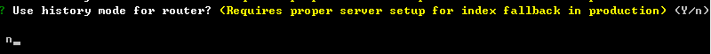
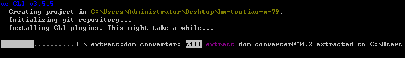

## 项目准备

> 关于移动开发

说明：

1. 和PC端开发区别不大，移动端开发需要做屏幕适配（运行到手机中，面对各种尺寸的手机屏幕）
2. 里边包含的功能和PC端的功能类似

### 01-项目介绍

- 首先，黑马头条移动端是一个IT资讯移动**web应用**，有着和今日头条一样的资讯浏览体验。
- 主要功能：资讯列表、标签页切换，文章举报，频道管理、离线频道，文章详情、阅读记忆，关注功能、点赞功能、评论功能、回复评论、搜索功能、登录功能、个人中心、编辑资料、小智同学、~~问答功能~~、~~视频功能~~ ...   
- 最后，黑马头条可打包成一款移动APP，后期结合H5+可在Dcloud打包成一款体验较好的手机应用。

演示地址：http://heima-project.gitee.io/toutiao-mobile/#/


### 02-使用技术

文件：`package.json`

-  生产依赖（dependencies） =》安装：npm i 包名
  - vuejs  核心vue
  - vuex  状态管理插件
  - vue-router  路由插件
  - axios  请求插件
  - json-bigint 最大安全数值处理
  - socket.io-client  即时通讯库IM => WebSocket(可以和服务器通信获取数据)
  - vant （有赞）移动组件库
  - amfe-flexible  **rem适配**
  - vue-lazyload 图片懒加载
- 开发依赖（devDependencies）=》安装：npm i 包名 -D
  - babel  ES转换器
  - less  css预处理器
  - postcss  css后处理器
  - vue-cli  vue项目脚手架
- 打包App
  - H5+ 打包
  - DCLOUD框架提供的HbuilderX软件=》 打包=》可以安装到手机上使用


### 03-创建项目

创建项目：

```sh
vue create hm-toutiao-m-118
```

自定义创建：


依赖插件：


路由是否使用history模式：



- 两种路由实现模式
  - hash模式 (兼容性好)=> 运行任何浏览器
    - 使用 location.hash = '/user'  跳转
    - 根据地址栏切换，更新页面内容（组件）即可。
      - 使用 window.onhashchange 来监听hash改变
  - history模式
    - 使用 BOM对象 history 提供了一些API  back forward go pushState(H5)
    - 使用 history.pushState(null,null,'/user')  跳转
    - 根据地址栏切换，更新页面内容（组件）即可。
      - 使用 window.onpopstate 来监听历史改变

预处理器:


语法风格：


风格检查：往提交代码会检查代码规范=》⚠️如果存在问题，不能提交=》检查代码哪里不符合规范=》npm run lint --fix


存储插件配置位置：


是否记录操作：


正在创建：



创建完毕启动项目：


### 04-调整结构和页面创建

页面划分：设计师的参照图（高保真）结合产品经理的PRD(需求文档=》说明有哪些页面)

调整src目录和结构：产品经理prd

```sh
├─api   #接口函数
├─assets  #静态资源
├─components  #公用组件
├─router #路由文件
├─store #共享状态文件
├─styles #less代码
├─utils #工具模块
└─views #路由页面
    ├─home #首页模块
    ├─question #问答模块
    ├─video #视频模块
    ├─profile #个人中心
    ├─article #文章详情
    ├─login #登录模块
    ├─user #用户模块（编辑资料和小智聊天）
    ├─search #搜索模块
    └─layout.vue #公用布局
├─App.vue #根组件
└─main.js #入口文件
```

页面创建后结构=》示例：


### 05-使用vant组件库

- 官方地址：https://youzan.github.io/vant/#/zh-CN/intro
- 安装：

```sh
npm i vant -S
```

- 入口中导入：

```js
import Vue from 'vue';
import Vant from 'vant';
import 'vant/lib/index.css';

Vue.use(Vant);
```

以上做法是完整导入，在项目开发阶段使用，配置方便节省时间，将来上线的时候可以使用按需导入。

* 测试组件

组件库用法说明：根据组件库用法文档

1. 看某个组件文档=》代码演示=》根据自己当前页面的需要，结合组件效果
2. 复制粘贴代码演示部分的代码=》修改成自己需要的效果


### 06-页面组件基本布局

> 使用准备的其它路由页面的基本布局

注意：练习时使用笔记写好的样式，请使用如下结构

home-index 组件

```vue
<template>
  <div class='container'>Home</div>
</template>

<script>
export default {
  name: 'home-index'
}
</script>

<style scoped lang='less'></style>
```

question-index 组件

> skeleton骨架屏=》相当于loading效果=》使用场景：发请求获取数据，数据没有回来之前显示骨架屏

```vue
<template>
  <div class='container'>
    <van-skeleton title :row="3" />
    <van-skeleton title :row="3" />
    <van-skeleton title :row="3" />
  </div>
</template>

<script>
export default {
  name: 'question-index'
}
</script>

<style scoped lang='less'>
.van-skeleton{
  margin-top: 10px;
}
</style>
```

video-index 组件

```vue
<template>
  <div class='container'>
    <van-skeleton title avatar :row="3" />
    <van-skeleton title avatar :row="3" />
    <van-skeleton title avatar :row="3" />
  </div>
</template>

<script>
export default {
  name: 'video-index'
}
</script>

<style scoped lang='less'>
.van-skeleton{
  margin-top: 10px;
}
</style>
```

profile-index 组件

```vue
<template>
  <div class='container'>User</div>
</template>

<script>
export default {
  name: 'user-index'
}
</script>

<style scoped lang='less'></style>
```

search-index 组件

```vue
<template>
  <div class="container">
    <van-nav-bar title="搜索中心" left-arrow @click-left="$router.back()" />
  </div>
</template>

<script>
export default {
  name: 'search-index'
}
</script>

<style scoped lang='less'></style>
```

search-result 组件

```html
<template>
  <div class='container'>
    <van-nav-bar title="搜索结果" left-arrow @click-left="$router.back()" />
  </div>
</template>

<script>
export default {
  name: 'search-result'
}
</script>

<style scoped lang='less'></style>
```

user-index 组件

```vue
<template>
  <div class="page-user-profile">
    <van-nav-bar left-arrow @click-left="$router.back()" title="编辑资料" right-text="保存" @click-right="save()"></van-nav-bar>
  </div>
</template>

<script>
export default {
  name:'user-profile',
  methods: {
    save () {
      this.$toast.success('保存成功')
    }
  }
}
</script>

<style scoped lang='less'></style>
```

user-chat 组件

```vue
<template>
  <div class="page-user-chat">
    <van-nav-bar fixed left-arrow @click-left="$router.back()" title="小智同学"></van-nav-bar>
  </div>
</template>

<script>
export default {
  name: 'user-chat'
}
</script>

<style scoped lang='less'></style>

```

login-index 组件

```vue
<template>
  <div class="page-user-login">
    <van-nav-bar left-arrow @click-left="$router.back()" title="登录"></van-nav-bar>
  </div>
</template>

<script>
export default {
  name: 'user-chat'
}
</script>

<style scoped lang='less'></style>

```

article-index  详情组件

```html
<template>
  <div class='container'>
    <van-nav-bar fixed left-arrow @click-left="$router.back()" title="文章详情"></van-nav-bar>
  </div>
</template>

<script>
export default {
  name: 'article'
}
</script>

<style scoped lang='less'></style>

```


### 07-修改vant主题

> 定制vant主题配色

使用场景：根据项目实际需求，自定义组件库的配色、字体大小等等（样式）

步骤：

1. 入口引入组件库less文件
2. webpack配置中覆盖颜色变量

`src/main.js`

```diff
import Vant from 'vant'
-import 'vant/lib/index.css'
+import 'vant/lib/index.less'
```

`vue.config.js`

```js
module.exports = {
  css: {
    loaderOptions: {
      less: {
        // 若使用 less-loader@5，请移除 lessOptions 这一级，直接配置选项。
        // lessOptions: {
        modifyVars: {
          // 直接覆盖变量
          blue: '#fc6627'
        }
        // }
      }
    }
  }
}

```

- vant文档：https://youzan.github.io/vant/#/zh-CN/theme
- vue-cli文档： https://cli.vuejs.org/zh/config/#css-loaderoptions
- less配置：http://lesscss.org/usage/#less-options-strict-units

注意：若使用 less-loader@5，请移除 lessOptions 这一级，直接配置选项


### 08-全局样式

> 添加项目的全局样式

`src/styles/index.less`

```less
// -----------------------全局样式-----------------------
*{
  margin: 0;
  padding: 0;
}
ul{
  list-style: none;
}

#app {
  position: absolute;
  left: 0;
  top: 0;
  overflow: hidden;
  width: 100%;
  height: 100%;
  font-size: 14px;
}

// -----------------------覆盖vant-----------------------
.van-nav-bar {
  background: #fc6627;
  .van-nav-bar__title {
    color: #fff;
  }
  .van-nav-bar__text {
    color: #fff;
    font-size: 12px;
  }
  .van-icon{
    color: #fff;
  }
}
.van-tabbar{
  background: #fdfdfd;
}
.van-nav-bar__text:active{
  background: transparent;
}
```

- 在引入vant样式后，导入自己样式，这样覆盖。


### 09-REM适配

> 注意：如果项目中没有生成postcss.config.js，请手动创建即可。

移动项目中和Vant 组件库中的样式默认使用`px`作为单位，如果需要使用`rem`单位，推荐使用以下两个工具

Rem: 移动端适配单位。

根据html根元素的字体大小进行计算缩放（**html字体大小决定了1rem的大小**）。

举个例子：HTML根字体大小是35.7px，那么1rem=35.7px

1. 相对单位
2. 跟随根HTML字体大小放大缩小

- ==[postcss-pxtorem](https://github.com/cuth/postcss-pxtorem) 是一款 postcss 插件，**用于将px单位转化为 rem单位**==

首先，需要安装：

```sh
# 后处理器 开发阶段使用
npm i postcss-pxtorem -D
```

然后，下面提供了一份基本的 postcss 配置（postcss.config.js），可以在此配置的基础上根据项目需求进行修改

==postcss-pxtorem要降级为5.1.1==

```diff
module.exports = {
  plugins: {
+    'postcss-pxtorem': {
+      rootValue: 37.5, // 屏宽/10 = 1rem
+      propList: ['*'] // 要转换的样式属性=》*代表所有 
+    }
  }
}
```
排除：propList: ['*', '!width']

* [lib-flexible](https://github.com/amfe/lib-flexible) **用于设置 rem 基准值（动态）**

作用：==根据手机屏幕大小动态设置根HTML字体大小==

安装：

```sh
# 修改rem基准值的js插件
npm i amfe-flexible -S
```

入口文件main.js导入 amfe-flexible 

```js
import 'amfe-flexible'
```

注意

- rootValue 是转换px的基准值，参考设备iPhone6，设备宽度375px（逻辑像素）。
- flexible 在iPhone6设备设置的  html--->font-size 也为37.5px 。
- 但是 设计稿 尺寸750px（物理像素） 大小，所以在设计稿量取的尺寸使用时候需要  **除以2**  。
- **不能转换元素行内样式的单位**
- **通用方案**=》适用于Vue、等项目移动开发


### 10-版本控制

> 码云或github新建空仓库

1. 创建远程仓库

```sh
# （空）仓库地址
```

2. 提交

```sh
git add .
git commit -m '初始化'
```

3. 推送远程仓库

```sh
# 加别名origin
git remote add origin 仓库地址
# 推送记录操作
git push -u origin master
```

> 参加工作可以会用一个叫`gitlab`的仓库管理系统（有点像码云/github）

作用：

1. 保存你在公司写的代码
2. 团队协作