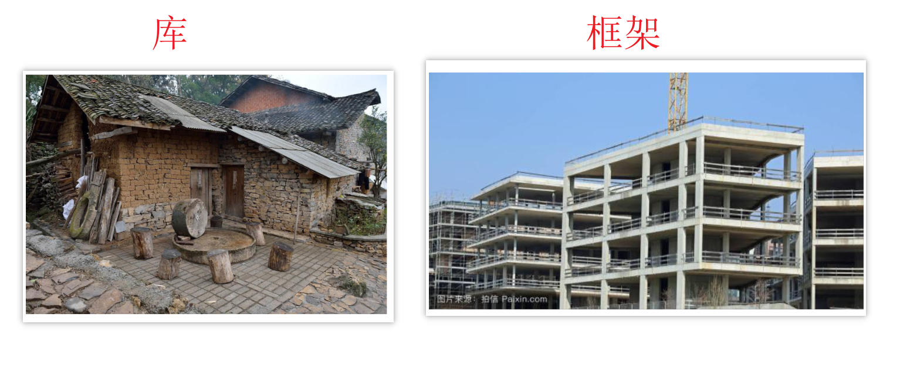
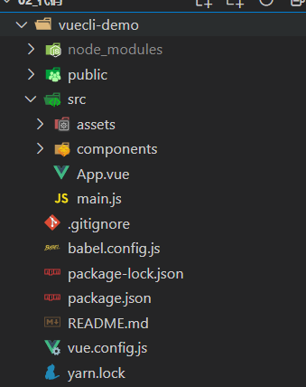

# Day02

## 铺垫(自学)

### 必安装 - vue-devtools

学习和调试vue必备之利器 - 官方插件

* 插件目录：`02-其它资源/vue开发调试插件/vue-dev-tool-5.3.crx`

安装：

1. 打开Chrome浏览器=》点击浏览器右上角小图标，按图示操作


2. 进入扩展程序菜单=》把`vue-dev-tool-5.3.crx`文件拖入网页中进行**[添加安装](https://cn.vuejs.org/v2/guide/)**


3. 安装完成后，固定显示插件


## 知识点自测

想学会今天的内容, 先测测这几个会不会

- [ ] 表达式, 变量是什么
- [ ] new的作用和含义
- [ ] 实例化对象
- [ ] 什么是对象上的, 属性和方法
- [ ] 对象的赋值和取值
- [ ] this的指向
- [ ] npm/yarn是什么, package.json干什么的, 下载包的命令是什么, 什么是模块化开发
- [ ] 函数的形参实参, 得马上反应过来, 哪个是变量哪个是值, 谁传给谁了

如果通不过, 请记住口诀:

1. 变量是一个容器, 表达式原地都有返回结果

   ```js
   var a = 10;
   console.log(a); // a就是变量, 运行后使用变量里的值再原地打印
   console.log(10 + 50); // 10 + 50 就是表达式
   console.log(a > 9); // 这叫判断表达式, 原地结果是true
   ```

2. new 类名() - 原地得到一个实例对象 - 对象身上有key(或叫属性, 叫键都行), 对应的值是我们要使用的

3. 实例化对象就是new 类名() 创造出来的对象, 身上包含属性(key, 键) 对应的 值

4. 什么是属性和方法(固定格式)

   ```js
   let obj = { // 属性指的是a, b, c, d, e这些名字
       a: 10,
       b: [1, 2, 3],
       c: function(){},
       d () {},
       e: () => {} // 值是冒号:右边的值
   }
   // 这个格式是固定的, 必须张口就来, 挥手就写, 准确率100%
   ```

5. 对象的赋值和取值(固定格式)

   有=(赋值运算符) 就是赋值, 没有就是取值

   ```js
   let obj = {
       a: 10,
       b: 20
   }
   console.log(obj.a); // 从obj对象的a上取值, 原地打印10
   obj.b = 100; // 有=, 固定把右侧的值赋予给左侧的键, 再打印obj这个对象, b的值是100了
   ```

6. this指向口诀

   * 在function函数中, this默认指向当前函数的调用者  调用者.函数名()

   * 在箭头函数中, this指向外层"函数"作用域this的值

## 今日学习目标

1. 能够理解vue的概念和作用
2. 能够使用vuecli脚手架工程化开发
3. 能够掌握单vue文件的使用
4. 能够使用vue的基础API和指令来实现功能
5. 能够理解mvvm设计模式和双向数据绑定

## 5. Vue基本概念


### Vue是什么

[vue官网](https://cn.vuejs.org/) (作者: 尤雨溪)

渐进式javascript**框架**, 而且简单高效, 增量开发, 组件集合, 便于复用


补充概念:

库:  封装的属性或方法 (例jquery.js)

框架: 拥有自己的规则和元素, 比库强大的多 (例vue.js)




渐进式: 逐渐按需添加, 想用什么就用什么, 不必全都使用


### Vue为何学

市场需求来说vue已经是国内最流行的框架 越来越成为前端工程师的一项基础技能


开发更加的效率和简洁, 易于维护, 快!快!快!就是块 (甚至测试, Java, Python工程师都要学点vue, 方便与前端沟通)

### Vue快不快

> 目标: 把一个数组里数据铺设到页面的li标签内

原生js做法

```js
<ul id="myUl"></ul>
<script>
    let arr = ["春天", "夏天", "秋天", "冬天"];
    let myUl = document.getElementById("myUl");
    for (let i = 0; i < arr.length; i++) {
        let theLi = document.createElement("li");
        theLi.innerHTML = arr[i];
        myUl.appendChild(theLi);
    }
</script>
```

Vue.js做法

```js
<div id="app"></div>
<ul>
    <li v-for="item in arr">{{item}}</li>
</ul>
<script src="https://cdn.jsdelivr.net/npm/vue/dist/vue.js"></script>
<script>
    new Vue({
        el: "#app", 
        data: {
            arr: ["春天", "夏天", "秋天", "冬天"] 
        }
    })
</script>
```

结论: 虽然vue写起来很爽, 但是一定不要忘记, vue的底层还是原生js

### Vue学习的方式

+ 传统开发模式：基于html/css/js文件开发vue

  

+ 工程化开发方式：在webpack环境中开发vue，这是最推荐, 企业常用的方式

  


### Vue如何学

1. 每天的知识点自测最好做到了如指掌 - 基础知识
2. 记住vue指令作用, 基础语法 - 多记
3. 在课上例子, 练习, 案例, 作业, 项目中, 反复磨炼使用- 多练
4. 学会查找问题的方式和解决方式(弄个报错总结.md, 避免反复进坑) -多总结

> 会写代码是徒弟, 会找问题是师傅, 会解决问题的是大师

## 6. Vue-cli基础使用

### 6.0_vue-cli 脚手架介绍

> 目标: 什么是vue-cli, 什么是脚手架

**vue-cli**是vue官方提供的一个==全局模块包==(带命令工具行的), 开箱即用, webpack零配置, 此包用于创建脚手架工程

 **脚手架**是为了保证各施工过程顺利进行而搭设的工作平台

- 脚手架工程就是一套固定的文件夹+文件+配置的工程, 我们在此基础上开发业务
- 在开发过程中，脚手架工具是有用的，开发完成（项目上线生产环境），它就没有用了


> ### vue-cli的好处和能力

- 统一的项目结构(文件夹+文件+配置代码)
- 开发过程中的webpack各系列支持
  - babel支持
  - eslint约束语法风格（代码风格）
  - 样式预处理器less 
  - **vue单文件支持**
- 提供一个开发时服务器，预览代码（预览项目）
  - 自动刷新，方便预览
  - 热更新 (只刷新修改的部分)
- 基于nodejs的命令行工具

### 6.1_vue-cli 脚手架安装

> 目标: 把@vue/cli模块包按到全局, 电脑拥有vue命令, 才能创建脚手架工程

* npm是非常重要的npm管理工具,由于npm的服务器位于国外, 所以一般建议将 npm设置成国内的淘宝镜像

设置淘宝镜像

```bash
$ npm config set registry  https://registry.npm.taobao.org/  #设置淘宝镜像地址
$ npm config get registry  #查看镜像地址
```

1. 全局安装命令

```bash
yarn global add @vue/cli
# OR
npm install -g @vue/cli
```

注意: 如果半天没动静(95%都是网速问题), 可以ctrl c 
* 停止重新来

* 换一个网继续重来

2. 查看`vue`脚手架版本

```bash
vue --version
```

> 总结: 如果出现版本号就安装成功, 否则失败

### 6.2_vue-cli 创建项目

> 目标: 使用vue命令, 创建脚手架项目

==注意,路径上不要有vue名字的文件夹, 项目名不能带中文和特殊符号==

1. 创建项目

```bash
# vue和create是命令, vuecli-demo是文件夹名
vue create vuecli-demo
```

2. 选择模板

   ==可以上下箭头选择, 弄错了ctrl+c重来==


​	

3. 回车等待生成项目文件夹+文件+下载必须的第三方包们


4. 进入脚手架项目下, 启动内置的热更新本地服务器

```bash
cd vuecil-demo

npm run serve
# 或
yarn serve
```

只要看到绿色的 - 啊. 你成功了(底层node+webpack热更新服务)


打开浏览器输入上述地址


> 总结: vue命令创建工程目录, 项目内置webpack本地热更新服务器, 帮我们打包项目预览项目

注意⚠️：如果使用git bash创建项目，不能上下选择选项，使用如下命令创建

```bash
winpty vue.cmd create 项目名字
```


### 6.3_vue-cli 覆盖webpack配置

> 目标：项目中没有webpack.config.js文件，因为vue用的vue.config.js

项目根目录下新建[vue.config.js](https://cli.vuejs.org/zh/config/#%E5%85%A8%E5%B1%80-cli-%E9%85%8D%E7%BD%AE)（和src同级）

```jsx
/* 覆盖webpack的配置 */
module.exports = {
  devServer: { // 自定义服务配置
    open: true,
    port: 3000
  },
  lintOnSave: false // 关闭eslint检查
}
跑服务器必须要有json文件的项目目录才能跑
```

说明：默认创建的项目不会检查[eslint错误](https://cli.vuejs.org/zh/config/#lintonsave)

### 6.4_vue-cli 项目目录分析与清理

> 目标: 了解初始项目文件夹和文件含义, 删除一些以后不需要的

```bash
 vuecil-demo        # 项目目录
    ├── node_modules # 项目依赖的第三方包
    ├── public       # 静态文件目录
      ├── favicon.ico# 浏览器小图标
      └── index.html # 单页面的html文件(网页浏览的是它)
    ├── src          # 业务文件夹=》写代码 source资源的简称
      ├── assets     # 静态资源
        └── logo.png # vue的logo图片
      ├── components # 组件目录
        └── HelloWorld.vue # 欢迎页面vue代码文件 
      ├── App.vue    # 整个应用的根组件
      └── main.js    # 入口js文件
    ├── package.json # 描述项目及项目
    ├── .gitignore   # git提交忽略配置
    ├── babel.config.js  # babel配置 
    ├── README.md    # 项目说明
	└── package-lock.json # 项目包版本锁定和下载地址
```

* src/App.vue默认有很多内容, 可以全部删除
* assets 和 components 文件夹下的一切都删除掉 (不要默认的欢迎页面)

### 6.5_vue-cli项目说明和运行介绍

> 目标: 知道项目入口, 以及代码执行顺序和引入关系

#### SPA单页应用

定义：SPA（single page application）单页面富应用开发=》典型代表：使用vue react angular框架开发

* 相对SPA比较传统开发方式MPA

区别：

1. SPA单页应用借助后续学习的**路由**切换页面（.vue文件）=》体验更好
2. MPA多页应用借助a标签跳转html页面

#### vue代码运行流程


#### vue单文件组件说明

> 目标: 一个`.vue`文件就是一个组件（页面）, 后续开发vue项目，所有的功能都是基于组件实现。

格式：`.vue`

基本组成：template+script+style

```vue
<template>
 <div class="box">
   我是html模板(必须)
  </div>
</template>
<script>
  // 我是js逻辑
  export default {
     data() {
       return {
         // 定义变量数据（任意类型）
       }
     }
  }
</script>
<style>
  /* 我是css样式 */
  .box {
    color:red
  }
</style>
```


#### 开发使用插件

* 代码高亮插件-vscode中安装


* 代码提示插件-vscode中安装


## 7. Vue基础用法和指令

### 7.0_vue基础-定义变量和插值

> 目的: 在dom标签中, 直接使用变量或表达式

又叫: 插值表达式|胡子语法

语法: {{ 变量或表达式 }}

```jsx
<template>
  <div>
    <h1>{{ msg }}</h1>
    <h2>{{ obj.name }}</h2>
    <h3>{{ obj.age > 18 ? '成年' : '未成年' }}</h3>
  </div>
</template>

<script>
export default {
  // 格式固定, 定义vue数据变量的函数  
  data() { 
    return {  
      // key相当于变量名
      msg: "hello, vue",
      obj: {
        name: "小vue",
        age: 5
      }
    }
  }
}
</script>

<style>
</style>

```

> 总结: dom中插值表达式赋值, vue的变量必须在data里声明

### 7.1_vue基础-MVVM设计模式

> 目的: 转变思维, 用**数据驱动视图**改变, 操作dom的事, vue源码内干了

#### 数据驱动视图演示

mvc

说明：设计模式/架构模式=》前人总结的开发经验

演示: 在上个代码基础上, 在devtool工具改变M层的变量, 观察V层(视图的自动同步)

❓等下面学了v-model再观察V改变M的效果


#### MVVM详解


> 模式说明

1. MVVM，一种软件架构模式，决定了写代码的思想和层次

+ M：   model数据模型            (data里定义)	
+ V：    view视图                   （template里定义html页面结构）
+ VM： ViewModel视图模型   (vue组件实例this)

2. MVVM通过`数据双向绑定`让数据自动地双向同步  **不再需要操作DOM**

- V（修改视图） -> M（数据自动同步）
- M（修改数据） -> V（视图自动同步）


注意⚠️：

**1. 在vue中，不推荐直接手动操作DOM！！！**  

**2. 在vue中，通过数据驱动视图，不要在想着怎么操作DOM，而是想着如何操作数据！！**(思想转变)


> 总结: vue源码内采用MVVM设计模式思想, 大大减少了DOM操作, 提高开发效率

### 7.2_vue指令-v-bind动态属性

> 目标: 给标签属性设置vue中data变量的值

**vue指令, 实质上就是特殊的 html 标签属性, 特点:  v- 开头**

每个指令, 都有独立的作用

- 语法：`v-bind:属性名="vue变量"`
- 简写：`:属性名="vue变量"`

```html
<!-- vue指令-v-bind属性动态赋值 -->
<a v-bind:href="url">我是a标签</a>


```

> 总结: 把vue变量的值, 赋予给dom属性上, 影响标签显示效果

### 7.3_vue指令-v-on事件绑定

> 目标: 给标签绑定事件

* 语法
  * v-on:事件名="要执行的==少量代码=="
  * v-on:事件名="methods中的函数"
  * v-on:事件名="methods中的函数(实参)" 
* 简写: @事件名="methods中的函数"

```html
<!-- vue指令:   v-on事件绑定-->
<p>你要买商品的数量: {{count}}</p>
<button v-on:click="count = count + 1">增加1</button>
<button v-on:click="addFn">增加1个</button>
<button v-on:click="addCountFn(5)">一次加5件</button>

<button @click="subFn">减少</button>

<script>
    export default {
        // ...其他省略
        methods: {
            addFn(){ // this代表export default后面的组件对象(下属有data里return出来的属性)
                this.count++
            },
            addCountFn(num){
                this.count += num
            },
            subFn(){
                this.count--
            }
        }
    }
</script>
```

> 总结: 常用@事件名, 给dom标签绑定事件, 以及=右侧事件处理函数

### 7.4_vue指令-v-on事件对象

> 目标: vue事件处理函数中, 拿到事件对象

* 语法:
  * 无传参, 通过形参直接接收
  * 传参, 通过$event指代事件对象传给事件处理函数

```vue
<template>
  <div>
    <a @click="one" href="http://www.baidu.com">阻止百度</a>
    <hr>
    <a @click="two(10, $event)" href="http://www.baidu.com">阻止去百度</a>
  </div>
</template>

<script>
export default {
  methods: {
    one(e){
      e.preventDefault()
    },
    two(num, e){
      e.preventDefault()
    }
  }
}
</script>
```

### 7.5_vue指令-v-on事件修饰符

> 目的: 在事件后面.修饰符名 - 给事件带来更强大的功能

* 语法:
  * @事件名.修饰符="methods里函数"
    * .stop - 阻止事件冒泡
    * .prevent - 阻止默认行为
    * .once - 程序运行期间, 只触发一次事件处理函数 类似jquery中的one事件
  
* // 点击事件回调函数中的this作用：

  // 可以调用其他methods中定义的方法

  // 可以火球data中定义的变量并修改=>触发数据驱动视图


```html
<template>
  <div @click="fatherFn">
    <!-- vue对事件进行了修饰符设置, 在事件后面.修饰符名即可使用更多的功能 -->
    <button @click.stop="btn">.stop阻止事件冒泡</button>
    <a href="http://www.baidu.com" @click.prevent="btn">.prevent阻止默认行为</a>
    <button @click.once="btn">.once程序运行期间, 只触发一次事件处理函数</button>
  </div>
</template>

<script>
export default {
  methods: {
    fatherFn(){
      console.log("father被触发");
    },
    btn(){
      console.log(1);
    }
  }
}
</script>
```

> 总结: 修饰符给事件扩展额外功能

### 7.6_vue指令-v-on按键修饰符

> 目标: 给键盘事件, 添加修饰符, 增强能力

* 语法:
  * @keyup.enter  -  监测回车按键
  * @keyup.esc     -   监测返回按键

[更多修饰符](https://cn.vuejs.org/v2/guide/events.html#%E6%8C%89%E9%94%AE%E4%BF%AE%E9%A5%B0%E7%AC%A6) 

通过全局 `config.keyCodes` 对象[自定义按键修饰符别名](https://cn.vuejs.org/v2/api/#keyCodes)：Vue.config.keyCodes.f1 = 112

```html
<template>
  <div>
    <input type="text" @keydown.enter="enterFn">
    <hr>
    <input type="text" @keydown.esc="escFn">
  </div>
</template>

<script>
export default {
 methods: {
   enterFn(){
     console.log("enter回车按键了");
   },
   escFn(){
     console.log("esc按键了");
   }
 }
}
</script>
```

> 总结: 多使用事件修饰符, 可以提高开发效率, 少去自己判断过程

### 7.7_课上练习-翻转世界

> 目标: 点击按钮 - 把文字取反显示 - 再点击取反显示(回来了)

> 提示: 把字符串取反赋予回去

效果演示:


正确代码:

```html
<template>
  <div>
    <h1>{{ message }}</h1>
    <button @click="btn">逆转世界</button>
  </div>
</template>

<script>
export default {
  data() {
    return {
      message: "HELLO, WORLD",
    };
  },
  methods: {
    btn(){
      this.message = this.message.split("").reverse().join("")
    }
  }
};
</script>
```

> 总结: 记住方法特点, 多做需求, vue是数据变化视图自动更新, 减少操作DOM时间, 提高开发效率

### 7.8_vue指令-v-model双向绑定

> 目标: 把value属性和vue数据变量, [双向绑定](https://cn.vuejs.org/v2/guide/forms.html)到一起  默认收集表单的value值

* 语法: v-model="data数据变量"
* 双向数据绑定
  * 数据变化 -> 视图自动同步
  * 视图变化 -> 数据自动同步

> 演示: 输入和选择的绑定

```vue
<template>
  <div>
    <!-- 
    	v-model:是实现vuejs变量和表单标签value属性, 双向绑定的指令
    -->
    <!-- 绑定输入 -->
    <div>
      <span>用户名:</span>
      <input type="text" v-model="username" />
    </div>
    <div>
      <span>密码:</span>
      <input type="password" v-model="pass" />
    </div>
    
    <!-- 绑定选择 -->
    <div>
      <span>来自于哪里?</span>
      <select v-model="from">
        <option value="西安">陕西-西安</option>
        <option value="燕京">北京-燕京</option>
        <option value="大连">辽宁-大连</option>
      </select>
    </div>
    
    <div>
      <!-- checkbox特殊, 内部判断v-model是数组, 绑定value值 -->  
      <span>爱好</span>
      <input type="checkbox" v-model="hobby" value="吃饭" /><span>吃饭</span>
      <input type="checkbox" v-model="hobby" value="逛街" /><span>逛街</span>
      <input type="checkbox" v-model="hobby" value="旅游" /><span>旅游</span>
    </div>
  </div>
</template>

<script>
export default {
  data() {
    return {
      username: "",
      pass: "",
      from: "",
      hobby: [], 
    }
  }
};
</script>
```

> 总结: v-model适用于表单开发，自动获取用户输入或选择数据

### 7.9_vue指令-v-model修饰符

> 目标: 让v-model拥有更强大的功能

* 语法:
  * v-model.修饰符="vue数据变量"
    * .number   以parseFloat转成数字类型
    * .trim          去除首尾空白字符
    * .lazy           在失去焦点时触发更改而非inupt时 ,一般在textarea时取消在输入的时候实时同步，延迟同步view到model，失去焦点再去同步类似防抖

```vue
<template>
  <div>
    <div>
      <span>年龄:</span>
      <input type="text" v-model.number="age">
    </div>
    <div>
      <span>人生格言:</span>
      <input type="text" v-model.trim="motto">
    </div>
    <div>
      <span>自我介绍:</span>
      <textarea v-model.lazy="intro"></textarea>
    </div>
  </div>
</template>

<script>
export default {
  data() {
    return {
      age: "",
      motto: "",
      intro: ""
    }
  }
}
</script>
```

> 总结: v-model修饰符, 可以对值进行预处理, 非常高效好用

### 7.10_vue指令-v-text和v-html

> 目的: 更新DOM对象的innerText/innerHTML

* 语法:
  * v-text="vue数据变量"    只能渲染字符串 innertext，推荐用胡子语法替代
  * v-html="vue数据变量"  可以渲染标签 innerhtml  ，场景新闻 标签+字符串
* 注意: 会覆盖插值表达式

```vue
<template>
  <div>
    <p v-text="str"></p>
    <p v-html="str"></p>
  </div>
</template>

<script>
export default {
  data() {
    return {
      str: "<span>我是一个span标签</span>"
    }
  }
}
</script>
```

> 总结: v-text把值当成普通字符串显示, v-html把值当做html解析

### 7.11_vue指令-v-show和v-if

> 目标: 控制标签元素的隐藏或出现

* 语法:
  * v-show="vue变量/表达式"            
  * v-if="vue变量/表达式" 
* 原理
  * v-show 用的display:none隐藏   (频繁切换使用) 性能好	 
  * v-if  直接从DOM树上添加或移除           创建或移除，每次重新创建都会触发回流，性能低
* 高级
  * v-else-if的使用  v-else不加条件 最后一个

```html
<template>
  <div>
    <h1 v-show="isOk">v-show的盒子</h1>
    <h1 v-if="isOk">v-if的盒子</h1>

    <div>
      <p v-if="age > 18">我成年了</p>
      <p v-else>还得多吃饭</p>
    </div>

    <div>
      <p>您的考试成绩如下: </p>
      <p v-if="grade >= 90">优秀</p>
      <p v-else-if="grade >= 80">良好</p>
      <p v-else-if="grade >= 70">中等</p>
      <p v-else-if="grade >= 60">及格</p>
      <p v-else>不及格</p>
    </div>
  </div>
</template>

<script>
export default {
  data() {
    return {
      isOk: true,
      age: 15,
      grade: 40
    }
  }
}
</script>
```

> 总结: 使用v-show和v-if以及v-else指令, 方便通过变量控制一套标签出现/隐藏

### 7.12_案例-折叠面板

> 目标: 点击展开或收起时，把内容区域显示或者隐藏


此案例使用了less语法, 项目中下载模块

```bash
npm i less@3.0.4 less-loader@5.0.0 -D
```

只有标签和样式

```vue
<template>
  <div id="app">
    <h3>案例：折叠面板</h3>
    <div>
      <div class="title">
        <h4>芙蓉楼送辛渐</h4>
        <span class="btn" >
          收起
        </span>
      </div>
      <div class="container">
        <p>寒雨连江夜入吴,</p>
        <p>平明送客楚山孤。</p>
        <p>洛阳亲友如相问，</p>
        <p>一片冰心在玉壶。</p>
      </div>
    </div>
  </div>
</template>

<script>
export default {
  data() {
    return {
      
    }
  }
}
</script>

<style lang="less">
body {
  background-color: #ccc;
  #app {
    width: 400px;
    margin: 20px auto;
    background-color: #fff;
    border: 4px solid blueviolet;
    border-radius: 1em;
    box-shadow: 3px 3px 3px rgba(0, 0, 0, 0.5);
    padding: 1em 2em 2em;
    h3 {
      text-align: center;
    }
    .title {
      display: flex;
      justify-content: space-between;
      align-items: center;
      border: 1px solid #ccc;
      padding: 0 1em;
    }
    .title h4 {
      line-height: 2;
      margin: 0;
    }
    .container {
      border: 1px solid #ccc;
      padding: 0 1em;
    }
    .btn {
      /* 鼠标改成手的形状 */
      cursor: pointer;
    }
  }
}
</style>
```

正确答案:

```vue
<template>
  <div id="app">
    <h3>案例：折叠面板</h3>
    <div>
      <div class="title">
        <h4>芙蓉楼送辛渐</h4>
        <span class="btn" @click="isShow = !isShow">
          {{ isShow ? '收起' : '展开' }}
        </span>
      </div>
      <div class="container" v-show="isShow">
        <p>寒雨连江夜入吴, </p>
        <p>平明送客楚山孤。</p>
        <p>洛阳亲友如相问，</p>
        <p>一片冰心在玉壶。</p>
      </div>
    </div>
  </div>
</template>

<script>
export default {
  data() {
    return {
      isShow: false
    }
  }
}
</script>

```

### 7.13_vue指令-v-for

> 目标: 列表渲染, 所在标签结构, 按照数据数量, 循环生成

* 语法
  * v-for="(值, 索引) in 目标结构"
  * v-for="值 in 目标结构"
  * 必须要有 :key='唯一的值'，如果没有id则以内容item
* 目标结构:
  * ==可以遍历数组 / 对象 / 数字==
  * 相当于for循环遍历给定的变量数组，遍历的次数是数组的长度
  * 是vue模板的方法 即是元素的循环

```vue
<template>
  <div id="app">
    <div id="app">
      <!-- v-for 把一组数据, 渲染成一组DOM -->
      <!-- 口诀: 让谁循环生成, v-for就写谁身上 -->
      <p>学生姓名</p>
      <ul>
        <li v-for="(item, index) in arr" :key="item">
          {{ index }} - {{ item }}
        </li>
      </ul>

      <p>学生详细信息</p>
      <ul>
        <li v-for="obj in stuArr" :key="obj.id">
          <span>{{ obj.name }}</span>
          <span>{{ obj.sex }}</span>
          <	span>{{ obj.hobby }}</span>
        </li>
      </ul>

      <!-- v-for遍历对象(了解) -->
      <p>老师信息</p>
      <div v-for="(value, key) in tObj" :key="value">
        {{ key }} -- {{ value }}
      </div>

      <!-- v-for遍历整数(了解) - 从1开始 -->
      <p>序号</p>
      <div v-for="i in count" :key="i">{{ i }}</div>
    </div>
  </div>
</template>

<script>
export default {
  data() {
    return {
      arr: ["小明", "小欢欢", "大黄"],
      stuArr: [
        {
          id: 1001,
          name: "孙悟空",
          sex: "男",
          hobby: "吃桃子",
        },
        {
          id: 1002,
          name: "猪八戒",
          sex: "男",
          hobby: "背媳妇",
        },
      ],
      tObj: {
        name: "小黑",
        age: 18,
        class: "1期",
      },
      count: 10,
    };
  },
};
</script>
```

> 总结: vue最常用指令, 铺设页面利器, 快速把数据赋予到相同的dom结构上循环生成

## 今日总结

- [ ] Vue是什么=> 一个渐进式的js框架
- [ ] Vue的特点
  * 渐进式
  * 数据驱动视图 (响应式)
  * 组件系统
- [ ] 如何使用vue开发=》1. 全局安装@vue/cli  2. vue create 项目名字（语义化）3. 在src目录写.vue文件
- [ ] 基本用法：定义变量（响应数据）和插值表达式
- [ ] v-bind作用=》给html元素动态绑定变量
- [ ] v-on作用=》@事件名="methods中定义的函数" =》事件绑定
- [ ] v-model（MVVM设计模式）
- [ ] v-if和v-show的区别和本质
- [ ] v-for的作用


## 今日作业

### 帅哥美女走一走

> 目标: 点击按钮, 改变3个li的顺序, 在头上的就到末尾.

> 提示: 操作数组里的顺序, v-for就会重新渲染li


正确代码(先不要看)

```html
<template>
  <div id="app">
    <ul>
      <li v-for="item in myArr" :key="item">{{ item }}</li>
    </ul>
    <button @click="btn">走一走</button>
  </div>
</template>

<script>
export default {
  data() {
    return {
      myArr: ["帅哥", "美女", "程序猿"],
    };
  },
  methods: {
    btn() {
      // 头部数据加入到末尾
      this.myArr.push(this.myArr[0]);
      // 再把头部的数据删除掉
      this.myArr.shift();
    },
  },
};
</script>
```

### 加加减减

> 目标: 点击生成按钮, 新增一个li(随机数字)和删除按钮, 点击删除按钮, 删除对应的li和值

> 提示: 数组渲染列表, 生成和删除都围绕数组操作


正确代码:

```html
<template>
  <div id="app">
    <ul>
      <li v-for="(item, ind) in arr" :key="item">
        <span>{{ item }}</span>
        <button @click="del(ind)">删除</button>
      </li>
    </ul>
    <button @click="add">生成</button>
  </div>
</template>

<script>
export default {
  data() {
    return {
      arr: [1, 5, 3],
    };
  },
  methods: {
    add() {
      this.arr.push(Math.floor(Math.random() * 20));
    },
    del(index) {
      this.arr.splice(index, 1);
    },
  },
};
</script>
```

注意：v-for的key属性值要求是唯一的

### 购物车

> 目标: 完成商品浏览和删除功能, 当无数据给用户提示

* 需求1: 根据给的初始数据, 把购物车页面铺设出来
* 需求2: 点击对应删除按钮, 删除对应数据
* 需求3: 当数据没有了, 显示一条提示消息


html+css和数据代码结构(可复制接着写)

```vue
<template>
  <div id="app">
    <table class="tb">
      <tr>
        <th>编号</th>
        <th>品牌名称</th>
        <th>创立时间</th>
        <th>操作</th>
      </tr>
      <!-- 循环渲染的元素tr -->
      <tr>
        <td>1</td>
        <td>车名</td>
        <td>2020-08-09</td>
        <td>
          <button>删除</button>
        </td>
      </tr>
      <tr>
        <td colspan="4">没有数据咯~</td>
      </tr>
    </table>
  </div>
</template>

<script>
export default {
  data() {
    return {
      list: [
        { id: 1, name: "奔驰", time: "2020-08-01" },
        { id: 2, name: "宝马", time: "2020-08-02" },
        { id: 3, name: "奥迪", time: "2020-08-03" },
      ],
    };
  },
};
</script>

<style>
#app {
  width: 600px;
  margin: 10px auto;
}

.tb {
  border-collapse: collapse;
  width: 100%;
}

.tb th {
  background-color: #0094ff;
  color: white;
}

.tb td,
.tb th {
  padding: 5px;
  border: 1px solid black;
  text-align: center;
}

.add {
  padding: 5px;
  border: 1px solid black;
  margin-bottom: 10px;
}
</style>

```

正确代码

```vue
<template>
  <div id="app">
    <table class="tb">
      <tr>
        <th>编号</th>
        <th>品牌名称</th>
        <th>创立时间</th>
        <th>操作</th>
      </tr>
      <!-- 循环渲染的元素tr -->
      <tr v-for="(item,index) in list" :key="item.id">
            <td>{{item.id}}</td>
            <td>{{item.name}}</td>
            <td>{{item.time}}</td>
            <td>
                <button @click="del(index)">删除</button>
            </td>
        </tr>
      <tr v-if="list.length === 0">
        <td colspan="4">没有数据咯~</td>
      </tr>
    </table>
  </div>
</template>

<script>
export default {
  data() {
    return {
      list: [
        { id: 1, name: "奔驰", time: "2020-08-01" },
        { id: 2, name: "宝马", time: "2020-08-02" },
        { id: 3, name: "奥迪", time: "2020-08-03" },
      ],
    };
  },
  methods: {
    del(index) {
      // 删除按钮 - 得到索引, 删除数组里元素
      this.list.splice(index, 1);
    },
  },
};
</script>

```


