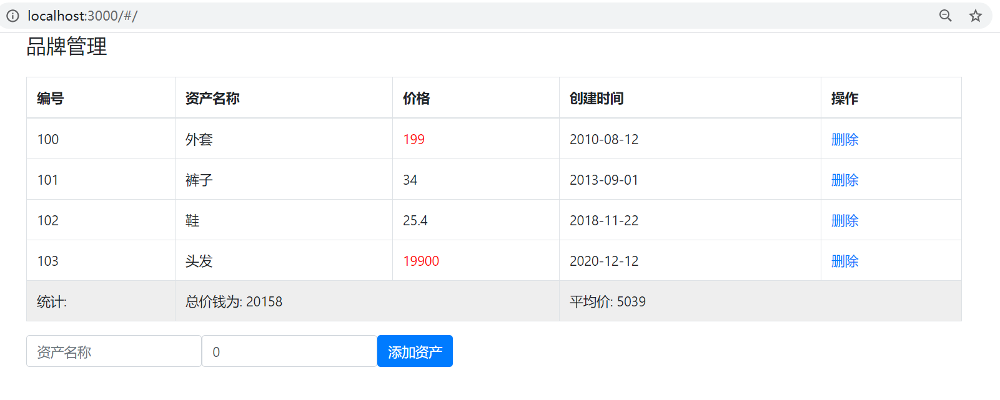

# 	Day03

## 知识点自测

- [ ] 会自己定义数据结构

```js
"红色","red", "蓝色","blue"
// 上面的数据结构, 要用1个变量来装这4个值, 用什么数据结构呢?(数组还是对象) - 对象(可映射key->value)
    
["红色","red", "蓝色","blue"]
// 上面的结构用数组比较合适
```

- [ ] 马上能反应过来循环遍历是什么, 索引(下标)是什么

```js
let arr = [10, 32, 99];
// 索引就是数字, 标记每个值对应的序号, 从0开始
// 索引是0, 1, 2
// 数组需要用索引来换取值, 固定格式 arr[索引]
// 遍历就是挨个取出来
```

- [ ] 数组的filter方法使用

```js
let arr = [19, 29, 27, 20, 31, 32, 35];
let newArr = arr.filter((val) => {return val >= 30})
// 数组调用.filter()方法 - 传入一个函数体 (固定格式)
// 运行过程: filter会遍历数组里的每一项, 对每一项执行一次函数体(会把每个值传给形参)
// 作用: 每次遍历如果val值符合return的条件, 就会被filter收集起来
// 返回值: 当filter遍历结束以后, 返回收集到的符合条件的那些值形成的新数组
console.log(newArr);
```

- [ ] 重绘与回流(重排)的概念

回流(重排): 当浏览器必须重新处理和绘制部分或全部页面时，回流就会发生大小布局显示隐藏和

重绘: 不影响布局, 只是标签页面发生变化, 重新绘制

 注意: 回流(重排)必引发重绘, 重绘不一定引发回流(重排)

- [ ] localStorage浏览器本地存储语法使用

localStorage.setItem("key名", 值) - 把值存在浏览器本地叫key的对应位置上

localStorage.getItem("key名") - 把叫key的对应值, 从浏览器本地取出来

==值只能是字符串类型, 如果不是请用JSON.stringify转, 取出后用JSON.parse转==

- [ ] JSON的方法使用

JSON.stringify(JS数据) - 把JS数据序列化成JSON格式字符串

JSON.parse(JSON字符串)  - 把JSON格式化字符串, 再转回成JS数据

## 今日学习目标

1. 能够了解key作用, 虚拟DOM和diff算法
2. 能够掌握设置动态样式
3. 能够掌握过滤器, 计算属性, 监听器
4. 能够完成品牌管理案例

## 8. vue基础

### 8.0_vue基础 v-for更新监测

> 目标: 当v-for遍历的目标结构改变, Vue触发v-for的更新

这些方法会触发数组改变, v-for会监测到并更新页面,使用数组的索引修改值

- `push()`
- `pop()`
- `shift()`
- `unshift()`
- `splice()`
- `sort()`
- `reverse()`

这些方法不会触发v-for更新=》**需要给数组重新赋值**

解决：不会触发v-for更新

1. 不改变源元素组的修改   vue2和vue3都存在

2. 使用数组索引修改值 虽然修改了源数组但是vue框架无法监控到变化，不会触发视图更新，只能调用==this.$set(数组，索引，新值)==，这个问题只存在于vue2

* `slice()`
* `filter()`
* `concat()` 

> 注意: vue不能监测到数组里**使用索引**修改值的变化而自动刷新, 如果需要请使用`this.$set(数组，索引，新值)`, 或覆盖整个数组重新赋值

```vue
<template>
  <div>
    <ul>
      <li v-for="item in arr">{{ item }}</li>
    </ul>
    <button @click="soBtn">排序</button>
    <button @click="reBtn">翻转</button>
    <button @click="jBtn">截取前3个</button>
    <button @click="upBtn">点击改掉第一个元素的值</button>
  </div>
</template>

<script>
export default {
  data() {
    return {
      arr: [3, 15, 10, 1, 19, 32],
    };
  },
  methods: {
    soBtn() {
      this.arr.sort();
    },
    reBtn() {
      this.arr.reverse();
    },
    jBtn() {
      this.arr = this.arr.slice(0, 3);
    },
    upBtn() {
      // this.arr[0] = "老李"; // 页面无变化 - vue无法监测数组里值的改变
      // 可以使用数组提供的方法
      // 数据目标, 索引, 新值
      // Vue.set(this.arr, 0, "老李"); // 静态方法set
      this.$set(this.arr, 0, "老李"); // 实例方法$set
    },
  },
};
</script>
```

> 总结:  改变原数组的方法才能让v-for更新, 如果未更新, 使用this.$set()方法, 或者覆盖原目标结构

### 8.1_vue基础 key属性

> 目的: 提高dom更新性能, 不加key也不影响功能，只不过会重新刷新数据

* 涉及到一些原理, 尽量听, 记住结论

准备例子App.vue中

```vue
<template>
  <div>
    <ul>
      <li v-for="(obj, index) in arr" :key="index">{{ obj.name }} --- <input type="text">       </li>
    </ul>
    <button @click="change">交换下标1和2元素位置</button>
    <button @click="add">从中间新增1个</button>
  </div>
</template>

<script>
export default {
  data() {
    return {
      arr: [
        {
          name: "小明",
          id: 100,
        },
        {
          name: "老王",
          id: 194,
        },
        {
          name: "老秦",
          id: 239,
        },
        {
          name: "老李",
          id: 15,
        },
        {
          name: "老赵",
          id: 27,
        },
      ]
    };
  },
  methods: {
    change(){ // 结论1: 更新时, v-for是就地更新
      let obj = this.arr[1];
      this.$set(this.arr, 1, this.arr[2]);
      this.$set(this.arr, 2, obj);
    },
    add(){// 结论2:没有key,会更新多个元素
      this.arr.splice(2, 0, {name: "新来的", id: 999})
    }
  }
};
</script>
```

> 总结: 无key也不影响v-for功能, key的值最好用id, 可以提高vue的更新性能, **启用diff算法**对比变化的dom更新，
>
> key的作用：用来标识元素是谁，提高渲染的性能=》局部更新

### 8.2_vue基础_虚拟dom和diff算法

> 目标: 了解虚拟DOM的概念 diff扩散器（diffuser）；微分；差速器（differential）

.vue文件中的template里写的标签, 都是模板, 都要被vue处理后, 才能显示到真实DOM页面上


> 详细说明 最后替换之前的虚拟dom，

1. 内存中生成一样的虚拟DOM结构(本质是个JS对象)

   因为真实的DOM属性好几百个, 没办法快速的知道哪个属性改变了

   ```js
   const dom = {
       type: 'p',
       attributes: [{id: 'box'}],
       children: "p元素的值"
   }
   ```

2. 以后vue数据更新

   * 生成新的虚拟DOM结构
   * 和旧的虚拟DOM结构对比 diff
   * 只更新变化的部分(重绘/回流)到页面

==好处1: 提高了更新DOM的性能==

==好处2: 虚拟DOM只包含必要的属性==

> 总结: 虚拟DOM保存在内存中, 只记录dom关键信息, 配合diff算法提高DOM更新的性能

### 8.3_vue基础 动态class

> 目标: 用v-bind给标签class设置动态的值

* 语法:
  * :class="变量类名/表达式"
  * :class="{类名1: 布尔值/表达式/变量, 类名2: 布尔值/表达式/变量}"

说明：可以和静态class共存

```vue
<template>
  <div>
    <p class="redStr" :class="someName">值为类名</p>     
    <p :class="{redStr: bool}">值为true, key作为类名生效</p>
  </div>
</template>

<script>
export default {
  data() {
    return {
      bool: true,
      someName: 'blueStr'
    };
  }
};
</script>

<style scoped>
.redStr{
  color: red;
}
.blueStr{
  color: blue;
}
.pinkStr{
  color: pink;
}
</style>
```

> 总结: 就是把类名保存在vue变量中赋予给标签

### 8.4_vue基础-动态style

> 目标: 给标签动态设置style的值

* 语法
  * :style="{css样式名: 值/变量(实际是样式值分号分隔，遇到-连接的用驼峰)}"

说明：可以和静态style共存

```vue
<template>
  <div>
    <p :style="{color: colorStr}">value变量的值, 将被赋予给css属性的key生效</p>
  </div>
</template>

<script>
export default {
  data() {
    return {
      colorStr: 'red'
    };
  }
};
</script>
```

> 总结: 动态style的key都是css属性名

注意：样式中带-属性写成小驼峰

### 8.5_案例-品牌管理(铺增删)

> 目标: 数据铺设, 数据新增和删除

需求

1. 把默认数据显示到表格上 

2. 注意资产超过100的, 都用红色字体标记出来

3.  点击删除的a标签, 删除数据；无数据提示

4. 实现底部添加资产的功能

细节:

* 注意a标签有默认行为-跳转刷新页面(如果有href属性)
* 添加资产时, 提示用户数据不能为空
* form表单里的button的点击事件, 会触发默认表单提交的行为

图示:


1. 因为案例使用了bootstrap, 工程化开发, 模块化用npm/yarn下载引入使用

```bash
npm i bootstrap
```

2. 静态模板代码(在这个基础上写)

```vue
<template>
  <div id="app">
    <div class="container">
      <!-- 顶部搜索框模块 -->
      <div class="form-group">
        <div class="input-group">
          <h4>品牌管理</h4>
        </div>
      </div>

      <!-- 数据表格 -->
      <table class="table table-bordered table-hover mt-2">
        <thead>
          <tr>
            <th>编号</th>
            <th>资产名称</th>
            <th>价格</th>
            <th>创建时间</th>
            <th>操作</th>
          </tr>
        </thead>
        <tbody>
          <tr >
            <td></td>
            <td></td>

            <!-- 如果价格超过100，就有red这个类 -->
            <td class="red"></td>
            <td></td>
            <td><a href="#" >删除</a></td>
          </tr>
        </tbody>
        <tfoot >
          <tr>
            <td colspan="5" style="text-align: center">暂无数据</td>
          </tr>
        </tfoot>
      </table>

      <!-- 添加资产 -->
      <form class="form-inline">
        <div class="form-group">
          <div class="input-group">
            <input
              type="text"
              class="form-control"
              placeholder="资产名称"
            />
          </div>
        </div>
        &nbsp;&nbsp;&nbsp;&nbsp;
        <div class="form-group">
          <div class="input-group">
            <input
              type="text"
              class="form-control"
              placeholder="价格"
            />
          </div>
        </div>
        &nbsp;&nbsp;&nbsp;&nbsp;
        <!-- 阻止表单提交 -->
        <button class="btn btn-primary">添加资产</button>
      </form>
    </div>
  </div>
</template>

<script>
import "bootstrap/dist/css/bootstrap.css" // 局部样式
export default {
  data() {
    return {
      name: "", // 名称
      price: 0, // 价格
      list: [
        { id: 100, name: "外套", price: 199, time: new Date('2010-08-12')},
        { id: 101, name: "裤子", price: 34, time: new Date('2013-09-01') },
        { id: 102, name: "鞋", price: 25.4, time: new Date('2018-11-22') },
        { id: 103, name: "头发", price: 19900, time: new Date('2020-12-12') }
      ],
    };
  },

};
</script>

<style >
.red{
  color: red;
}
</style>
```

完整正确的代码

```vue
<template>
  <div id="app">
    <div class="container">
      <!-- 顶部搜索框模块 -->
      <div class="form-group">
        <div class="input-group">
          <input type="text" class="form-control" placeholder="搜索" />
        </div>
      </div>

      <!-- 数据表格 -->
      <table class="table table-bordered table-hover">
        <thead>
          <tr>
            <th>编号</th>
            <th>资产名称</th>
            <th>价格</th>
            <th>创建时间</th>
            <th>操作</th>
          </tr>
        </thead>
        <tbody>
          <tr v-for="(item, idx) in list" :key="item.id">
            <td>{{ item.id }}</td>
            <td>{{ item.name }}</td>

            <!-- 如果价格超过100，就有red这个类 -->
            <td :class="{ red: item.price > 100 }">{{ item.price }}</td>
            <td>{{ item.time }}</td>
            <td><a href="#" @click.prevent="hDel(idx)">删除</a></td>
          </tr>
        </tbody>
        <tfoot v-if="list.length == 0">
          <tr>
            <td colspan="4" style="text-align: center">暂无数据</td>
          </tr>
        </tfoot>
      </table>

      <!-- 添加资产 -->
      <form class="form-inline">
        <div class="form-group">
          <div class="input-group">
            <input
              v-model.trim="name"
              type="text"
              class="form-control"
              placeholder="资产名称"
            />
          </div>
        </div>
        &nbsp;&nbsp;&nbsp;&nbsp;
        <div class="form-group">
          <div class="input-group">
            <input
              v-model.trim.number="price"
              type="text"
              class="form-control"
              placeholder="价格"
            />
          </div>
        </div>
        &nbsp;&nbsp;&nbsp;&nbsp;
        <!-- 阻止表单提交 -->
        <button class="btn btn-primary" @click.prevent="hAdd">添加资产</button>
      </form>
    </div>
  </div>
</template>

<script>
import "bootstrap/dist/css/bootstrap.css" // 默认找文件夹下的index文件(但是这个不是所以需要写路径)
export default {
  data() {
    return {
      name: "", // 名称
      price: 0, // 价格
      list: [
        { id: 1, name: "外套", price: 199, time: new Date('2010-08-12')},
        { id: 2, name: "裤子", price: 34, time: new Date('2013-09-01') },
        { id: 3, name: "鞋", price: 25.4, time: new Date('2018-11-22') },
        { id: 4, name: "头发", price: 19900, time: new Date('2020-12-12') },
      ],
    };
  },
  methods: {
    hDel(index) {
      // 删除数组中指定位置的元素
      this.list.splice(index, 1);
    },
    hAdd() {
      // 收集用户的输入信息
      // 简单判空         // chrome浏览器的v8引擎隐式准换
     //if (!this.name.length || this.price === 0) {

      if (this.name.length == 0 || this.price.length == 0 || this.price < 0) {
        alert("请写入正确的名字和价格");
        return; // 阻止代码继续向下执行-返回出去这个函数
      }

      // 向数组中添加一个元素(id应该是数据库产生的, 但是现在是纯前端练习, 所以用数组长度+1)
      this.list.push({
        id: this.list.length + 1,
        name: this.name,
        price: this.price,
        time: new Date()
      });
    },
  },
};
</script>

<style>
.red{
  color: red;
}
</style>
```

## 9. vue过滤器   return 返回值

### 9.0_vue过滤器-定义使用   ==只会支持vue2，vue3不支持==

> 目的: 转换格式, 过滤器就是一个**函数**, 传入值返回处理后的值

过滤器使用： ==插值表达式==

Vue中的过滤器场景：格式化数据

* 字母转大写, 输入"hello", 输出"HELLO"
* 字符串翻转, "输入hello, world", 输出"dlrow ,olleh"

语法: 

* Vue.filter("过滤器名", (值) => {return "返回处理后的值"})  =》全局所有的vue文件都能用
* filters: {过滤器名字(值) => {return "返回处理后的值"}=》局部 只能当前的vue文件使用
* ==过滤器的名字和要被格式化变量的值==
* 使用的话用管道符 | 传参数

例子:

* 全局定义字母都大写的过滤器
* 局部定义字符串翻转的过滤器

#### 全局定义

`main.js`

```js
import Vue from "vue";

Vue.filter("toUp", (val) => { // 2. 全局过滤器: 到处使用=>全局注册在main.js中注册, 一处注册到处使用
  return val.toUpperCase();
});
```
#### 局部定义

组件中

```vue
<template>
  <div>
    {{ msg }}
    <!-- 1. 过滤器格式: vue变量 | 过滤器名 -->
    <!-- 翻转过滤器reverse -->
    <p>{{ msg | reverse }}</p>
    <!-- 首字母过滤器first -->
    <p :title="msg | toUp">鼠标长时间停留</p>
  </div>
</template>

<script>
export default {
  data() {
    return {
      msg: "hello, world",
    };
  },
  filters: { // 3. 局部过滤器: 只能在当前的vue文件中使用
    reverse(val) {
      return val.split("").reverse().join("");
    },
  },
};
</script>
```

> 总结: 
>
> 1. 把值转成另一种形式, 使用过滤器, Vue3用函数替代了过滤器 =》不会修改被格式化的原始数据，只用作展现
>
> 2. 全局注册最好在main.js中注册, 一处注册到处使用

### 9.1_vue过滤器-传参和多过滤器(了解)

> 目标: 可同时使用多个过滤器, 或者给过滤器传参

* 语法:
  * 过滤器传参:   vue变量 | 过滤器(实参) 
  * 多个过滤器:   vue变量 | 过滤器1 | 过滤器2

```vue
<template>
  <div>
    {{ msg }}
    <!-- 可以给过滤器传参 -->
    <p>{{ msg | reverse("|") }}</p>
    <!-- 可以多个过滤器 -->
    <p :title="msg | toUp | reverse">鼠标长时间停留</p>
  </div>
</template>

<script>
import Vue from "vue";
Vue.filter("toUp", (val) => { 
  return val.toUpperCase();
});

export default {
  data() {
    return {
      msg: "hello, world",
    };
  },
  filters: { 
    reverse(val, joinStr = "") {
      return val.split("").reverse().join(joinStr);
    },
  },
};
</script>
```

> 总结: 过滤器可以传参, 还可以对某个过滤器结果, 后面在使用一个过滤器

### 9.2_案例-品牌管理(时间格式化)

> 目标: 复制上个案例, 在此基础上, 把表格里的时间用过滤器+moment模块, 格式化成YYYY-MM-DD 格式

图示: 


1. 下载moment处理日期的第三方工具模块

   moment官网文档: http://momentjs.cn/docs/#/displaying/

   ```bash
   npm i moment
   ```

2. 定义过滤器, 把时间用moment模块格式化, 返回我们想要的格式

   ```js
   <td>{{ item.time | dateFormate }}</td>
   
   import moment from 'moment'
   
   filters: {
       dateFormate(val){
           return moment(val).format("YYYY-MM-DD")
       }
   }
   ```

vue3中的过滤器      格式化方法 定义在methods中，使用  {{函数名(要被格式化变量的值)}}，省去了filter额外的定义和使用|管道符，逻辑和基本原理是一样的


## 10. vue计算属性   return 返回值

### 10.0_vue计算属性-computed


> 目标: 一个数据, 依赖另外一些数据(data中定义的变量)计算而来的==结果==，用来渲染页面

语法:

* ```js
  computed: {
      "计算属性变量名" () {
          return "值"
      }
  }
  属性：
  计算属性虽然是函数形式(假函数)，实质是一个变量存储数据(结果值)依赖data变量，是一个值
  键控函数内用到data变量的值===》一旦发生变化，函数就会重复执行
  ```

需求: 

* 需求1: 求2个数的和显示到页面上
* 需求2: 字符串翻转

```vue
<template>
  <div>
    <p>和为: {{ num }}</p>
    <p>{{ reverseMessage }}</p>
  </div>
</template>

<script>
export default {
  data() {
    return {
      a: 10,
      b: 20,
      message: "我是个字符串",
    };
  },
  computed: {
    num() {
      return this.a + this.b;
    },
    reverseMessage() {
      return this.message.split("").reverse().join("");
    },
  },
};
</script>
```

> 注意: 计算属性也是vue数据变量, 所以不要和data里重名, 用法和data相同

> 总结: 一个数据, 依赖另外一些数据计算而来的结果

### 10.1_vue计算属性-缓存

> 目标: 计算属性是基于它们的依赖项的值结果进行缓存的，只要依赖的变量不变, 都直接从缓存取结果


```vue
<template>
  <div>
    <p>{{ reverseMessage }}</p>
    <p>{{ reverseMessage }}</p>
    <p>{{ reverseMessage }}</p>
    <p>{{ getMessage() }}</p>
    <p>{{ getMessage() }}</p>
    <p>{{ getMessage() }}</p>
  </div>
</template>

<script>
export default {
  data() {
    return {
      message: "我是个字符串",
    };
  },
  computed: {
    reverseMessage() {
      console.log("计算属性执行");
      return this.message.split("").reverse().join("");
    }
  },
  methods: {
    getMessage(){
      console.log("方法执行");
      return this.message.split("").reverse().join("");
    }
  }
};
</script>

<style>
</style>
```

> 总结: 计算属性根据依赖变量结果缓存, 依赖变化重新计算结果存入缓存, 比普通方法性能更高
>
> 缓存计算结果(数据没有变化就不会重新执行计算)，性能好

### 10.2_案例-品牌管理(总价和均价)

> 目标: 基于之前的案例, 完成总价和均价的计算效果



此处只修改了变化的代码

```vue
<tr style="background-color: #EEE">
     <td>统计:</td>
     <td colspan="2">总价钱为: {{ allPrice }}</td>
     <td colspan="2">平均价: {{ svgPrice }}</td>
</tr>
<tfoot v-if="list.length == 0">
    <tr>
        <td colspan="5" style="text-align: center">暂无数据</td>
    </tr>
</tfoot>

<script>
export default {
  // ...源代码省略
  computed: {
    allPrice(){
      return Math.floor(this.list.reduce((sum, obj) => sum += obj.price, 0))
    },
    svgPrice(){
      return Math.floor(this.allPrice / this.list.length)
    }
  }
}
</script>
```

> 总结: 总价来源于所有数据计算而来的结果, 故采用计算属性

### 10.3_vue计算属性-完整写法(难点-了解)

> 目标: 计算属性也是变量, 如果想要**直接赋值**, 需要使用完整写法=>开启读写模式

语法:

```js
computed: {
    "属性名": {
        set(值){
            
        },
        get() {
            return "值"
        }
    }
}
```

需求: 

* 计算属性给v-model使用

页面准备输入框

```vue
<template>
  <div>
    <div>
      <span>名字:</span>
      <input type="text" v-model="full">
    </div>
  </div>
</template>

<script>
export default {
 data () {
    return {
      msg: 'full'
    }
  },
  computed: {
    full: { 
      get(){ // 获取full的值
        console.log("get方法触发");
        return this.msg
      },
      set(val){ // 要给full赋值
        console.log(val)
        this.msg = val
      }
    }
  }
}
</script>
```

> 总结: 想要给计算属性赋值, 需要使用set方法

### 10.4_案例-全选和反选

> 目标: 完成全选和反选的功能

注意: 小选框都选中(手选/点反选), 全选自动选中

1. 写方法实现
2. 计算属性实现

图示:


标签和数据准备(可复制):

```vue
<template>
  <div>
    <span>全选:</span>
    <input type="checkbox" />
    <button >反选</button>
    <ul>
      <li >
        <input type="checkbox" />
        <span>名字</span>
      </li>
    </ul>
  </div>
</template>

<script>
export default {
  data() {
    return {
      arr: [
        {
          name: "猪八戒",
          checked: false,
        },
        {
          name: "孙悟空",
          checked: false,
        },
        {
          name: "唐僧",
          checked: false,
        },
        {
          name: "白龙马",
          checked: false,
        },
      ],
    };
  }
};
</script>

<style>
</style>
```

正确答案(不可复制):

```html
<template>
  <div>
    <span>全选:</span>
    <input
      type="checkbox"
      v-model="isAll"
    />
    <button @click="fan">反选</button>
    <ul>
      <li
        v-for="(item, index) in arr"
        :key="index"
      >
        <input
          type="checkbox"
          v-model="item['checked']"
        />
        <span>{{ item["name"] }}</span>
      </li>
    </ul>
  </div>
</template>

<script>
export default {
  data () {
    return {
      arr: [
        {
          name: "猪八戒",
          checked: false,
        },
        {
          name: "孙悟空",
          checked: false,
        },
        {
          name: "唐僧",
          checked: false,
        },
        {
          name: "白龙马",
          checked: false,
        },
      ],
    }
  },
  methods: {
    // 方法实现
    fan () {
      this.arr.forEach((obj) => {
        obj.checked = !obj["checked"]
      })
    },
  },
  computed: {
    // 计算属性实现
    isAll: {
      set (val) {
        // 设置isAll的值的时候触发此方法, 传入要设置的值
        // val是全选框的true/false的值
        this.arr.forEach((obj) => {
          obj["checked"] = val
        })
      },
      get () {
every() 方法用于检测数组所有元素是否都符合指定条件（通过函数提供）。
every() 方法使用指定函数检测数组中的所有元素：返回的是
        return this.arr.every((obj) => obj["checked"] === true)
      },
    },
//    isAll () {
//      return this.arr.every((obj) => obj["checked"] === true)
//    }
  },
};
</script>

<style>
</style>
```

## 11. vue监听属性

### 11.0_vue监听属性-watch

> 目标: 可以监听data/computed等属性值改变

语法:

 ```js
  watch: {
    简单类型  函数形式
      "被监听的属性名" (newVal, oldVal){
          
      }
  }
 ```

完整例子代码:

```vue
<template>
  <div>
    <input type="text" v-model="name">
  </div>
</template>

<script>
export default {
  data(){
    return {
      name: ""
    }
  },
  watch: {
    name(newVal, oldVal){ // 当msg变量的值改变触发此函数
      console.log(newVal, oldVal);
    }
  }
}
</script>

<style>

</style>
```

> 总结: 想要监听一个属性变化, 可使用监听属性watch，==监听函数名要和data中监听的变量名一样==

### 11.1_vue监听属性-深度监听和立即执行  

> 目标: 监听复杂类型, 或者立即执行监听函数

* 语法:

  ```js
  watch: {
      "要监听的属性名": {
          immediate: true, // 页面加载的时候默认执行一次默认false 初始化
          deep: true, // 深度监听复杂类型内变化默认false
             // 发生变化就执行，回调,拿到newVal
          handler (newVal, oldVal) {
              
          }
      }
  }
  ```

完整例子代码:

```vue
<template>
  <div>
    <input type="text" v-model="user.name">
    <input type="text" v-model="user.age">
  </div>
</template>

<script>
export default {
  data(){
    return {
      user: {
        name: "小白",
        age: 18
      }
    }
  },
  watch: { // 固定属性(设置监听哪些属性)
    user: { // 具体属性名(被监听)
      handler(newVal, oldVal){ // 固定触发此函数
        console.log(newVal);
      },
      immediate: true, // 马上监听触发
      deep: true // 深度监听(监听name和age值的改变)
    }
  }
}
</script>
```

> 总结: immediate立即监听, deep深度监听, handler固定方法触发

监听属性和计算属性区别：

1. 这两个属性内部对data变量有监听行为===》相同点

2. 计算属性：计算一个结果这个结果必须返回，===》渲染到页面

   监听属性：监听变量变化，===》实现某种功能

扩展：

对象形式修改局部属性监听要写完整格式 

数组或数组嵌套对象形式局部修改写完整格式

简单类型用函数监听

如果复杂类型地址改了用函数格式

先写函数简写，不行就用完整，开启deep和immediate

### 11.2_案例-品牌管理(数据缓存)

> 目标: 监听list变化, 同步到浏览器本地

需求：

1. 品牌数据缓存到本地=> 新增和修改价格都支持保存到本地
2. 刷新后可以从本地读取渲染，上次缓存数据

```diff
<script>
export default {
  data() {
    return {
      name: "", // 名称
      price: 0, // 价格
+      list: JSON.parse(localStorage.getItem('data')) || []
    };
  },
  methods: {
    hDel(index) {
      // 删除数组中指定位置的元素
      this.list.splice(index, 1);
    },
    hAdd() {
      // 收集用户的输入信息
      // 简单判空
      if (this.name.length == 0 || this.price.length == 0 || this.price < 0) {
        alert("请写入正确的名字和价格");
        return; // 阻止代码继续向下执行-返回出去这个函数
      }
      let id = this.list.length > 0 ? this.list[this.list.length - 1].id + 1 : 100
      this.list.push({
        id,
        name: this.name,
        price: this.price,
        time: new Date()
      });
    },
  },
+  watch: {
+    list: {
      handler(newArr){
+        localStorage.setItem('data', JSON.stringify(newArr))
      },
      deep: true
    }
+  }
};
</script>
```

## 今日总结

- [ ] v-for能监测到哪些数组方法变化, 更新页面（响应式）=》
 1. 调用数组方法（push、splice可以修改原数组，就可以触发刷新）
  2. 数组下标修改列表的值（不会触发响应式）=>解=》`this.$set(数组, 数组的索引, 数组修改的值)`
- [ ] key的作用是什么 =》给v-for遍历的元素标记唯一值
- [ ] 虚拟dom和diff算法作用 =》修改了变量=》会生成一份最新的虚拟DOM=》通过diff算法和上一次虚拟DOM=》找不同=》只更新变化部分
- [ ] 动态设置class或style=》通过data变量动态控制样式
- [ ] vue过滤器作用和分类 =》作用：格式化data中定义的变量数据=》不影响原变量的值
- [ ] vue计算属性作用=》新的变量的定义方式=》用法和data中定义的变量一样 =>{{计算属性函数名}}
- [ ] vue监听器的作用


## 今日作业

### 买点书练习

> 目标: 把数据铺设到页面上, 当用户点击买书按钮, 书籍数量增加1, 并且要计算累计的总价

演示:


标签结构和数据(复制接着写): 

```vue
<template>
  <div>
    <p>请选择你要购买的书籍</p>
    <ul>
    </ul>
    <table border="1" width="500" cellspacing="0">
      <tr>
        <th>序号</th>
        <th>书名</th>
        <th>单价</th>
        <th>数量</th>
        <th>合计</th>
      </tr>
    </table>
    <p>总价格为: </p>
  </div>
</template>

<script>
export default {
  data() {
    return {
      arr: [
        {
          name: "水浒传",
          price: 107,
          count: 0,
        },
        {
          name: "西游记",
          price: 192,
          count: 0,
        },
        {
          name: "三国演义",
          price: 219,
          count: 0,
        },
        {
          name: "红楼梦",
          price: 178,
          count: 0,
        },
      ],
    };
  }
};
</script>
```

正确答案(不可复制)

```vue
<template>
  <div>
    <p>请选择你要购买的书籍</p>
    <ul>
      <li v-for="(item, ind) in arr" :key="ind">
        <span>{{ item["name"] }}</span>
        <button @click="buy(ind)">买书</button>
      </li>
    </ul>
    <table border="1" width="500" cellspacing="0">
      <tr>
        <th>序号</th>
        <th>书名</th>
        <th>单价</th>
        <th>数量</th>
        <th>合计</th>
      </tr>
      <tr v-for="(item, index) in arr" :key="index">
        <td>{{ index + 1 }}</td>
        <td>{{ item["name"] }}</td>
        <td>{{ item["price"] }}</td>
        <td>{{ item["count"] }}</td>
        <td>{{ item["price"] * item["count"] }}</td>
      </tr>
    </table>
    <p>总价格为: {{ allPrice }}</p>
  </div>
</template>

<script>
export default {
  data() {
    return {
      arr: [
        {
          name: "水浒传",
          price: 107,
          count: 0,
        },
        {
          name: "西游记",
          price: 192,
          count: 0,
        },
        {
          name: "三国演义",
          price: 219,
          count: 0,
        },
        {
          name: "红楼梦",
          price: 178,
          count: 0,
        },
      ],
    };
  },
  methods: {
    buy(index) {
      this.arr[index]["count"]++;
    },
  },
  computed: {
    allPrice() {
      // 数组里放的是对象, 而对象是复杂类型, 引用关系, 值改变会触发计算属性重新执行
      return this.arr.reduce((sum, obj) => {
        return (sum += obj["price"] * obj["count"]);
      }, 0);
    },
  },
};
</script>

<style>
</style>
```

### 选你爱我求和

> 目标: 把用户选中的数字, 累计求和显示

提示: 

* v-model绑定的变量是数组, 可以收集checkbox的value属性呦

演示:


数据(复制):

```js
[9, 15, 19, 25, 29, 31, 48, 57, 62, 79, 87]
```

==此处不可复制==:正确答案:

```html
<template>
  <div>
    <!-- 无id时, 可以使用index(反正也是就地更新) -->
    <div
      v-for="(item, index) in arr"
      style="display: inline-block"
      :key="index"
    >
      <input type="checkbox" v-model="checkNumArr" :value="item" />
      <span>{{ item }}</span>
    </div>
    <p>你选中的元素, 累加的值和为: {{ theSum }}</p>
  </div>
</template>

<script>
export default {
  data() {
    return {
      arr: [9, 15, 19, 25, 29, 31, 48, 57, 62, 79, 87],
      checkNumArr: [], //  保存用户选中的数字
    };
  },
  computed: {
    theSum() {
      return this.checkNumArr.reduce((sum, val) => {
        return (sum += val);
      }, 0);
    },
  },
};
</script>

<style>
</style>
```

> 总结, 当计算属性函数里引用的vue变量发生改变, 函数就执行并重新返回结果并缓存起来

