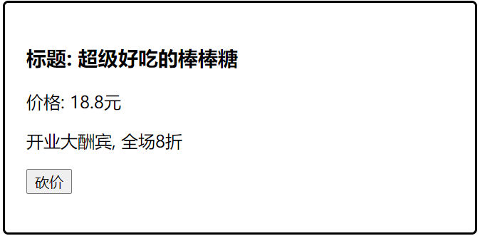

# Day04

## 知识点自测

- [ ] this指向=》调用者

```js
let obj = {
    fn: function(){
        // this指向此函数的调用者
    },
    fn () {
        // this指向当前函数的调用者 (如果都是在vue里, this指向的都是vue实例对象)
    },
    fn: () => {
        // this指向外层函数作用域this的值
    }
}
obj.fn();

axios().then(res => {
    // 这里的this的值是多少哦?
})
```

- [ ] =作用

```js
let a = 10;
let b = a; 
b = 20; // 基础类型, 单纯的值的赋值

let a = {name: "哈哈"};
let b = a; // a变量的值是引用类型, a里保存的是对象在堆的内存地址, 所以b和a指向同一个对象 (引用类型=是内存地址的赋值)
b.name = "刘总";
```

## 今日学习目标

1. 能够理解vue组件概念和作用
2. 能够掌握封装复用组件能力
3. 能够使用组件之间通信
4. 能够完成todo案例

## 12. vue组件

### 什么是组件化开发

> 组件是可复用的 Vue 实例, 封装标签, 样式和JS代码

组件分类：

1. **页面**组件当页面
2. 当页面下**功能组件**

**组件化开发** ：一个页面(.vue)可能有一个或多个组件(.vue)组成完整的页面功能

* 封装的思想，把页面上 `可重用的部分` 封装为 `组件`，从而方便项目的 开发 和 维护

**一个页面， 可以拆分成一个个组件，一个组件就是一个整体, 每个组件可以有自己==独立==的 结构 样式 和 行为(html, css和js)**


### 为什么用组件化开发

以前做过一个折叠面板, 现在想要多个收起展开的部分


方案1: 复制代码

- 代码重复 冗余
- 不利于维护

1. 案例用less写的样式, 所以下载

```bash
npm i less less-loader@5.0.0 -D
```

2. 相同样式, 不同的部分, 用不同的isShow变量

```html
<template>
  <div id="app">
    <h3>案例：折叠面板</h3>
    <div>
      <div class="title">
        <h4>芙蓉楼送辛渐</h4>
        <span class="btn" @click="isShow = !isShow">
          {{ isShow ? '收起' : '展开' }}
        </span>
      </div>
      <div class="container" v-show="isShow">
        <p>寒雨连江夜入吴, </p>
        <p>平明送客楚山孤。</p>
        <p>洛阳亲友如相问，</p>
        <p>一片冰心在玉壶。</p>
      </div>
    </div>
    <div>
      <div class="title">
        <h4>芙蓉楼送辛渐</h4>
        <span class="btn" @click="isShow1 = !isShow1">
          {{ isShow1 ? '收起' : '展开' }}
        </span>
      </div>
      <div class="container" v-show="isShow1">
        <p>寒雨连江夜入吴, </p>
        <p>平明送客楚山孤。</p>
        <p>洛阳亲友如相问，</p>
        <p>一片冰心在玉壶。</p>
      </div>
    </div>
    <div>
      <div class="title">
        <h4>芙蓉楼送辛渐</h4>
        <span class="btn" @click="isShow2 = !isShow2">
          {{ isShow2 ? '收起' : '展开' }}
        </span>
      </div>
      <div class="container" v-show="isShow2">
        <p>寒雨连江夜入吴, </p>
        <p>平明送客楚山孤。</p>
        <p>洛阳亲友如相问，</p>
        <p>一片冰心在玉壶。</p>
      </div>
    </div>
  </div>
</template>

<script>
export default {
  data() {
    return {
      isShow: false,
      isShow1: false,
      isShow2: false
    }
  }
}
</script>

<style lang="less">
body {
  background-color: #ccc;
  #app {
    width: 400px;
    margin: 20px auto;
    background-color: #fff;
    border: 4px solid blueviolet;
    border-radius: 1em;
    box-shadow: 3px 3px 3px rgba(0, 0, 0, 0.5);
    padding: 1em 2em 2em;
    h3 {
      text-align: center;
    }
    .title {
      display: flex;
      justify-content: space-between;
      align-items: center;
      border: 1px solid #ccc;
      padding: 0 1em;
    }
    .title h4 {
      line-height: 2;
      margin: 0;
    }
    .container {
      border: 1px solid #ccc;
      padding: 0 1em;
    }
    .btn {
      /* 鼠标改成手的形状 */
      cursor: pointer;
    }
  }
}
</style>

```

### 12.0_vue组件-封装创建

> 目标: 每个组件都是一个独立的个体, 代码里体现为一个独立的.vue文件

口诀: 哪部分标签复用, 就把哪部分封装到组件内

==(重要): 组件内template只能有一个根标签==

==(重要): 组件内data必须是一个函数, 独立作用域==

components/Pannel.vue

```vue
<template>
  <div>
    <div class="title">
      <h4>芙蓉楼送辛渐</h4>
      <span class="btn" @click="isShow = !isShow">
        {{ isShow ? "收起" : "展开" }}
      </span>
    </div>
    <div class="container" v-show="isShow">
      <p>寒雨连江夜入吴,</p>
      <p>平明送客楚山孤。</p>
      <p>洛阳亲友如相问，</p>
      <p>一片冰心在玉壶。</p>
    </div>
  </div>
</template>

<script>
export default {
  name: "Pannel",
  data() {
    return {
      isShow: false,
    };
  },
};
</script>

<style lang="less">
.title {
  display: flex;
  justify-content: space-between;
  align-items: center;
  border: 1px solid #ccc;
  padding: 0 1em;
}
.title h4 {
  line-height: 2;
  margin: 0;
}
.container {
  border: 1px solid #ccc;
  padding: 0 1em;
}
.btn {
  /* 鼠标改成手的形状 */
  cursor: pointer;
}
</style>

```

> 总结: 封装标签+样式+js - 组件都是独立的, 为了复用

### 12.1_vue组件-复用

> 目标: 创建后需要注册后再使用

#### 全局 - 注册使用

全局入口在main.js, 在new Vue之上注册 因为代码是从上到下，new vue是以app充当页面来渲染真是页面的，

语法:

```js
import Vue from 'vue'
import 组件对象 from 'vue文件路径'

Vue.component("组件名", 组件对象) vue文件输出就是对象
import App from '@/路径' @/相当于src文件
```

main.js

```diff
import Vue from 'vue'
import App from './App.vue'
+ import Pannel from './components/Pannel' // 引入组件文件对象

+ Vue.component("PannelCom", Pannel) // 组件名开头大写驼峰(推荐) => 全局注册一个组件

Vue.config.productionTip = false

new Vue({
  render: h => h(App),
}).$mount('#app')
```

全局注册PannelCom组件名后, 就可以当做标签在任意template里用  不要省略第二个参数

单双标签都可以, 运行后, 会把这个自定义标签当做组件解析, 使用==组件里封装的标签替换到这个位置==

在页面中使用：

```vue
<template>
  <div id="app">
    <h3>案例：折叠面板</h3>
    <PannelCom></PannelCom>
    	<!-- or -->
    <PannelCom />
  </div>
</template>
```

#### 局部 - 注册使用

语法: 

```js
import 组件对象 from 'vue文件路径'

export default {
    components: {
        键值对 名称一致简写
        "组件名": 组件对象
    }
}
```

在页面中使用：

```diff
<template>
  <div id="app">
    <h3>案例：折叠面板</h3>
    <PannelCom></PannelCom>
+    <Pannel></Pannel>
  </div>
</template>

<script>
+ import Pannel from './components/12.1_Pannel'
export default {
  components: {
+    Pannel: Pannel // key随便定义的组件名(也是一会使用的自定义标签名, 不能与已知的 标签重名)
  }
}
</script>

<style lang="less">
body {
  background-color: #ccc;
  #app {
    width: 400px;
    margin: 20px auto;
    background-color: #fff;
    border: 4px solid blueviolet;
    border-radius: 1em;
    box-shadow: 3px 3px 3px rgba(0, 0, 0, 0.5);
    padding: 1em 2em 2em;
    h3 {
      text-align: center;
    }
  }
}
</style>
```

组件使用总结:

1. (创建)封装html+js+css到独立的.vue文件中
2. (导入注册)组件文件 => 得到组件配置对象
3. (使用)当前页面当做**标签使用**

### 12.2_vue组件-scoped作用   样式模块化

> 目的: 解决多个组件样式名相同, 类名冲突问题 组件嵌套                        style全局

说明：

1. 默认组件style 中定义的样式是全局=》存在相同名字覆盖的情况=>==父覆盖子==

2. 局部样式=》在style标签上加上[scoped属性](https://vue-loader.vuejs.org/zh/guide/scoped-css.html)

* 在==父和子==style上加入scoped属性, 就会在此组件的标签上加上一个随机生成的data-v开头的属性唯一哈希值  .类名[data-v-哈希值]原理，哈希值就是随机的唯一性的字符串

* 而且必须是当前组件的元素或者子组件的根元素, 才会有这个自定义属性


> 总结: style上加scoped, 组件内的样式只在当前vue组件生效；相反，样式就是全局的

### 12.3_vue组件-/deep/深度作用选择符

> 目标：父组件控制子组件的样式（style都加了scoped属性情况）

父组件：

```diff
<template>
  <div class="box">
    <h1 class="red">父组件</h1>
    <hr />
+    <Child />
  </div>
</template>

<script>
import Child from '@/components/Child'
export default {
  components: {
    Child,
  },
}
</script>

<style scoped>
.red {
  color: blue;
}
+ .box /deep/ h2 {
+  color: lawngreen;
+ }
</style>
```

子组件：

```diff
<template>
  <div>
+    <h2>子组件</h2>
    <p class="red">
      <span>123</span>
    </p>
  </div>
</template>

<script>
export default {

}
</script>

<style scoped>
.red {
  color: red;
}
</style>
```

> 总结：父组件中控制子组件元素或类名，覆盖样式=》需要在前边加上 `/deep/`
>
> 加scoped在类名后加属性用属性选择器  .类名[data-v-哈希值]原理，加：deep或/deep/是在类名前加[data-v-哈希值]

注意⚠️：默认==子组件的根元素==，会带上父组件的data-v-hash属性，所以可以直接控制


## 13. vue组件通信

问题：因为每个组件的变量和值都是独立的=》 如果想获取对方页面中定义的变量应该怎么做？

* 组件通信先暂时关注父传子, 子传父

父: 使用其他组件的vue文件

子: 被引入到这个vue文件的组件(嵌入)

例如: App.vue(父)  MyProduct.vue(子)

### 13.0_vue组件通信_父向子-props

> 目的: 从外面给组件内传值, 先学会语法, 练习中在看使用场景

需求: 封装一个商品组件MyProduct.vue - 外部传入具体要显示的数据, 如下图所示


步骤:

1. 创建组件components/MyProduct_13.0.vue - 准备标签

2. 组件内再props定义变量, 用于接收外部传入的值

   ==props属性名建议都小写,因为标签里的属性只能小写/把变量驼峰转成-连接==

3. App.vue中引入注册组件, 使用时, 传入具体数据给组件显示

components/MyProduct_13.0.vue - 准备模板标签

```vue
<template>
  <div class="my-product">
    <h3>标题:</h3>
    <p>价格: 元</p>
    <p></p>
  </div>
</template>

<script>
export default {

}
</script>

<style>
.my-product {
  width: 400px;
  padding: 20px;
  border: 2px solid #000;
  border-radius: 5px;
  margin: 10px;
}
</style>
```

完整代码

components/MyProduct_13.0.vue

```vue
<template>
  <div class="my-product">
    <h3>标题: {{ title }}</h3>
    <p>价格: {{ price }}元</p>
    <p>{{ info }}</p>
  </div>
</template>

<script>
export default {
  props: ['title', 'price', 'info'] // 声明属性, 等待接收外部传入的值
}
</script>

<style>
.my-product {
  width: 400px;
  padding: 20px;
  border: 2px solid #000;
  border-radius: 5px;
  margin: 10px;
}
</style>
```

App.vue中使用并传入数据

```vue
<template>
  <div>
    <!--
      加: 后面是vue变量数据
      不加: 后面认为是字符串
     -->
    <MyProduct title="超级好吃的口水鸡" price="50" :info="msg"></MyProduct>
    <MyProduct :title="'超级难吃的榴莲'" :price="20" :info="msg"/>
  </div>
</template>

<script>
import MyProduct from './components/MyProduct_13.0'
export default {
  data(){
    return {
      msg: '开业大酬宾, 全场8折'
    }
  },
  components: {
    MyProduct
  }
}
</script>
```

> 总结: 组件封装复用的标签和样式, 而具体数据要靠外面传入  props相当于声明变量，值可以是数组和对象，数组的时候是要引号的

### 13.1_vue组件通信_父向子-循环复用

> 目的: 把数据循环分别传入给组件内显示  加速页面渲染

数据

```js
list: [
    { id: 1, proname: "超级好吃的棒棒糖", proprice: 18.8, info: '开业大酬宾, 全场8折' },
    { id: 2, proname: "超级好吃的大鸡腿", proprice: 34.2, info: '好吃不腻, 快来买啊' },
    { id: 3, proname: "超级无敌的冰激凌", proprice: 14.2, info: '炎热的夏天, 来个冰激凌了' },
],
```

正确代码(==不可复制==)`

```vue
<template>
  <div>
    <MyProduct v-for="obj in list"
    :title="obj.proname" 
    :price="obj.proprice" 
    :info="obj.info"
    :key="obj.id"></MyProduct>
  </div>
</template>

<script>
import MyProduct from "./components/MyProduct_13.1";
export default {
  data() {
    return {
      list: [
        { id: 1, proname: "超级好吃的棒棒糖", proprice: 18.8, info: '开业大酬宾, 全场8折' },
        { id: 2, proname: "超级好吃的大鸡腿", proprice: 34.2, info: '好吃不腻, 快来买啊' },
        { id: 3, proname: "超级无敌的冰激凌", proprice: 14.2, info: '炎热的夏天, 来个冰激凌了' },
      ],
    };
  },
  components: {
    MyProduct,
  },
};
</script>

<style>
</style>
```

### 扩展-单向数据流

在vue中需要遵循单向数据流原则  父组件的数据流向子组件，子组件只有接收和读取的权利，只要使用就必须接收 接收数据属性名和父组件传递属性名保持一致 两种方式 数组和对象，数组不会校验数据的类型和默认值，对象功能齐全，
  1. 父组件的数据发生了改变，子组件会自动跟着变
       2. > 子组件不能直接修改父组件传递过来的props =》  props是只读的简单数据类型,但是只要不修改复杂数据的地址就行不会报错

说明：==父组件传给子组件的是一个对象，子组件修改对象的属性，是不会报错的，对象是引用类型, 互相更新；但不能改变引用地址==  只要不修改对象的地址，

```diff
<template>
  <div>
    <MyProduct v-for="obj in list"
+    :obj="obj"
    :title="obj.proname"
    :price="obj.proprice"
    :info="obj.info"
    :key="obj.id"></MyProduct>
  </div>
</template>
```

> 总结: props的值不能重新赋值, 但是引用类型可以子改父
>
> 在父组件中给子组件动态绑定一个变量，如果不加冒号不是动态绑定就会传递字符串
>
> 在子组件内部通过props配置接收，数组和对象，推荐对象，接收的名字和动态绑定的属性名一致
>
> 

### 13.2_vue组件通信_子向父

> 目标: 从子组件把值传出来给外面使用或者修改父组件数据  子组件修改、赋值父组件数据


需求: 课上例子, 砍价功能, 子组件点击实现随机砍价-1功能



语法:

* 父: @自定义事件名="父methods函数"
* 子: this.$emit("自定义事件名", 传值) - 执行父methods里函数代码  事件名加引号


components/MyProduct_13.3.vue

```vue
<template>
  <div class="my-product">
    <h3>标题: {{ title }}</h3>
    <p>价格: {{ price }}元</p>
    <p>{{ info }}</p>
    <p>
      <button @click="kanFn">砍价</button>
    </p>
  </div>
</template>

<script>
export default {
  props: ['index', 'title', 'price', 'info'], // 声明属性, 等待接收外部传入的值
  methods: {
    kanFn(){
      this.$emit('subprice', this.index, 1)
    }
  }
}
</script>

<style>
.my-product {
  width: 400px;
  padding: 20px;
  border: 2px solid #000;
  border-radius: 5px;
  margin: 10px;
}
</style>
```

App.vue

```vue
<template>
  <div>
    <MyProduct
      v-for="(obj, index) in list"
      :title="obj.proname"
      :price="obj.proprice"
      :info="obj.info"
      :key="obj.id"
      :index="index"
      @subprice="fn"
    ></MyProduct>
  </div>
</template>

<script>
import MyProduct from "./components/MyProduct_13.3";
export default {
  data() {
    return {
      list: [
        {
          id: 1,
          proname: "超级好吃的棒棒糖",
          proprice: 18.8,
          info: "开业大酬宾, 全场8折",
        },
        {
          id: 2,
          proname: "超级好吃的大鸡腿",
          proprice: 34.2,
          info: "好吃不腻, 快来买啊",
        },
        {
          id: 3,
          proname: "超级无敌的冰激凌",
          proprice: 14.2,
          info: "炎热的夏天, 来个冰激凌了",
        },
      ],
    };
  },
  components: {
    MyProduct,
  },
  methods: {
    fn(index, price) {
      this.list[index].proprice = price;
    },
  },
};
</script>

<style>
</style>
```

> 总结: 父自定义事件和方法, 等待子组件触发事件给方法传值  通知父组件调用
>
> 都是父组件调用
>
> 父传子 加速渲染
>
> 子传父，把子组件的数据传递给父组件使用==》干事 回调函数 修改数据 谁和父组件通信自定义事件就绑在哪个标签组件上
>
> 
>
> 在父组件中为子组件绑定一个自定义事件+回调函数，（回头触发）
>
> 在子组件内部触发自定义事件 ：固定语法：  this.$emit('事件名'，data)   事件名是绑定的自定义事件名字，data是参数可选
>
> 


## 14. todo案例


### 14.0_todo案例-创建工程和组件

> 目标: 新建工程, 准备好所需的一切

预先准备: 把styles的样式文件准备好(从预习资料复制)

根据需求: 我们定义3个组件准备复用


components/TodoHeader.vue - 复制标签和类名

```vue
<template>
  <header class="header">
    <h1>todos</h1>
    <input id="toggle-all" class="toggle-all" type="checkbox" >
    <label for="toggle-all"></label>
    <input
      class="new-todo"
      placeholder="输入任务名称-回车确认"
      autofocus
    />
  </header>
</template>

<script>
export default {
 
}
</script>
```

components/TodoMain.vue - 复制标签和类名

```vue
<template>
  <ul class="todo-list">
    <!-- completed: 完成的类名 -->
    <li class="completed" >
      <div class="view">
        <input class="toggle" type="checkbox" />
        <label>任务名</label>
        <button class="destroy"></button>
      </div>
    </li>
  </ul>
  
</template>

<script>
export default {
}
</script>
```

components/TodoFooter.vue - 复制标签和类名

```vue
<template>
  <footer class="footer">
    <span class="todo-count">剩余<strong>数量值</strong></span>
    <ul class="filters">
      <li>
        <a class="selected" href="javascript:;" >全部</a>
      </li>
      <li>
        <a href="javascript:;">未完成</a>
      </li>
      <li>
        <a href="javascript:;" >已完成</a>
      </li>
    </ul>
    <button class="clear-completed" >清除已完成</button>
  </footer>
</template>

<script>
export default {

}
</script>
```

App.vue中引入和使用

```vue
<template>
  <section class="todoapp">
    <!-- 除了驼峰, 还可以使用-转换链接 -->
    <todo-header></todo-header>
    <todo-main></todo-main>
    <todo-footer></todo-footer>
  </section>
</template>

<script>
import TodoHeader from "./components/TodoHeader";
import TodoMain from "./components/TodoMain";
import TodoFooter from "./components/TodoFooter";

import "./styles/base.css"
import "./styles/index.css"
export default {
  components: {
    TodoHeader,
    TodoMain,
    TodoFooter,
  },
};
</script>
```

注意❓：页面组件根元素添加类名`todoapp`

### 14.1_todo案例-循环展示任务

> 目的: 把待办任务, 展示到页面TodoMain.vue组件上

App.vue

```js
<todo-main :list="list"></todo-main>

export default {
  data() {
    return {
      list: [
        { id: 100, name: "吃饭", isDone: true },
        { id: 201, name: "睡觉", isDone: false },
        { id: 103, name: "打豆豆", isDone: true },
      ],
    };
  }
};
```

TodoMain.vue

```vue
<template>
  <ul class="todo-list">
    <!-- completed: 完成的类名 -->
    <li :class="{ completed: item.isDone }" v-for="item in list" :key="item.id">
      <div class="view">
        <input class="toggle" type="checkbox" v-model="item.isDone" />
        <label>{{ item.name }}</label>
        <button class="destroy"></button>
      </div>
    </li>
  </ul>
</template>

<script>
export default {
  props: ["list"]
};
</script>

<style>
</style>
```

### 14.2_todo案例-添加功能

> 目标: 在顶部输入框输入要完成的任务名, 敲击回车, 完成新增功能

TodoHeader.vue

```vue
<template>
  <header class="header">
    <h1>todos</h1>
    <input id="toggle-all" class="toggle-all" type="checkbox" >
    <label for="toggle-all"></label>
    <input
      class="new-todo"
      placeholder="输入任务名称-回车确认"
      v-model="name"
      @keydown.enter="down"
    />
  </header>
</template>

<script>
export default {
    data(){
        return {
            name: ""
        }
    },
    methods: {
        down(ev){
            this.$emit("add", this.name)
            this.name = ""
        }
    }
}
</script>
```

App.vue

```js
<todo-header @add="addFn"></todo-header>

methods: {
    // ...省略了原来的方法
    addFn(name){
        this.list.push({
            id: Date.now(),
            name,
            isDone: false
        })
    }
}
```

### 14.3_todo案例-删除功能

> 目标: 实现点x, 删除任务功能

App.vue - 传入自定义事件等待接收要被删除的id或索引

```js
<todo-main :list="list" @del="delFn"></todo-main>

methods: {
    delFn(id) {
        // 把id过滤掉
        this.list = this.list.filter((item) => item.id !== id);
    },
},
```

TodoMain.vue - 把id传回去实现删除(想好数据在哪里, 就在哪里删除)

```js
<button class="destroy" @click="del(item.id)"></button>

methods: {
    del(id) {
        // console.log(id)
        this.$emit("del", id);
    },
},
```

注意⚠️：通过子传父删除，以免影响后续不同状态下数据的删除操作

### 14.4_todo案例-底部统计

> 目的: 显示现在任务的总数

TodoFooter.vue

```diff
<template>
  <footer class="footer">
+    <span class="todo-count">剩余<strong>{{list.length}}</strong></span>
    <ul class="filters">
      <li>
        <a class="selected" href="javascript:;">全部</a>
      </li>
      <li>
        <a href="javascript:;">未完成</a>
      </li>
      <li>
        <a href="javascript:;">已完成</a>
      </li>
    </ul>
    <button class="clear-completed">清除已完成</button>
  </footer>
</template>

<script>
export default {
+  props: ['list']
}
</script>

<style>

</style>
```

App.vue - 传入数据

```vue
<todo-footer :list="list"></todo-footer>
```

### 14.5_todo案例-数据切换(难点)

> 目的: 点击底部切换数据，显示对应状态的任务列表

需求：

1. 父组件中定义切换状态数据=》`全部 未完成 已完成`
2. 当前状态传递给子组件foot，根据切换状态高亮显示按钮
3. 显示对应状态的任务列表数据

父组件App.vue

```diff
<todo-main
+ :list="showArr"
/>
<todo-footer :list="list"
+             :condition="conStr"
+             @changeCondition="changeFn"
             />

<script>
    export default{
        data(){
            return {
                // ...其他代码省略
+               conStr: "all" // all(全部) completed(完成) incompleted(未完成)
            }
        },
        methods: {
            // ...其他省略
+            changeFn(str){ // 数据筛选-类型切换
+                this.conStr = str;
+            }
        },
+        computed: { // 计算不同状态的列表数据
            showArr(){
                if (this.conStr === 'completed'){
                    return this.list.filter(obj => obj.isDone)
                } else if (this.conStr === 'incompleted'){
                    return this.list.filter(obj => !obj.isDone)
                } else {
                    return this.list
                }
            }
+       }
    }
</script>
```

子组件TodoFooter.vue

```vue
<template>
  <footer class="footer">
    <span class="todo-count">剩余<strong>{{list.length }}</strong></span>
    <ul class="filters">
      <li>
        <a :class="{selected: condition === 'all'}" href="javascript:;" @click="changeFn('all')">全部</a>
      </li>
      <li>
        <a :class="{selected: condition === 'incompleted'}" href="javascript:;" @click="changeFn('incompleted')">未完成</a>
      </li>
      <li>
        <a :class="{selected: condition === 'completed'}" href="javascript:;" @click="changeFn('completed')">已完成</a>
      </li>
    </ul>
    <button class="clear-completed" @click="$emit('clearCompleted')">清除已完成</button>
  </footer>
</template>

<script>
export default {
  props: ['condition'],
  methods: {
    changeFn(str){
      this.$emit("changeCondition", str)
    }
  }
}
</script>
```

### 14.6_todo案例-清空已完成

> 目的: 点击右下角按钮- 把已经完成的任务删除了

App.vue - 先传入一个自定义事件-因为得接收TodoFooter.vue里的点击事件

```diff
<todo-footer :list="list"
             :condition="conStr"
             @changeCondition="changeFn"
+             @clearCompleted="clearFn"
             />

<script>
    clearFn(){ // 清空已完成
+      this.list = this.list.filter(obj => !obj.isDone)
    }
</script>
```

TodoFooter.vue=》**通知父组件删除已完成数据**

```vue
<button class="clear-completed" @click="$emit('clearCompleted')">清除已完成</button>
```

### 14.7_todo案例-数据缓存

> 目的: 新增/修改状态/删除 后, 马上把数据同步到浏览器本地存储

需求：

1. list默认值从本地取/没有给空数组
2. list发生任何变化都更新本地缓存

App.vue

```diff
<script>
    export default {
        data() {
            return {
+                list: JSON.parse(localStorage.getItem("todoList")) || [],
                conStr: "all" // all(全部) completed(完成) incompleted(未完成)
            };
        },
        components: {
            TodoHeader,
            TodoMain,
            TodoFooter,
        },
        methods: {
            delFn(id) {
                // 把id过滤掉
                this.list = this.list.filter((item) => item.id !== id);
            },
            addFn(name){
                this.list.push({
                    id: Date.now(),
                    name,
                    isDone: false
                })
            },
            changeFn(str){ // 数据筛选-类型切换
                this.conStr = str;
            },
            clearFn(){ // 清空已完成
                this.list = this.list.filter(obj => !obj.isDone)
            }
        },
+        watch: { // 监测状态改变, 也要同步到本地
            list: {
                deep: true,
                handler(listArr){
                    localStorage.setItem("todoList", JSON.stringify(this.list));
                }
            }
+        },
        computed: {
            showArr(){
                if (this.conStr == 'completed'){
                    return this.list.filter(obj => obj.isDone)
                } else if (this.conStr == 'incompleted'){
                    return this.list.filter(obj => !obj.isDone)
                } else {
                    return this.list
                }
            }
        }
    };
</script>
```

### 14.8_todo案例-全选功能

> 目标: 点击左上角v号, 可以设置一键完成, 再点一次取消

提示: 根据全选框的值，遍历所有的对象, 修改他们的完成状态属性的值和全选框的值保持一致

子组件TodoHeader.vue

```js
<input id="toggle-all" class="toggle-all" type="checkbox" v-model="all">
<label for="toggle-all"></label>


props: ['list'],
computed: {
	all: {
		set(val){
			this.$emit("isAll", val)
		},
		get(){
			return this.list.every(obj => obj.isDone)
		}
	}
},
```

父组件App.vue

```js
<todo-header :list="list" @add="addFn" @isAll="changeAllFn"></todo-header>

changeAllFn(bool){ // 全选改变事件
    this.list.forEach(obj => obj.isDone = bool);
}
```

## 今日总结

- [ ] 组件分类=》1.页面组件 2. 页面下功能 （.vue格式）
- [ ] 组件化开发是什么 =》一个页面由多个.vue文件组成，完成一个完整的页面效果
- [ ] 组件创建和**复用 =》1. 全局 （main.js）** 2. 局部


- [ ] 掌握组件通信的主要方式
  1. 父传子 =》父组件：提供数据 =》:传递数据名字="变量"     |   子组件：接收props:['传递数据名字']
  2. 子传父（单向数据流）=》父组件：提供自定义事件=》@语义化事件名="callback"   |   子组件：通知父组件修改 `this.$emit('语义化事件名', data,data2)`

## 今日作业

### 喜欢小狗狗吗

> 目标: 封装Dog组件, 用来复用显示图片和标题的

效果:


----

正确答案(==先不要看==)

components/Dog1.vue

```html
<template>
  <div class="my_div">
    
    <p>这是一个孤独可怜的狗</p>
  </div>
</template>

<script>
export default {};
</script>

<style>
.my_div {
  width: 400px;
  border: 1px solid black;
  text-align: center;
  float: left;
}

.my_div img {
  width: 100%;
}
</style>
```

在App.vue中使用

```vue
<template>
  <div>
    <Dog></Dog>
    <Dog/>
  </div>
</template>

<script>
import Dog from './components/Dog1'
export default {
  components: {
    Dog
  }
}
</script>

<style>

</style>
```

> 总结: 重复部分封装成组件, 然后注册使用

### 点击文字变色

> 目标: 修改Dog组件, 实现组件内点击变色

提示: 文字在组件内, 所以事件和方法都该在组件内-独立

图示:


正确代码(==先不要看==)

components/Dog2.vue

```html
<template>
  <div class="my_div">
    
    <p :style="{backgroundColor: colorStr}" @click="btn">这是一个孤独可怜的狗</p>
  </div>
</template>

<script>
export default {
  data(){
    return {
      colorStr: ""
    }
  },
  methods: {
    btn(){
      this.colorStr = `rgb(${Math.floor(Math.random() * 256)}, ${Math.floor(Math.random() * 256)}, ${Math.floor(Math.random() * 256)})`
    }
  }
};
</script>

<style>
.my_div {
  width: 400px;
  border: 1px solid black;
  text-align: center;
  float: left;
}

.my_div img {
  width: 100%;
}
</style>
```

### 卖狗啦

> 目标: 把数据循环用组件显示铺设

数据:

```js
[
    {
        dogImgUrl:
        "http://nwzimg.wezhan.cn/contents/sitefiles2029/10146688/images/21129958.jpg",
        dogName: "博美",
    },
    {
        dogImgUrl:
        "https://ss2.bdstatic.com/70cFvnSh_Q1YnxGkpoWK1HF6hhy/it/u=1224576619,1307855467&fm=26&gp=0.jpg",
        dogName: "泰迪",
    },
    {
        dogImgUrl:
        "https://ss2.bdstatic.com/70cFvnSh_Q1YnxGkpoWK1HF6hhy/it/u=2967740259,1518632757&fm=26&gp=0.jpg",
        dogName: "金毛",
    },
    {
        dogImgUrl:
        "https://pic1.zhimg.com/80/v2-7ba4342e6fedb9c5f3726eb0888867da_1440w.jpg?source=1940ef5c",
        dogName: "哈士奇",
    },
    {
        dogImgUrl:
        "https://timgsa.baidu.com/timg?image&quality=80&size=b9999_10000&sec=1563813435580&di=946902d419c3643e33a0c9113fc8d780&imgtype=0&src=http%3A%2F%2Fvpic.video.qq.com%2F3388556%2Fd0522aynh3x_ori_3.jpg",
        dogName: "阿拉斯加",
    },
    {
        dogImgUrl:
        "https://timgsa.baidu.com/timg?image&quality=80&size=b9999_10000&sec=1563813454815&di=ecdd2ebf479568453d704dffacdfa12c&imgtype=0&src=http%3A%2F%2Fwww.officedoyen.com%2Fuploads%2Fallimg%2F150408%2F1-15040Q10J5B0.jpg",
        dogName: "萨摩耶",
    },
]
```

图示:


正确代码(==不可复制==)

components/Dog3.vue

```vue
<template>
  <div class="my_div">
    
    <p :style="{backgroundColor: colorStr}" @click="btn">{{ dogname }}</p>
  </div>
</template>

<script>
export default {
  props: ['imgurl', 'dogname'],
  // ...其他代码省略
};
</script>
```

App.vue引入使用把数据循环传给组件显示

```vue
<template>
  <div>
    <Dog v-for="(obj, index) in arr"
    :key="index"
    :imgurl="obj.dogImgUrl"
    :dogname="obj.dogName"
    ></Dog>
  </div>
</template>

<script>
import Dog from './components/Dog3'
export default {
  data() {
    return {
      // 1. 准备数据
      arr: [
        {
          dogImgUrl:
            "https://img-pre.ivsky.com/img/tupian/pre/201605/30/pomeranian-001.jpg",
          dogName: "博美",
        },
        {
          dogImgUrl:
            "https://ss2.bdstatic.com/70cFvnSh_Q1YnxGkpoWK1HF6hhy/it/u=1224576619,1307855467&fm=26&gp=0.jpg",
          dogName: "泰迪",
        },
        {
          dogImgUrl:
            "https://ss2.bdstatic.com/70cFvnSh_Q1YnxGkpoWK1HF6hhy/it/u=2967740259,1518632757&fm=26&gp=0.jpg",
          dogName: "金毛",
        },
        {
          dogImgUrl:
            "https://gimg2.baidu.com/image_search/src=http%3A%2F%2Fs9.rr.itc.cn%2Fr%2FwapChange%2F20165_6_11%2Fa0teml39607703025596.png&refer=http%3A%2F%2Fs9.rr.itc.cn&app=2002&size=f9999,10000&q=a80&n=0&g=0n&fmt=jpeg?sec=1616048681&t=228c337babe1aed1e95a3e689693130f",
          dogName: "哈士奇",
        },
        {
          dogImgUrl:
            "https://timgsa.baidu.com/timg?image&quality=80&size=b9999_10000&sec=1563813435580&di=946902d419c3643e33a0c9113fc8d780&imgtype=0&src=http%3A%2F%2Fvpic.video.qq.com%2F3388556%2Fd0522aynh3x_ori_3.jpg",
          dogName: "阿拉斯加",
        },
        {
          dogImgUrl:
            "https://timgsa.baidu.com/timg?image&quality=80&size=b9999_10000&sec=1563813454815&di=ecdd2ebf479568453d704dffacdfa12c&imgtype=0&src=http%3A%2F%2Fwww.officedoyen.com%2Fuploads%2Fallimg%2F150408%2F1-15040Q10J5B0.jpg",
          dogName: "萨摩耶",
        },
      ],
    };
  },
  components: {
    Dog
  }
};
</script>
```

### 选择喜欢的狗

> 目标: 用户点击狗狗的名字, 在右侧列表显示一次名字

效果:


正确代码(==不可复制==)

components/Dog4.vue

```js
this.$emit("love", this.dogname);
```

App.vue

```vue
<template>
  <div>
    <Dog
      v-for="(obj, index) in arr"
      :key="index"
      :imgurl="obj.dogImgUrl"
      :dogname="obj.dogName"
      @love="fn"
    ></Dog>

    <hr />
    <p>显示喜欢的狗:</p>
    <ul>
      <li v-for="(item, index) in loveArr" :key="index">{{ item }}</li>
    </ul>
  </div>
</template>

<script>
import Dog from "./components/Dog4";
export default {
  data() {
    return {
        loveArr: []
    }
  },
  // ...中间省略代码
  methods: {
    fn(dogName) {
      this.loveArr.push(dogName)
    },
  },
};
</script>
```

