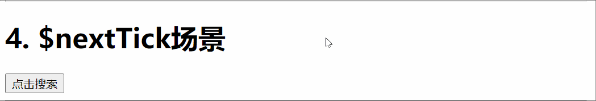

# 	Day05

## 知识点自测

- [ ] 知道window.onload的作用
- [ ] ajax是什么, XMLHttpRequest的使用步骤
- [ ] jQ的 $.ajax底层是什么
- [ ] Promise的作用
- [ ] async和await的作用-如何和Promise配合
- [ ] 同步异步的概念, 代码执行顺序
- [ ] 请求和响应, 以及JSON解析能力
- [ ] Vue基础, 组件使用, props传值, 组件通信, 计算属性使用, 对象引用类型使用

## 今日学习目标

- [ ] 能够说出vue组件生命周期
- [ ] 能够掌握axios的使用
- [ ] 能够了解\$refs, $nextTick使用
- [ ] 能够完成购物车案例开发

## 15. vue组件生命周期

### 什么是组件生命周期

> 一个组件从 创建 到 销毁 的整个过程就是生命周期


### 生命周期函数(钩子函数)

> vue 框架内置函数，随着组件的生命周期，自动按次序执行

作用：特定的时间点，执行某些特定的操作

场景: 组件创建完毕后，可以在created 生命周期函数中发起Ajax 请求，从而初始化 data 数据

分类:

- 初始化 =》创建组件  => beforeCreate created
- 挂载 =>渲染显示组件 =>  beforeMount mouted
- 更新 =》修改了变量=》触发视图刷新 => beforeUpdate updated
- 销毁 =》切换页面 =》会把组件对象从内存删除 => beforeDestory destoryed

[官网文档](https://cn.vuejs.org/v2/guide/instance.html#%E7%94%9F%E5%91%BD%E5%91%A8%E6%9C%9F%E5%9B%BE%E7%A4%BA)

下图展示了实例的生命周期。你不需要立马弄明白所有的东西，不过随着你的不断学习和使用，它的参考价值会越来越高。


### 生命周期函数执行过程

components/Life.vue - 创建一个文件（复制代码，演示执行过程）

```html
<template>
  <div>
    <ul id="myUl">
      <li v-for="(item, ind) in arr" :key="ind">{{ item }}</li>
    </ul>
    <button
      @click="
        () => {
          arr.push(Math.random() * 10);
        }
      "
    >
      增加一个元素
    </button>
  </div>
</template>

<script>
export default {
  data () {
    return {
      msg: "我是变量",
      arr: [1, 2, 3, 4],
      isShow: true,
    }
  },
  beforeCreate () {
    // 1. 创建前
    console.log("beforeCreate --- 实例初始化前")
    console.log(this.msg) // undefined
  },
  created () {
    // 2. 创建后=> 发送ajax请求
    console.log("created ---  实例初始化后")
    console.log(this.msg) // "我是变量"
  },
  beforeMount () {
    // 3. 挂载前
    console.log("beforeMount --- vue的虚拟DOM, 挂载到真实的网页之前")
    console.log(document.getElementById("myUl")) // null
    // console.log(document.getElementById("myUl").children[1].innerHTML) // 报错
  },
  mounted () {
    // 4. 挂载后=》操作dom
    console.log("mounted --- vue的虚拟DOM, 挂载到真实的网页上 ")
    // console.log(document.getElementById("myUl").children[1].innerHTML)
    console.log(document.querySelector('#myUl').children[1].innerText)
  },
  beforeUpdate () {
    // 5. 更新前
    console.log("beforeUpdate --- 数据更新, 页面更新前")
    // 比如点击新增数组元素, vue会触发此生命周期函数, 但是此时页面并未更新, 所以获取不到新增的li标签
    // console.log(document.getElementById("myUl").children[4].innerHTML) // 报错
  },
  updated () {
    // 6. 更新后
    console.log("updated --- 数据更新, 页面更新后")
    console.log(document.getElementById("myUl").children[4].innerHTML)
  },
  beforeDestroy () {
    // 7. 销毁前
     // (清除定时器 / 解绑js定义的事件 不包含模板的事件)
    console.log("beforeDestroy --- 实例销毁之前调用")
  },
  destroyed () {
    // 8. 销毁后
    // (清除定时器 / 解绑js定义的事件)
    console.log("destroyed --- 销毁完成")
  },
};
</script>

<style>
</style>
```

注意(面试)：

说明❓：==如果有子孙组件的情况下，所有子孙组件mounted之后父组件才会执行mounted==

App.vue - 引入使用

```vue
<template>
  <div>
     // 移除销毁模拟
    <Life v-if="isShow"/>
    <hr>
    <button @click="isShow = !isShow">销毁Life组件</button>
  </div>
</template>

<script>
import Life from './components/Life'
export default {
  data(){
    return {
      isShow: true
    }
  },
  components: {
    Life
  }
};
</script>
```

## 16. axios使用

### axios介绍

- [axios文档](http://www.axios-js.com/) 是一个专门用于发送ajax请求的库
  - 支持客户端发送Ajax请求
  - 支持服务端Node.js发送请求
  - 支持Promise相关用法
  - 支持请求和响应的拦截器功能
  - 自动转换JSON数据
- axios 底层还是原生js实现, 内部通过Promise封装的

### axios基本使用

```js
// 1. 导入axios
import axios from 'axios'
// 2. 使用
axios({
  method: '请求方式', // get post
  url: '请求地址',
  data: {    // 拼接到请求体的参数,  post请求的参数
    xxx: xxx,
  },
  params: {  // 拼接到请求url的参数, get请求的参数
   	xxx: xxx 
  }
}).then(res => {
  console.log(res.data) // 后台返回的结果
}).catch(err => {
  console.log(err) // 后台报错返回
})

```

### 案例-图书演示

说明：接口文档在笔记最后

`练习模板`

```vue
	<template>
  <div>
    <div>
      <h4>1. 查询所有图书信息</h4>
      <button @click="allFn">查询-看控制台</button>
    </div>
    <div>
      <h4>2. 查询某本图书信息</h4>
      <input type="text" placeholder="输入要查询的书名" v-model="bookName" />
      <button @click="selFn">查询-看控制台</button>
    </div>
    <div>
      <h4>3. 新增图书信息</h4>
      <input type="text" placeholder="书名" v-model="obj.bookname" />
      <input type="text" placeholder="作者" v-model="obj.author" />
      <input type="text" placeholder="出版社" v-model="obj.publisher" />
    </div>
    <button @click="addFn">点击新增图书</button>
  </div>
</template>
<script>
export default {
  data () {
    return {
      bookName: "",
      obj: {
        bookname: "",
        author: "",
        publisher: ""
      }
    }
  },
  methods: {
    // 获取所有图书
    allFn () {

    },
    // 查询某个图书信息
    selFn () {

    },
    // 新增图书
    addFn () {

    }
  },
}
</script>
```


`正确答案`

```vue
<template>
  <div>
    <div>
      <h4>1. 查询所有图书信息</h4>
      <button @click="allFn">查询-看控制台</button>
    </div>
    <div>
      <h4>2. 查询某本图书信息</h4>
      <input type="text" placeholder="输入要查询的书名" v-model="bookName" />
      <button @click="selFn">查询-看控制台</button>
    </div>
    <div>
      <h4>3. 新增图书信息</h4>
      <input type="text" placeholder="书名" v-model="obj.bookname"/>
      <input type="text" placeholder="作者" v-model="obj.author"/>
      <input type="text" placeholder="出版社" v-model="obj.publisher"/>
    </div>
    <button @click="addFn">点击新增图书</button>
  </div>
</template>

<script>
import axios from "axios";
export default {
  data() {
    return {
      bookName: "",
      obj: {
          bookname: "",
          author: "",
          publisher: ""
      }
    };
  },
  methods: {
    allFn() {
      axios({
        method: "get",
        url: "http://123.57.109.30:3006/api/getbooks",
      }).then(function (res) {
        console.log(res);
      });
    },
    selFn() {
      axios({
        method: "get",
        url: "http://123.57.109.30:3006/api/getbooks",
        params: {
          bookname: this.bookName,
        },
      }).then(function (res) {
        console.log(res);
      });
    },
    addFn(){
        axios({
            method: "POST",
            url: "http://123.57.109.30:3006/api/addbook",
            data: {
                appkey: "7250d3eb-18e1-41bc-8bb2-11483665535a",
                ...this.obj
            }
        }).then(res => {
            console.log(res);
        })
    }
  },
};
</script>

<style>
</style>
```

...扩展运算符可展开数组和对象

解构赋值可多层 {data:{data}}

created 只是引入了数据和事件props methods等，还未挂载

mounted才能使用获取

### 全局默认配置

* 入口`main.js`导入axios进行配置

```diff
+ import axios from "axios";
+ axios.defaults.baseURL = "http://123.57.109.30:3006"
```

* 组件中使用

```diff
import axios from "axios";

// 所有的axios请求都可以不带域名前缀了, 默认都拼接基础url
axios({
    method: "get",
-    url: "http://123.57.109.30:3006/api/getbooks",
+    url: "/api/getbooks",
}).then(function (res) {
    console.log(res);
});
```

##17.\$nextTick和$refs知识

> 不太常用, 高级用法, 先了解有印象

### 17.0 $refs使用

> 目标: 利用 ref 和 $refs 可以用于获取 dom 元素, 或者组件实例
>
>  * $refs作用：
>  * 步骤：1. 在元素身上写ref的属性：<p ref="p">value</p> 2.获取=》this.$refs.h1
>  * 1. 获取dom对象
>  * 2. 获取组件实例(.vue)=》调用方法=》干事

==使用场景1: 获取到原生DOM标签==

App.vue

```vue
<template>
  <div>
    <h1 ref="myH1">1. ref获取原生dom</h1>
    <button @click="fn">点击修改上面内容</button>
  </div>
</template>

<script>
export default {
  methods: {
    fn() {
      console.log(this.$refs.myH1); // <h1></h1> 原生DOM标签
      this.$refs.myH1.innerHTML = "改内容了";
    }
  }
}
</script>
```

==使用场景2: 获取组件对象, 调用组件里方法==

components/Demo.vue

```vue
<template>
  <div>
    <p :style="{ color: ind == 0 ? 'red' : '' }">首页</p>
    <p :style="{ color: ind == 1 ? 'red' : '' }">分类</p>
    <p :style="{ color: ind == 2 ? 'red' : '' }">爱好</p>
  </div>
</template>

<script>
export default {
  data() {
    return {
      ind: 0,
    };
  },
  methods: {
    changeIndex(index) {
      this.ind = index;
    },
  },
};
</script>

<style>
</style>
```

App.vue - 获取组件对象 - 调用组件方法

```vue
<h1>2. 调用demo组件方法</h1>
<button @click="fn2">点击demo组件里最后一个高亮</button>
<Demo ref="de"></Demo>

<script>
import Demo from "./components/Demo";
export default {
  components: {
    Demo,
  },
  methods: {
    // ...省略
    fn2() {
      this.$refs.de.changeIndex(2);
    },
  },
};
</script>
```

> 总结: ref定义值, 通过`$refs.值` 来获取dom或组件实例对象 父调子组件方法 元素上绑定的ref值是组件或vm的$refs的属性名         键
>
> 

### 17.1 $nextTick使用

> 目标: 等DOM更新后, 触发此方法里的回调函数
>
>  // 结论：数据驱动视图的时候=》变量值的修改是同步的/异步更新DOM（思考） => js单线程和dom更新花费时间多
>       this.count++ // 数字添加后, 异步更新DOM, 所以马上获取标签的值还是0

```js
async searchFn () {
      this.isShow = true // 点击显示输入框, 隐藏按钮
      // this.$refs.inp.focus() // 让输入框处于激活状态

      // 发现报错了, this.$refs.inp是个undefined(没获取到dom标签)
      // 因为数据isShow改变后, "异步"显示input, 而代码会继续往下走所以还没获取到input, 所以是undefined

      // 解决: 在dom更新后, 会触发$nextTick里的回调函数
      console.log(this.$nextTick())返回promise对象
      // 回调写法
      // this.$nextTick(() => {
      //   this.$refs.inp.focus()
      // })
      // async/await 写法(推荐)
      await this.$nextTick()
      // 异步更新之后走到下一行
      this.$refs.inp.focus()
```


==vue数据变化, 更新DOM过程是异步的==

示例演示：

Tick.vue

```vue
<template>
  <div>
    <p ref="a">数字: {{ count }}</p>
    <button @click="btn">点击+1, 观察打印</button>
  </div>
</template>

<script>
export default {
  data() {
    return {
      count: 0,
    };
  },
  methods: {
    btn() {
        this.count++; // 数字添加后, 异步更新DOM, 所以马上获取标签的值还是0
        console.log(this.$refs.a.innerHTML); // 0
        this.$nextTick(() => {
            console.log("DOM更新后触发$nextTick函数");
            console.log(this.$refs.a.innerHTML); // 1
        })
    },
  },
};
</script>
```

> 总结: dom是异步更新的, $nextTick可以等待dom更新后触发此方法

### 17.2 $nextTick使用场景

> 目标: 点击搜索按钮, 显示聚焦的输入框, 按钮消失=》默认输入框不显示



Search.vue

```vue
<template>
  <div>
      <input type="text" placeholder="输入要搜索的关键字" v-if="isShow" ref="inp">
      <button v-else @click="searchFn">点击搜索,出输入框并马上处于激活状态</button>
  </div>
</template>

<script>
export default {
    data(){
        return {
            isShow: false
        }
    },
    methods: {
        searchFn(){
            this.isShow = true // 点击显示输入框, 隐藏按钮
            // this.$refs.inp.focus() // 让输入框处于激活状态

            // 发现报错了, this.$refs.inp是个undefined(没获取到dom标签)
            // 因为数据isShow改变后, "异步"显示input, 而代码会继续往下走所以还没获取到input, 所以是undefined

            // 解决: 在dom更新后, 会触发$nextTick里的回调函数
            this.$nextTick(() => {
                this.$refs.inp.focus();
            })
        }
    }
}
</script>
```

App.vue - 引入使用即可

### 扩展-$nextTick返回Promise对象

> 所以上面还可以改成如下写法

```js
methods: {
    async searchFn(){
        this.isShow = true
        await this.$nextTick()
        this.$refs.inp.focus()
    }
}
```


## 18. 案例-购物车

### 18.0 案例-购物车-项目初始化

> 目标: 初始化新项目，选择less编写样式，清空不要的东西；下载[bootstrap](https://getbootstrap.net/docs/getting-started/download/)库；

1. 创建项目和安装开发依赖

```bash
vue create shopcar

npm i less@3.0.4 less-loader@5.0.0 -D  // 选了就不用装了
npm i bootstrap
```

2. 在main.js中引入bootstrap库样式

```js
import 'bootstrap/dist/css/bootstrap.min.css'
```

### 18.1 案例-购物车-创建组件

> 目标：根据页面效果，进行组件拆分=》组件化开发

组件拆分技巧：可以按照布局进行拆分，根据实际需要细化组件拆分

图示:


1. 按照需求, 把项目页面拆分成几个组件

* MyHeader组件

```vue
<template>
  <div class="my-header">购物车案例</div>
</template>

<script>
export default {

}
</script>

<style lang="less" scoped>
  .my-header {
    height: 45px;
    line-height: 45px;
    text-align: center;
    background-color: #1d7bff;
    color: #fff;
    position: fixed;
    top: 0;
    left: 0;
    width: 100%;
    z-index: 2;
  }
</style>
```

* MyFooter组件

```vue
<template>
  <!-- 底部 -->
  <div class="my-footer">
    <!-- 全选 -->
    <div class="custom-control custom-checkbox">
      <input type="checkbox" class="custom-control-input" id="footerCheck">
      <label class="custom-control-label" for="footerCheck">全选</label>
    </div>
    <!-- 合计 -->
    <div>
      <span>合计:</span>
      <span class="price">¥ 100</span>
    </div>
    <!-- 按钮 -->
    <button type="button" class="footer-btn btn btn-primary">结算 (0)</button>
  </div>
</template>

<script>
export default {

}
</script>

<style lang="less" scoped>
.my-footer {
  position: fixed;
  z-index: 2;
  bottom: 0;
  width: 100%;
  height: 50px;
  border-top: 1px solid #ccc;
  display: flex;
  justify-content: space-between;
  align-items: center;
  padding: 0 10px;
  background: #fff;

  .price {
    color: red;
    font-weight: bold;
    font-size: 15px;
  }
  .footer-btn {
    min-width: 80px;
    height: 30px;
    line-height: 30px;
    border-radius: 25px;
    padding: 0;
  }
}
</style>
```

* MyGoods组件 - 商品列表

```vue
<template>
  <div class="my-goods-item">
    <div class="left">
      <div class="custom-control custom-checkbox">
        <input type="checkbox" class="custom-control-input" id="input">
        <label class="custom-control-label" for="input">
          
        </label>
      </div>
    </div>
    <div class="right">
      <div class="top">商品名称</div>
      <div class="bottom">
        <span class="price">¥ 108</span>
        <span>这里放置counter组件</span>
      </div>
    </div>
  </div>
</template>

<script>
export default {
}
</script>

<style lang="less" scoped>
.my-goods-item {
  display: flex;
  padding: 10px;
  border-bottom: 1px solid #ccc;
  .left {
    img {
      width: 120px;
      height: 120px;
      margin-right: 8px;
      border-radius: 10px;
    }
     .custom-control-input {
      margin-right: 10px;
    }
    .custom-control-label::before,
    .custom-control-label::after {
      top: 50px;
    }
  }
  .right {
    flex: 1;
    display: flex;
    flex-direction: column;
    justify-content: space-between;
    .top{
        font-size: 14px;
        font-weight: 700;
    }
    .bottom {
      display: flex;
      justify-content: space-between;
      padding: 5px 0;
      align-items: center;
      .price {
        color: red;
        font-weight: bold;
      }
    }
  }
}

</style>
```

* MyCount组件=>在MyGoods中引入使用MyCount组件

`components/MyCount.vue`

```vue
<template>
  <div class="my-counter">
    <button type="button" class="btn btn-light">-</button>
    <input type="number" class="form-control inp" value="1">
    <button type="button" class="btn btn-light">+</button>
  </div>
</template>

<script>
export default {

}
</script>

<style lang="less" scoped>
.my-counter {
  display: flex;
  .inp {
    width: 45px;
    text-align: center;
    margin: 0 10px;
  }
  .btn, .inp{
    transform: scale(0.9);
  }
}
</style>
```

2. 然后引入到App.vue上注册

```vue
<template>
  <div>
    <MyHeader :backgroundColor="'red'" :color="'black'"></MyHeader>
    <div id="app">
      <MyGoods></MyGoods>
    </div>
    <MyFooter></MyFooter>
  </div>
</template>

<style>
#app {
  padding-top: 45px;
  padding-bottom: 50px;
}
</style>
```


> 总结: 明确目标, 拆分组件, 准备基础结构和样式

### 18.2 案例-购物车-头自定义

> 目的: 头部的标题, 颜色, 背景色可以随便修改, props类型的校验

说明❓：**Number, String, Boolean, Array,  Function, Object**  (常用类型)

思路：

1. 在MyHeader.vue中准备props里变量, 然后使用
2. 在使用MyHeader.vue组件时, 传入相应的值 (color和backgroundColor)

MyHeader.vue

```vue
<template>
    <div class="my-header" :style="{backgroundColor: backgroundColor, color: color}">{{title}}</div>
</template>

<script>
export default {
  props: {
    color: String,
    title: {
      type: String,
      default: '购物车案例'
    },
    backgroundColor: {
      type: String,
      required: true
    }
  }
}
</script>
```

App.vue传入相应自定义的值

```vue
<template>
  <div>
    <MyHeader :backgroundColor="'red'" :color="'black'"></MyHeader>
  </div>
</template>
```

> 总结:  
>
> props: [] - 只能声明变量和接收, 不能类型校验
>
> props: {} - 声明变量和校验类型规则 - 外部传入值不对则报错

### 18.3 案例-购物车-请求数据

> 目标: 使用axios把数据请求回来

数据地址: https://www.escook.cn/api/cart  (get方式)

1. 下载axios

```vue
npm i axios
```

2. App.vue请求使用

```js
import axios from 'axios'
export default {
  data () {
    return {
      goodsList: []
    }
  },
  created () {
    this.getGoodsList()
  },
  methods: {
    // 请求商品数据的方法
    async getGoodsList () {
      const res = await axios.get('https://www.escook.cn/api/cart') 
      const { list, status } = res.data
      if (status !== 200) return console.log('请求商品数据失败')
      this.goodsList = list
    }
  }
}
```

> 总结: 利用axios, 调用接口, 把数据请求回来

 * vue中发请求获取数据的步骤：
 * 1. 在methods中定义方法发请求
 * 2. 在created/mouted中调用请求方法
 * 2. 在created/mounted中调用请求方法=>获取后台数据 最好用created 因为此时还未渲染
 * 3. 获取到后台数据赋值给data中的变量=》渲染
 */

### 18.4 案例-购物车-数据渲染

> 目标: 把上面请求的数据, 铺设到页面上

App.vue

```vue
<MyGoods 
	v-for="obj in goodsList" 
	:key="obj.id"
	:goodsObj="obj"
></MyGoods>
```

MyGoods.vue

```vue
<template>
  <div class="my-goods-item">
    <div class="left">
      <div class="custom-control custom-checkbox">
        <input type="checkbox" class="custom-control-input" id="input" v-model="goodsObj.goods_state">
        <label class="custom-control-label" for="input">
          
        </label>
      </div>
    </div>
    <div class="right">
      <div class="top">{{ goodsObj.goods_name }}</div>
      <div class="bottom">
        <span class="price">¥ {{ goodsObj.goods_price }}</span>
        <span>
          <MyCount :obj="goodsObj"></MyCount>
        </span>
      </div>
    </div>
  </div>
</template>
<script>
import Counter from './MyCount'
export default {
  components: {
    Counter,
  },
  props: ['goodsObj']
}
</script>
```

> 总结: 把各个组件关联起来, 把	数据都铺设到页面上

### 18.5 案例-购物车-数量加减

MyCount.vue

```vue
<template>
  <div class="my-counter">
    <button type="button" class="btn btn-light" :disabled="obj.goods_count === 1" @click="obj.goods_count--">-</button>
    <input type="number" class="form-control inp" v-model.number="obj.goods_count">
    <button type="button" class="btn btn-light" @click="obj.goods_count++">+</button>
  </div>
</template>

<script>
export default {
  props: ["obj"]
}
</script>
```

> 总结：子组件接受数据是引用类型，可以局部修改，而且互相影响

### 18.6 案例-购物车-选中功能

> 问题: 点击label发现总是第一个被选中

* 原来id和for都是"input"

* 但是id是唯一的啊, 所以用数据的id来作为标签的id, 分别独立, 为了兼容label点击图片也能选中的效果

```diff
    <div class="left">
      <div class="custom-control custom-checkbox">
        <input
          type="checkbox"
          class="custom-control-input"
          v-model="goodsObj.goods_state"
+          :id="goodsObj.id"
        >
        <label
          class="custom-control-label"
+          :for="goodsObj.id"
        >
          
        </label>
      </div>
    </div>
```

> 总结: lable的for值对应input的id, 点击label就可以操作对应ID的元素

### 18.7 案例-购物车-全选功能

> 目标: 在底部组件上, 完成全选功能


思路: 

1. 点击获取全选框的选中状态
2. 同步给上面每个小选框 - 而小选框的选中状态又在数组里
3. 把数组传给MyFooter, 然后更新即可 - 因为对象都是引用关系的

MyFooter.vue

```vue
<!-- 全选 -->
<input
	type="checkbox"
	class="custom-control-input"
	id="footerCheck"
	v-model="isAll"
/>

<script>
export default {
  props: {
    goodsList: {
      type: Array,
    },
  },
  computed: {
    isAll: {
      set(val) {
        this.goodsList.forEach(obj => obj.goods_state = val)
      },
      get() {
        return this.goodsList.every(obj => obj.goods_state)
      },
    },
  },
};
</script>
```

App.vue

```vue
<MyFooter :goodsList="goodsList"></MyFooter>
```

> 总结: 全选框v-model的值绑定计算属性, 需要使用计算属性完整写法

### 18.8 案例-购物车-选中数量

> 目标: 完成底部组件, 显示选中的商品的**总数量**

思路：

计算父组件传递的商品列表数据=》渲染展示

MyFooter.vue

```js
<!-- 按钮 -->
<button type="button" class="footer-btn btn btn-primary">结算 ({{selCount}})</button>

<script>
export default {
  props: {
    goodsList: {
      type: Array,
    },
  },
computed: {
    // ...省略
+    selCount(){
+      return  this.goodsList.filter(obj => obj.goods_state).reduce((sum, obj) => sum += obj.goods_count , 0)
+    }
  }

}
</script>
```

> 总结: 计算属性依赖的数据也可以是父组件传递的数据

### 18.9 案例-购物车-计算总价

> 目标: 完成选中商品总价计算

MyFooter.vue

```js
    <!-- 合计 -->
    <div>
      <span>合计:</span>
      <span class="price">¥ {{selPrice}}</span>
    </div>

<script>
export default {
  props: {
    goodsList: {
      type: Array,
    },
  },
computed: {
    // ...省略
+    selPrice(){
+        return this.goodsList.filter(obj => obj.goods_state).reduce((sum, obj) => sum += 								obj.goods_price * obj.goods_count , 0)
+    }
  }
}
</script>
```

> 总结: 根据选中的商品和数量, 统计总价


## 今日总结

- [ ] vue的生命周期哪4个阶段, 哪8个自执行回调函数（钩子函数）

- [ ]  axios是什么, 底层是什么, 具体如何使用=》发送ajax请求获取后台数据

- [ ] axios返回的是什么, 如何接收结果=》返回Promise=>通过then回调或者async/await形式获取response结果

- [ ] 知道$refs使用和作用 =》可以获取DOM元素或组件实例

- [ ] 知道$nextTick的作用=》因为数据驱动视图=》数据的修改（同步），但是DOM更新是异步的

  

## 今日作业

把课上购物车再来一遍

## 接口文档

> axios请求接口使用

根域名: http://123.57.109.30:3006

### 案例 - 图书相关

#### 获取

* 请求方式:  GET
* 请求地址: 根域名/api/getbooks
* 请求参数: 

1. 不传参获取所有默认书籍
2. 也可以选择传递下面任意1-多个参数, 获取指定的相关书籍信息

| 参数名称  | 参数类型 | 是否必选 | 参数说明 |
| --------- | -------- | -------- | -------- |
| id        | Number   | 否       | 图书Id   |
| bookname  | String   | 否       | 图书名称 |
| author    | String   | 否       | 作者     |
| publisher | String   | 否       | 出版社   |
| appkey    | String   | 否       | 个人ID   |

* 返回示例:

```json
{
  "status": 200, // 状态码200都代表完全成功 - 无任何意义随便写, 只是方便前端写判断条件
  "msg": "获取图书列表成功", // 后台返回的提示消息, 随便写, 只是方便前端直接打印提示消息
  "data": [ // 后台返回的数据
    { "id": 1, "bookname": "西游记", "author": "吴承恩", "publisher": "北京图书出版社" },
    { "id": 2, "bookname": "红楼梦", "author": "曹雪芹", "publisher": "上海图书出版社" },
    { "id": 3, "bookname": "三国演义", "author": "罗贯中", "publisher": "北京图书出版社" }
  ]
}

```

#### 添加

* 请求方式: POST
* 请求地址: 根域名/api/addbook
* 请求参数:

| 参数名称  | 参数类型 | 是否必选 | 参数说明                                          |
| --------- | -------- | -------- | ------------------------------------------------- |
| bookname  | String   | 是       | 图书名称                                          |
| author    | String   | 是       | 作者                                              |
| publisher | String   | 是       | 出版社                                            |
| appkey    | String   | 是       | 个人ID - 用'7250d3eb-18e1-41bc-8bb2-11483665535a' |

* 返回示例:

```js
{
    "status": 201, // 后台返回数据逻辑层的状态码, 201代表后台已经新增加了一个资源
    "data": {
        "author": "施大神"
        "bookname": "水浒传2"
        "id": 41
        "publisher": "未来出版社"
    }
    "msg": "添加图书成功"
}
```

