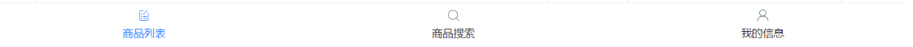

# Day06

## 知识点自测

- [ ] 组件创建, 注册和使用 - 伸手就来特别熟练
- [ ] 指令的作用=》v-bind:属性名="变量" | v-model="变量"等操作DOM

## 今日学习目标

1. 能够了解组件进阶知识
2. 能够掌握自定义指令创建和使用
3. 能够完成tabbar案例的开发

## 19. 组件进阶

### 19.0 组件进阶 - 动态组件

> 目标: 多个组件使用同一个挂载点，并可以动态切换，这就是动态组件

需求: 完成一个注册功能页面, 2个按钮切换, 一个填写注册信息, 一个填写用户简介信息

效果如下:


定义两个子组件：

* components/UserName.vue - 用户名和密码输入框 - 组件

* components/UserInfo.vue - 人生格言和自我介绍框 - 组件

在父组件Dynamic.vue中使用 `<component :is="comName"></component>`

```vue
<template>
  <div>
    <button @click="comName = 'UserName'">账号密码填写</button>
    <button @click="comName = 'UserInfo'">个人信息填写</button>

    <p>下面显示注册组件:</p>
    <div style="border: 1px solid red">
      <!-- vue内置的组件component, 可以动态显示组件 -->
      <component :is="comName"></component>
    </div>
  </div>
</template>

<script>
import UserName from "./UserName";
import UserInfo from "./UserInfo";
export default {
  data() {
    return {
      comName: "UserName",
    };
  },
  components: {
    UserName,
    UserInfo,
  },
};
</script>
```

在App.vue - 引入Dynamic.vue并使用显示

注意⚠️：

* is只能是动态属性=》`:is="组件名字符串或data变量"` 
* 不能直接拿注册标签名赋值使用

> 总结: vue内置component组件, 配合is属性, 设置要显示的组件标签名字

### 19.1 组件进阶 - 组件缓存

> 目标: 组件切换会导致组件被频繁销毁和重新创建, 性能不高

* 使用Vue内置的keep-alive组件, 可以让包裹的组件保存在内存中不被销毁

演示1: 可以先给UserName.vue和UserInfo.vue 注册created和destroyed生命周期事件, 观察创建和销毁过程

演示2: 使用keep-alive内置的vue组件, 让动态组件缓存而不是销毁

补充生命周期:

* activated - 激活
* deactivated - 失去激活状态

Dynamic.vue

```vue
<keep-alive>
    <!-- vue内置的组件component, 可以动态显示组件 -->
    <component :is="comName"></component>
</keep-alive>
```

> 总结: keep-alive可以提高组件的性能, 内部包裹的标签不会被销毁和重新创建, 触发激活和非激活的生命周期方法

### 扩展-缓存控制

> 可以使用keep-alive的include属性控制缓存范围

语法：`include="组件名1,组件名2..."` 组件的name                      // name相当于组件的ID，唯一的，而且不能和html已知元素名一样不赋值全部组件缓存  当组件定义了name属性后允许组件模板递归地调用自身。一般文件名一致注意，组件在全局用 `Vue.component()` 注册时，全局 ID 自动作为组件的 name。没name就是把注册时候的标签名作为id

指定 `name` 选项的另一个好处是便于调试。有名字的组件有更友好的警告信息。另外，当在有 [vue-devtools](https://github.com/vuejs/vue-devtools)，未命名组件将显示成 `<AnonymousComponent>`，这很没有语义。通过提供 `name` 选项，可以获得更有语义信息的组件树。

```vue
<keep-alive include="name1,name2">
    <!-- vue内置的组件component, 可以动态显示组件 -->
    <component :is="comName"></component>
</keep-alive>
```

 * 动态组件用法：<component :is="tagName"></component>
 * 说明：component是vue框架的内置全局组件
 * 注意：:is="变量（==要显示的组件的标签名==）" 注册组件的标签名  
 * 特点：默认的时候每次切换，都会把上次显示的组件销毁了=》后创建并显示当前组件（反复）=》没有缓存
 * 
 * 开发的时候，考虑性能问题，需要缓存动态切换的组件
 * 使用的技术：keep-alive是vue框架的内置全局组件 =>作用：缓存动态切换的组件（内存）
 * 用法：使用keep-alive包裹动态组件
 * 怎么控制缓存范围？
 * 使用keep-alive组件的include属性="组件的name值1,组件的name值2"=>说明：include内包含有的组件name的组件会被缓存   还有exclude排除
    activated（进入了：第一次组件创建页会执行一次） | deactivated（离开了） =》前提条件：只有当前组件被缓存才会执行
 * */

### 19.2 组件进阶 - 默认插槽

> 目标: 用于实现组件的内容分发, 通过 slot 标签, 可以接收到写在组件标签内的内容

==vue提供组件插槽能力, 允许开发者在封装组件时，把不确定的部分、用户指定的部分定义为插槽==

插槽例子:


需求: 以前折叠面板案例, 想要实现不同内容显示, 我们把折叠面板里的Pannel组件, 添加组件插槽方式


口诀: 

1. 子组件内用<slot></slot>占位
2. 父组件中使用子组件<Pannel></Pannel>夹着的地方, 传入标签替换slot

子-Pannel.vue - 组件

 * 插槽使用

 * 插槽的概念和作用：vue的插槽起到==渲染html结构的作用==（指定传入）==定制结构内容的显示==

 * 目的：让一个组件借助插槽技术=》==复用最大化==

 * 

 * ==默认插槽1个==

 * 使用步骤：1. 在子组件标签内些html结构（样式+绑定父的变量）2. 在组件中template中指定位置写个slot元素（vue框架内置全局组件）

 * ==具名插槽多个==  同默认插槽 有name 属性

 * 使用 在子组件元素标签中用template包裹html结构，template加一个v-solt名字指定是哪一个插槽，v-solt:"xxx"（v-bind可以省略成:    v-on: 可以省略成@   那么v-slot: 可以简化成#即  #xxx），在子组件接收的时候 slot加name属性 <solt name="xxx">

 * ==作用域插槽==  类似子传父 具名和默认类似父传子 传的是html结构   传递子组件的数据，把子组件的数据传到使用插槽的template区域中使用 让插槽内容能够访问子组件中才有的数据，在父组件中使用子组件中的内容【data中的数据】

    复用性最大化

   应用场景 表格渲染时定制内容的显示，虽然数据数组在父组件但是无法确定是哪个循环组件的插槽使用，要把数据传递给子组件，子组件使用插槽，把数据传递给父组件作用域下子组件应用插槽template 的名字后面解构赋值就能在区域使用，使用定义的插槽无关，这样能确定是哪一个插槽需要定制结构内容

 * 使用步骤：

 * 1. 在子组件slot身上写传递数据的属性：<slot name="名字" :data="子组件变量" />

 * 2. 在父组件具名插槽的template起名字的地儿接收：<template #名字="{data:子组件变量的值}"> (scope对象包装的数据，键自定义数据变量名，值为子组件数据)

显然页面渲染的顺序是调用时的顺序。
也就是说，我们在写模板插槽的时候，插槽的顺序并不重要，重要的是调用时的顺序。

注意默认插槽的缩写语法**不能**和具名插槽混用，因为它会导致作用域不明确：

只要出现多个插槽，请始终为*所有的*插槽使用完整的基于 `<template>` 的语法：


解构是按需加载   :传递的属性=“23”  冒号动态去除死数据，引号值去除表示变量报错，如果动态(冒号)数字引号会转为 数值型，此现象应用传递数据

```js
      <template v-slot:one={row}>
          <!-- <p>{{ scope }}</p> 插槽的名字后加等号赋值，值为一个对象，对象的名字规范scope可以解构scope可以自定义单永远是对象形式
        <p>{{ scope.row.name }}</p> -->
        <p>{{ row.name + ":" + row.age }}</p>
```


 * 

```js
<template>
  <div>
    <!-- 按钮标题 -->
    <div class="title">
      <h4>芙蓉楼送辛渐</h4>
      <span class="btn" @click="isShow = !isShow">
        {{ isShow ? "收起" : "展开" }}
      </span>
    </div>
    <!-- 下拉内容 -->
    <div class="container" v-show="isShow">
+      <slot></slot>
    </div>
  </div>
</template>

<script>
export default {
  data() {
    return {
      isShow: false,
    };
  },
};
</script>

<style scoped>
h3 {
  text-align: center;
}

.title {
  display: flex;
  justify-content: space-between;
  align-items: center;
  border: 1px solid #ccc;
  padding: 0 1em;
}

.title h4 {
  line-height: 2;
  margin: 0;
}

.container {
  border: 1px solid #ccc;
  padding: 0 1em;
}

.btn {
  /* 鼠标改成手的形状 */
  cursor: pointer;
}

img {
  width: 50%;
}
</style>
```

父-UserSlot.vue - 使用组件

```vue
<template>
  <div id="container">
    <div id="app">
      <h3>案例：折叠面板</h3>
      <Pannel>
        
        <span>我是文字哦</span>
      </Pannel>
      <Pannel>
        
        <span>我是文字哦</span>
      </Pannel>
      <Pannel>
        <div>
          <p>寒雨连江夜入吴,</p>
          <p>平明送客楚山孤。</p>
          <p>洛阳亲友如相问，</p>
          <p>一片冰心在玉壶。</p>
        </div>
      </Pannel>
    </div>
  </div>
</template>

<script>
import Pannel from "./Pannel";
export default {
  components: {
    Pannel,
  },
};
</script>

<style>
#app {
  width: 400px;
  margin: 20px auto;
  background-color: #fff;
  border: 4px solid blueviolet;
  border-radius: 1em;
  box-shadow: 3px 3px 3px rgba(0, 0, 0, 0.5);
  padding: 1em 2em 2em;
}
</style>
```

> 总结: 组件内容分发技术, slot占位, 使用组件时传入替换slot位置的标签

注意：插槽内样式父子组件都可以直接控制

### 19.3 组件进阶 - 插槽默认内容

> 目标: 如果外面不给传, 想给个默认显示内容

口诀: <slot>夹着内容默认显示内容, 如果不给插槽slot传东西, 则使用<slot>夹着的内容在原地显示

```vue
<slot>默认内容</slot>
```

### 19.4 组件进阶 - 具名插槽

> 目标: 当一个组件内有2处以上需要外部传入标签的地方

* 传入的标签可以分别派发给不同的slot位置

要求: v-slot一般跟template标签使用 (template是html5新出标签内容模板元素, 不会渲染到页面上, 一般被vue解析为内部标签)

1. 子组件-Pannel2.vue - 留下具名slot

```vue
<div class="container" v-show="isShow">
    <slot name="one"></slot>
    <slot name="two"></slot>
</div>
```

2 .父组件-UseSlot2.vue

==v-slot可以简化成#使用==

> v-bind可以省略成:    v-on: 可以省略成@   那么v-slot: 可以简化成#但是仅限template使用div等盒子用slot，但是会生成不必要的div

写法1:

```vue
<Pannel2>
    <template v-slot:one>
		
    </template>
    <template v-slot:two>
		<span>我是文字哦</span>
    </template>
</Pannel2>
```
写法2：

```vue
<Pannel2>
    <!-- 简化写法 -->
    <template #one>
		<div>
            <p>寒雨连江夜入吴,</p>
            <p>平明送客楚山孤。</p>
            <p>洛阳亲友如相问，</p>
            <p>一片冰心在玉壶。</p>
        </div>
    </template>
    <template #two>
		
    </template>
</Pannel2>
```

> 总结: slot的name属性起插槽名；使用组件时, template配合#插槽名传入具体html标签或组件

### 19.5 组件进阶 - 作用域插槽

> 目标: 子组件中的数据, 在给插槽赋值时在父组件环境下使用=> 子传父=》传数据

复习: 插槽内slot中显示默认内容

> 例子: 默认内容和数据在子组件中, 但是父组件需要借助插槽自定义内容=》获取子的数据

口诀: 

* 创建子组件, 准备slot, 在slot上绑定属性和子组件值
* 使用子组件, 传入自定义标签, 用template和v-slot="自定义变量名"  
* 自定义变量名会自动绑定slot上所有属性, 就可以使用子组件内值, 并替换slot位置解构赋值按需绑定
* 如果父组件使用作用域插槽没赋值就显示默认插槽的数据

1. 子组件-Pannel3.vue - 定义组件, 和具名插槽, 给slot绑定属性和值 

```vue
<template>
  <div>
    <p>这里是个Pannel3-子组件, 下面是插槽位置</p>
    <slot name="one" :row="slotDefault">{{ slotDefault.default1 }}</slot>
  </div>
</template>

<script>
export default {
  data(){
    return {
      slotDefault: {
        default1: "无名氏",
        default2: "孙红雷"
      }
    }
  }
}
</script>
```

2. 父组件-UseSlot3.vue

```vue
<template>
  <div>
    <!-- 夹着位置不传, slot使用默认内容"无名氏" -->
    <Pannel3></Pannel3>
    <!-- 想要改变默认内容, 但是默认数据在子组件里, 想让插槽使用就使用插槽作用域 -->
    <!-- 
      口诀: 1.创建组件, 准备slot, 在slot上绑定属性和子组件值
      2. 使用组件, 传入自定义标签, 用template和v-slot="自定义变量名"
      3. 自定义变量名会自动绑定slot上所有属性, 就可以使用子组件内值, 并替换slot位置
     -->
    <Pannel3>
      <template v-slot:one="scope">
        {{ scope.row.default2 }}
      </template>
    </Pannel3>
  </div>
</template>

<script>
import Pannel3 from './Pannel3'
export default {
  components: {
    Pannel3
  }
}
</script>
```

> 总结: 组件内变量绑定在slot上, 然后使用组件v-slot:插槽名字="变量" ，变量上就会绑定slot传递的属性和值  父

### 19.6 组件进阶 - 作用域插槽使用场景

> 目标: 了解作用域插槽使用场景, 自定义组件内标签+**内容**

案例: 封装一个表格组件, 在表格组件内循环产生单元格

准备示例数据：

```js
[
  {
    name: "小传同学",
    age: 18,
    headImgUrl:
    "https://gitee.com/mengi/imgs/raw/master/img/1.jpeg",
  },
  {
    name: "小黑同学",
    age: 25,
    headImgUrl:
    "https://gitee.com/mengi/imgs/raw/master/img/3.jpeg",
  },
  {
    name: "智慧同学",
    age: 21,
    headImgUrl:
    "https://gitee.com/mengi/imgs/raw/master/img/4.jpeg",
  }
]
```

1. 封装MyTable.vue 

```vue
<template>
  <div>
    <table border="1">
      <thead>
        <tr>
          <th>序号</th>
          <th>姓名</th>
          <th>年龄</th>
          <th>头像</th>
        </tr>
      </thead>
      <tbody>
        <tr v-for="(obj, index) in arr" :key="index">
          <td>{{ index + 1 }}</td>
          <td>{{ obj.name }}</td>
          <td>{{ obj.age }}</td>
          <td>
            <slot :data="obj">{{ obj.headImgUrl }}</slot>
          </td>
        </tr>
      </tbody>
    </table>
  </div>
</template>

<script>
export default {
  props: {
    arr: {
      type: Array,
      default: () => []
    }

  }
}
</script>
```

2. UseTable.vue - 准备数据, 传入给MyTable.vue组件里循环使用

```vue
<template>
  <div>
      <MyTable :arr="list">
          <!-- <template v-slot:default="scope"> -->
          <template v-slot="scope">
              
          </template>
      </MyTable>
  </div>
</template>

<script>
import MyTable from "./MyTable";
export default {
  components: {
    MyTable
  },
  data() {
    return {
      list: [
        {
          name: "小传同学",
          age: 18,
          headImgUrl:
            "https://gitee.com/mengi/imgs/raw/master/img/1.jpeg",
        },
        {
          name: "小黑同学",
          age: 25,
          headImgUrl:
            "https://gitee.com/mengi/imgs/raw/master/img/3.jpeg",
        },
        {
          name: "智慧同学",
          age: 21,
          headImgUrl:
            "https://gitee.com/mengi/imgs/raw/master/img/4.jpeg",
        },
      ],
    };
  },
};
</script>

<style>
</style>
```

```
 * 插槽使用
 * 插槽的概念和作用：vue的插槽起到渲染html结构的作用（指定传入）
 * 目的：让一个组件借助插槽技术=》复用最大化
 * (1). 默认插槽(1个)
 * (1). 默认插槽(1个)(父传子)
 * 使用步骤：1. 在子组件标签内写html结构（可以控制样式+绑定父的变量传入）2. 在子组件template中指定位置写个slot元素（vue框架内置全局组件）接收插槽传递内容
 * (2). 具名插槽（多个）=> 起名字 v-slot:名字 === #名字（推荐）
 * (2). 具名插槽（多个）(父传子)=> 起名字 v-slot:名字 === #名字（推荐）
 * 使用步骤：1. 在子组件标签内用template包裹写html结构，template加个v-slot:名字 2. 在子组件template中指定位置写个slot元素（vue框架内置全局组件）接收插槽传递内容,同时指定name值（和v-slot:name的值）
 * 3. 作用域插槽
 * (3). 作用域插槽(子传父)=》传递子组件的数据，给传入的插槽结构使用
 * 使用步骤：
 * 1. 在子组件slot身上写传递数据的属性：<slot name="名字" :data="子组件变量" />
 * 2. 在父组件具名插槽的template起名字的地儿接收：<template #名字="{data:子组件变量的值}">
 */
```


> 
>
> 总结: 插槽可以自定义显示内容； 作用域插槽可以把组件内的值取出来自定义显示内容

## 20. 自定义指令            ---------------------操作DOM

[自定义指令文档](https://cn.vuejs.org/v2/guide/custom-directive.html#ad)（了解）

* 除了核心功能默认内置的指令 (`v-model` 和 `v-show`)等，Vue 也允许注册自定义指令=》 `v-xxx`  

1. html+css+js的复用的主要形式是组件

2. 你需要对普通 DOM 元素进行底层操作，这时候就会用到自定义指令

### 20.0 自定义指令-定义方式

> 目标: 获取标签, 扩展额外的功能

#### 全局注册   ==inserted==

在main.js用 Vue.directive()方法来进行注册, 以后随便哪个.vue文件里都可以直接用v-fofo指令

```js
参数 自定义指令名字 ， 对象（逻辑）

Vue.directive("fofo",  {
  //el表示绑定指令的dom对象/元素
    inserted(el){
    el.focus()
  }
})
```

#### 局部注册

Direct.vue - 只能在当前组件.vue文件中使用

```vue
<template>
  <div>
    <input type="text" v-focus />
  </div>
</template>

<script>
export default {
  // 局部注册
  directives: {
    focus: { // 自定义指令名
        inserted(el){ // 固定配置项 - 当指令插入到标签自动触发此函数
            el.focus()
        }
    },
  },
};
</script>
```

> 总结: 全局注册自定义指令, 哪里都能用, 局部注册, 只能在当前vue文件里用

### 20.1 自定义指令-传值和更新

> 目标: 使用自定义指令, 传入一个值

需求: 定义color指令-传入一个颜色, 给标签设置文字颜色

main.js定义处修改一下

```js
Vue.directive("color", {
  inserted(el, binding){ // 插入时触发此函数一次
    el.style.color = binding.value;
  },
  update(el, binding){ // 更新绑定的变量时触发此函数=》手动更新
    el.style.color = binding.value;
  }
})
```

Direct.vue处更改一下

```vue
<p v-color="theColor" @click="changeColor">使用v-color指令控制颜色, 点击变蓝</p>

<script>
  data() {
    return {
      theColor: "red",
    };
  },
  methods: {
    changeColor() {
      this.theColor = 'blue';
    },
  },
</script>
```

> 总结: v-xxx, 自定义指令, 获取原生DOM, 自定义操作

> 指令钩子函数会被传入以下参数：
>
> - `el`：指令所绑定的元素，可以用来直接操作 DOM。
>
> - ```
>   binding
>   ```
>
>   ：一个对象，包含以下 property：
>
>   - `name`：指令名，不包括 `v-` 前缀。
>   - `value`：指令的绑定值，例如：`v-my-directive="1 + 1"` 中，绑定值为 `2`。
>   - `oldValue`：指令绑定的前一个值，仅在 `update` 和 `componentUpdated` 钩子中可用。无论值是否改变都可用。
>   - `expression`：字符串形式的指令表达式。例如 `v-my-directive="1 + 1"` 中，表达式为 `"1 + 1"`。
>   - `arg`：传给指令的参数，可选。例如 `v-my-directive:foo` 中，参数为 `"foo"`。
>   - `modifiers`：一个包含修饰符的对象。例如：`v-my-directive.foo.bar` 中，修饰符对象为 `{ foo: true, bar: true }`。
>
> - `vnode`：Vue 编译生成的虚拟节点。移步 [VNode API](https://cn.vuejs.org/v2/api/#VNode-接口) 来了解更多详情。
>
> - `oldVnode`：上一个虚拟节点，仅在 `update` 和 `componentUpdated` 钩子中可用。
>
> 除了 `el` 之外，其它参数都应该是只读的，切勿进行修改。如果需要在钩子之间共享数据，建议通过元素的 [`dataset`](https://developer.mozilla.org/zh-CN/docs/Web/API/HTMLElement/dataset) 来进行。

## 21. 案例-tabbar

> 需求分析和效果演示


知识点:

- 组件封装
- 动态组件
- keep-alive
- 作用域插槽
- 自定义指令

### 21.0 案例-tabbar-创建项目

> 目标: 创建和初始化项目, 下载bootstrap, axios

```bash
vue create tabbar-demo
npm i bootstrap axios
npm i less@3.0.4 less-loader@5.0.0 -D
```

1. 删除不相关文件

 2. 在main.js中引入bootStrap.css和案例字体图标样式

说明：字体图标文件在`02-其它资源/tabBar案例图标/fonts`，拷贝到项目assets目录下

```js
import 'bootstrap/dist/css/bootstrap.min.css'
import './assets/fonts/iconfont.css'
```

### 21.1 案例-tabbar-创建组件

> 目标：根据需求进行组件拆分和创建


注意：商品列表页面，列表抽离为公共的table组件开发

创建如下文件：

1. MyHeader.vue

```vue
<template>
  <div class="my-header">
    拼刀刀
  </div>
</template>

<script>
export default {
}
</script>

<style lang="less" scoped>
.my-header {
  height: 50px;
  line-height: 50px;
  text-align: center;
  font-size: 16px;
  background-color: red;
  color: #fff;
  position: fixed;
  left: 0;
  top: 0;
  width: 100%;
}
</style>

```

2. MyTabBar.vue

```vue
<template>
  <div class="my-tab-bar">
  	<div class="tab-item" v-for="item in 3" :key="item">
      <!-- 图标 -->
      <span class="iconfont icon-shangpinliebiao"></span>
      <!-- 文字 -->
      <span>商品{{item}}</span>
    </div>
  </div>
</template>

<script>
export default {
}
</script>

<style lang="less" scoped>
.my-tab-bar {
  position: fixed;
  left: 0;
  bottom: 0;
  width: 100%;
  height: 50px;
  border-top: 1px solid #ccc;
  display: flex;
  justify-content: space-around;
  align-items: center;
  background-color: white;
  .tab-item {
    display: flex;
    flex-direction: column;
    align-items: center;
  }
}
</style>

```

3. components/MyTable.vue(可复用=》能自定义表格显示的数据)

```vue
<template>
  <table class="table table-bordered table-stripped">
    <!-- 表格标题区域 -->
    <thead>
      <tr>
        <th>#</th>
        <th>商品名称</th>
        <th>价格</th>
        <th>标签</th>
        <th>操作</th>
      </tr>
    </thead>
    <!-- 表格主体区域 -->
    <tbody>
      <tr >
        <td>1</td>
        <td>商品</td>
        <td>998</td>
        <td>xxx</td>
        <td><button class="btn btn-danger btn-sm">删除</button></td>
      </tr>
    </tbody>
  </table>
</template>

<script>
export default {
}
</script>

```

4. MyGoodsList.vue

* 导入复用的MyTable组件，注册使用

 5. MyGoodsSearch.vue和MyUserInfo.vue做切换练习使用，无功能

 6. 导入创建的组件到App.vue中注册使用

> 总结：根据需求准备页面组件

### 21.2 案例-tabbar-头部封装

> 目标: 完成底部导航自定义标题和背景色功能

使用技术：父传子=》props自定义组件显示


1. 允许用户自定义  **title 标题**
2. 允许用户自定义  **bgcolor 背景色**

MyHeader.vue

```vue
<template>
  <div class="my-header" :style="{ backgroundColor: bgcolor }">
    {{ title }}
  </div>
</template>

<script>
export default {
  props: {
    title: {
      type: String,
      default: 'tabbar 案例'
    },
    bgcolor: {
      type: String,
      default: '#1d7bff'
    }
  }
}
</script>

<style lang="less" scoped>
.my-header {
  height: 50px;
  line-height: 50px;
  text-align: center;
  font-size: 16px;
  background-color: red;
  color: #fff;
  position: fixed;
  left: 0;
  top: 0;
  width: 100%;
}
</style>
```

### 21.3 案例-tabbar-底部封装

> 目标: 实现MyTabBar.vue组件功能



1. 通过 ` tabs` 的 props 属性，为 tabbar 组件指定数据源
2. 数据源的限制:  tabbar 的 item 项最少 2 个，最多 5 个
3. 每个 tabbar 的 item 配置项，至少要包含如下两个属性：
   - icon -> 要展示的图标
   - text -> 显示的文本
4. 从App.vue给MyTabBar.vue传入底部导航的数据

MyTabBar.vue

```vue
<template>
  <div class="my-tab-bar">
  	<div class="tab-item" v-for="item in tabs" :key="item.text">
      <!-- 图标 -->
      <span class="iconfont" :class="item.icon"></span>
      <!-- 文字 -->
      <span>{{ item.text }}</span>
    </div>
  </div>
</template>

<script>
export default {
  name: "MyTabBar",
  props: {
    tabs: {
      type: Array,
      required: true,
      // props的自定义校验
      validator (value) {
        // 校验长度必须是2-5位
        if (value.length >= 2 && value.length <= 5) {
          return true
        } else {
          console.error('tabList长度必须是2-5位')
          return false
        }
      }
    },
  },
};
</script>

<style lang="less" scoped>
.my-tab-bar {
  position: fixed;
  left: 0;
  bottom: 0;
  width: 100%;
  height: 50px;
  border-top: 1px solid #ccc;
  display: flex;
  justify-content: space-around;
  align-items: center;
  background-color: white;
  .tab-item {
    display: flex;
    flex-direction: column;
    align-items: center;
  }
}
</style>
```

App.vue

```vue
<MyTabBar :tabs="tabList"></MyTabBar>

<script>
import MyTabBar from "@/components/MyTabBar"
export default {
	components: {
		MyHeader,
		MyTabBar
    },
    data() {
        return {
          tabList: [
            {
              icon: "icon-shangpinliebiao",
              text: "商品列表",
            },
            {
              icon: "icon-sousuo",
              text: "商品搜索",
            },
            {
              icon: "icon-user",
              text: "我的信息",
            },
          ],
        };
     },
}
</script>
```

### 21.4 案例-tabbar-底部高亮

> 总结: 点击底部导航实现高亮效果

步骤:

1. 绑定点击事件, 获取点击的索引
2. 给循环的标签设置动态class, 当遍历的索引, 和点击保存的索引比较, 相同则高亮

MyTabBar.vue里定义

```diff
<template>
  <div class="my-tab-bar">
    <div
      class="tab-item"
      v-for="(item, index) in tabs"
      :key="item.text"
+      :class="{ current: activeIndex === index }"
+      @click="tabClickFn(index)"
    >
      <!-- 图标 -->
      <span class="iconfont" :class="item.icon"></span>
      <!-- 文字 -->
      <span>{{ item.text }}</span>
    </div>
  </div>
</template>

<script>
import "../assets/fonts/iconfont.css";
export default {
  name: "MyTabBar",
  data() {
    return {
+      activeIndex: 0,
    };
  },
  methods: {
    tabClickFn(ind) {
+      this.activeIndex = ind;
    },
  },
  // 省略props
};
</script>

<style lang="less" scoped>
/* 省略了代码... */

+ .current {
  color: #1d7bff;
}
</style>
```

### 21.5 案例-tabbar-组件切换

> 目的: 点击底部导航, 切换页面组件显示

思路: 现在还没学路由, 所以, 使用动态组件切换页面

步骤:

1. 在App.vue - 引入所有需要切换的组件-**3个页面**
2. 给底部**导航数据每个对象**添加属性name保存**组件标签名字**
3. tabbar点击后, 把应该切换的组件名再传递出来, 赋予给is属性, 实现组件切换

父组件-App.vue - 引入并注册

```diff
<template>
  <div>
    <MyHeader />
    <div class="main">
      <keep-alive>
+        <components :is="isCom"></components>
      </keep-alive>
    </div>
+    <MyTabBar :tabs="tabList" @changeCom="changeFn"></MyTabBar>
  </div>
</template>

<script>
import MyHeader from "@/components/MyHeader";
import MyTabBar from "@/components/MyTabBar";
import MyGoodsList from "@/components/MyGoodsList";
import MyGoodsSearch from "@/components/MyGoodsSearch";
import MyUserInfo from "@/components/MyUserInfo";
export default {
  components: {
    MyHeader,
    MyTabBar,
    MyGoodsList,
    MyGoodsSearch,
    MyUserInfo,
  },
  methods: {
    changeFn(ind) {
+      this.isCom = this.tabList[ind].name;
    },
  },
  data() {
    return {
+      isCom: "MyGoodsList", // 页面默认显示的
      tabList: [
        {
          icon: "icon-shangpinliebiao",
          text: "商品列表",
+          name: "MyGoodsList",
        },
        {
          icon: "icon-sousuo",
          text: "商品搜索",
+          name: "MyGoodsSearch",
        },
        {
          icon: "icon-user",
          text: "我的信息",
+          name: "MyUserInfo",
        },
      ],
    };
  },
};
</script>

<style scoped>
.main {
  padding: 50px 0;
}
</style>
```

子组件-MyTabBar.vue - 点击传递过来索引, 把组件名字替换到动态组件位置显示

```diff
methods: {
    tabClickFn(ind) {
      this.activeIndex = ind;
+      this.$emit("changeCom", ind);
    },
  },
```

### 21.6 案例-tabbar-商品列表-请求数据

> 目标: 使用axios请求数据, 传入表格组件渲染

main.js - 注册axios配置默认地址

```js
import axios from 'axios'

axios.defaults.baseURL = "https://www.escook.cn"
Vue.prototype.$axios = axios
```

MyGoodsList.vue - 使用axios请求数据, 把数据传入给MyTable.vue里循环铺设

```vue
<template>
  <div>
    <MyTable :data="goodsList">
    </MyTable>
  </div>
</template>

<script>
import MyTable from "./MyTable";
export default {
  data() {
    return {
      goodsList: [],
    };
  },
  components: {
    MyTable,
  },
  methods: {
    // 初始化商品的数据
    async getGoodsList() {
      // 发送ajax请求
      const res = await this.$axios.get("/api/goods");
      const { status, data } = res.data;
      if (status !== 0) return console.log("获取商品列表失败");
      // 请求成功
      this.goodsList = data;
    }
  },
  created() {
    this.getGoodsList();
  },
};
</script>
```

### 21.7 案例-tabbar-商品列表-自定义表格-插槽技术

> 目标: 使用插槽技术, 给MyTable.vue组件, 自定义列标题, 自定义表格内容

步骤:

1. 提高组件复用性, 把表格列标题thead部分预留<slot>标签, 设置name属性
2. 使用MyTable.vue时, 传入**自定义的列标题标签**
3. 表格**内容td部分也可以让组件使用者自定义**, 也给tbody下tr内留好<slot>标签和name属性名


子组件-MyTable.vue - 留好具名插槽

```diff
<template>
  <table class="table table-bordered table-stripped">
    <!-- 表格标题区域 -->
    <thead>
      <tr>
+        <slot name="header"></slot>
      </tr>
    </thead>
    <!-- 表格主体区域 -->
    <tbody>
      <tr v-for="(item, i) in data" :key="item.id">
+        <slot name="body"></slot>
      </tr>
    </tbody>
  </table>
</template>

<script>
export default {
  name: 'MyTable',
  props: {
    data: {
      type: Array,
      default: () => []
    }
  }
}
</script>
```

父组件-MyGoodsList.vue 使用

```vue
<template>
  <div>
    <MyTable :data="goodsList">
      <template #header>
        <th>#</th>
        <th>商品名称</th>
        <th>价格</th>
        <th>标签</th>
        <th>操作</th>
      </template>

      <template #body>
        <td>1</td>
        <td>xxx</td>
        <td>¥ 99.00</td>
        <td>xxx</td>
        <td>
          <button class="btn btn-danger btn-sm">删除</button>
        </td>
      </template>
    </MyTable>
  </div>
</template>
```

### 21.8 案例-tabbar-商品列表-作用域插槽

> 目标: 在传入标签时, 要使用对应组件内的数据

思路：

1. 子MyTable.vue里在**slot上绑定动态属性和值**
2. 父-MyGoodsList.vue在template上**声明变量接收**
3. 插槽td标签上使用MyTable.vue内的数据

MyTable.vue

```diff
<tbody>
    <tr v-for="(item, index) in data" :key="item.id">
+        <slot name="body" :row="item" :index="index"></slot>
    </tr>
</tbody>
```

MyGoodsList.vue

```vue
<template #body="scope">
    <td>{{ scope.index + 1 }}</td>
    <td>{{ scope.row.goods_name }}</td>
    <td>¥ {{ scope.row.goods_price }}</td>
    <td>{{ scope.row.tags }}</td>
    <td>
    	<button class="btn btn-danger btn-sm">删除</button>
    </td>
</template>
```

### 21.9 案例-tabbar-商品列表-tags渲染

> 目标: 把单元格里的标签, tags徽章铺设下

bootstrap徽章: https://v4.bootcss.com/docs/components

MyGoodsList.vue - 插槽

```vue
<span v-for="tag in row.tags" :key="tag" class="badge btn-danger">{{ tag }}</span>
```

下面额外添加样式

```vue
<style lang="less" scoped>
.my-goods-list {
  .badge {
    margin-right: 5px;
  }
}
</style>
```

### 21.10 案例-tabbar-商品列表-删除功能

> 目标: 点击删除对应这条数据

1. 父-MyGoodsList.vue - 注册点击事件

```jsx
<button class="btn btn-danger btn-sm" @click="delFn(scope.index)">删除</button>
```

2. 父-MyGoodsList.vue - 根据 id 删除

```jsx
delFn(index){
    this.goodsList.splice(index, 1)
}
```


## 今日总结

1. 动态组件的使用步骤

2. 组件缓存使用步骤和作用 

3. 组件插槽用法

   传递html结构内容

   * 默认插槽 =》1. 子组件标签下不使用template写html结构 2. 子组件通过<slot></slot>
   * 具名插槽 => 1. 子组件标签下使用template =》包裹传递html结构 =》template上提供名字#插槽名 2. 子组件通过<slot name="插槽名"></slot>
   
   传递数据=》子传父
   
   *  作用域插槽=> 1. 子组件<slot name="插槽名" :传递数据的名字="变量"></slot> 2. 父组件=》<template #插槽名="接收数据对象"></template>
   
   插槽使用的目的：
   
   使复用组件的内容结构和数据动态化=》增强组件的可复用性


4. 自定义指令如何使用

指令作用：操作DOM元素

几种方式？

1. 全局 =》Vue.directive('指令名', { inserted (el, bind)  { 操作DOM } })
2. 局部=》在组件对象 { directives: { 指令名: {指令逻辑}  }  }

  ```js
  <p v-指令名="data"></p>
  ```


## 今日作业

把课上的tabbar再来一遍

