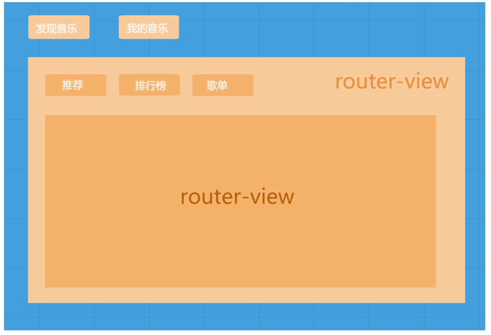

# Day07

## 知识点自测

- [ ] url的组成部分都有哪些, hash值指的什么

## 今日学习目标

1. 能够了解单页面应用概念和优缺点
2. 能够掌握vue-router路由系统使用
3. 能够掌握链接导航和编程式导航用法
4. 能够掌握路由嵌套和路由守卫

## 22. vue路由 - 简介和基础使用   浏览器 **URL 中的哈希值**( # hash) 与 **展示视图内容(组件)** 之间的对应规则，不同的hash对应的不同的页面组件

[vue路由官网](https://router.vuejs.org/zh/)

### 22.0 路由 - SPA单页面应用

> 目标: 了解什么是单页面应用, 以及前端路由作用

演示：MPA demo回顾多页应用

SPA（Single Page Application）：单页面富应用

* 单页面应用: 所有功能在一个页面上实现=》组件组成，完成开发=》组件化开发

**前端路由**: 专门为SPA提供页面（组件）切换功能=》**.vue文件的跳转支持**

[网易云音乐](https://music.163.com/)

单页面-多页面对比

| 对比部分     | 单页应用（最流行）                                 | 多页面应用（传统方式）           |
| ------------ | -------------------------------------------------- | -------------------------------- |
| 页面组成     | 一个html文件多个组件组成                           | 多个html文件                     |
| 静态资源共用 | 共用，一次性加载完毕,借助ssr优化server side render | 不共用，每个页面都加载一遍       |
| 刷新方式     | 页面局部刷新                                       | 整页加载                         |
| url模式      | itcast.com/#/pageone                               | itcast.com/pageone.html          |
| 用户体验     | **用户体验良好**                                   | 页面切换加载缓慢体验较差         |
| 数据传递     | 容易                                               | 依赖url传参，cookie,localStorage |
| 搜索引擎优化 | 不利于seo优化，需要ssr优化                         | 支持良好                         |
| 使用场景     | 追求高体验 不要求seo                               | 高度要求seo                      |
| 开发成本     | 较高 需要依赖专业的框架, 开发效率高                | 较低 重复代码多, 开发效率低      |

说明❓：ssr（server side render）指服务端渲染

优点：

- 整体不刷新页面，用户体验更好
- 组件化，数据传递容易, 开发效率高

缺点：

* 一定的学习成本

- 首次加载会比较慢一点
- 不利于seo搜索引擎优化

> 总结: 单页面应用, 用户体验好, 开发效率高

### 22.1 路由 - SPA下组件分类

> 目标:  .vue文件分2类, 一个是页面组件, 一个是复用组件

src/views(或pages) 文件夹 和 src/components文件夹

* 页面组件 - 页面展示 - **配合路由用**（父组件）
* 复用组件 - 展示数据/常用于复用 功能组件 （子孙组件）


> 总结: views下的页面组件, 配合路由切换, components下的一般引入到views下的vue中复用展示数据

SEO搜索内容==》蜘蛛不时地爬取存到数据库（搜索引擎）+算法        索引  抓静态/不会js           获取页面是单页面应用文件doc页面请求从服务器下载执行默认是空的，内容是js动态生成，蜘蛛抓取不能获取关键字，不利于索引，NUXTjs、谷歌搜索可以 

### 22.2 路由 - 工作原理介绍

> 目标: 前端路由的本质, 对url的hash值进行改变和监听，切换对应页面组件的dom结构

演示： [网易云音乐](https://music.163.com/)的一级路由切换, 路径对应下面不同的组件页面

总结： 

- **前端路由** : 是浏览器 **URL 中的哈希值**( # hash) 与 **展示视图内容(组件)** 之间的==对应规则==
- **为什么要学习路由**: 
  - ==SPA渐进式 =>vue => vuer-router (管理组件之间的跳转)==
  - ==提升网页显示的速度, 提高网站的性能==
- **vue 中的路由** : 是 **hash** 和 **component** 的对应关系, **一个哈希值对应一个组件页面**

> 总结: 路由本质是就是hash值和组件的对应关系

### 22.3 路由 - 工作原理手写

> 目标: 了解hash改变, 如何显示不同的组件的过程

基本思路:

1. 用户点击了页面上的a链接
2. 导致了 URL 地址栏中的 Hash 值发生了变化
3. 前端js监听了到 Hash 地址的变化
4. 前端js把当前 Hash 地址对应的组件渲染都浏览器中

实现简单的前端路由:

1. src/views/创建并在App.vue里导入和注册组件

   MyHome.vue

   MyMovie.vue

   MyAbout.vue

```html
<script>
import MyAbout from '@/views/my-about.vue'
import MyHome from '@/views/my-home.vue'
import MyMovie from '@/views/my-movie.vue'
export default {
  components: {
    MyHome,
    MyAbout,
    MyMovie
  }
}
</script>
```

2. 通过动态组件, 控制要显示的组件

```vue
<template>
  <div>
    <h1>App组件</h1>
    <component :is="comName"></component>
  </div>
</template>

<script>
export default {
  // ...省略其他
  data () {
    return {
      comName: 'MyHome'
    }
  }
}
</script>
```

3. 声明三个导航链接, 点击时修改地址栏的 hash 值

```jsx
<template>
  <div>
    <h1>App组件</h1>
    <a href="#/home">首页</a>&nbsp;
    <a href="#/movie">电影</a>&nbsp;
    <a href="#/about">关于</a>&nbsp;
    <component :is="comName"></component>
  </div>
</template>
```

4. 在 created 中, 监视地址栏 hash 时的变化, 一旦变化, 动态切换展示的组件

```jsx
created () {
  window.onhashchange = () => {
    switch(location.hash) {
      case '#/home':
        this.comName = 'my-home'
        break
      case '#/movie':
        this.comName = 'my-movie'
        break
      case '#/about':
        this.comName = 'my-about'
        break
    }
  }
},
```

> 总结: 改变浏览器url的hash值, JS监听到hash值改变, 把对应的组件显示到同一个挂载点


window中有location.hash        

监听hash变化 window.onhashchange事件 ，回调函数/箭头函数，hash改变执行回调，根据hash值渲染hash对应的页面

```vue
<template>
  <div>
    <h1>路由原理</h1>
    <!-- 菜单 -->
    <div class="menu">
      <a href="#/home">首页</a>
      <a href="#/about">关于我们</a>
      <a href="#/contact">联系我们</a>
    </div>
    <hr />
    <component :is="currCom" />
  </div>
</template>

<script>
import Home from './pages/home.vue'
import About from './pages/about.vue'
import Contact from './pages/contact.vue'

export default {
  components: {
    Home,
    About,
    Contact
  },
  data () {
    return {
      currCom: 'Home'
    }
  },
    // 创建钩子
  created() {
    // 刷新时候因为有默认值且监听到变化时才会切换hash切页面,url的hash和对应的组件不同步
    // 在最初执行一次
    const currhash = location.hash;
    if (currhash === "Home") {
      this.currc = "Home";
    } else if (currhash === "About") {
      this.currc = "About";
    } else {
      this.currc = "Contact";
    }

    // 监听浏览器url中hash值的变化
    window.onhashchange = () => {
      console.log('url中hash值的变化:', location.hash)
      // 根据hash值，渲染hash值对应的页面
      const currHash = location.hash
      if (currHash === '#/home') {
        this.currCom = 'Home'
      } else if (currHash === '#/about') {
        this.currCom = 'About'
      } else {
        this.currCom = 'Contact'
      }
    }
  }
}
</script>

<style lang="less" scoped>
.menu {
  a {
    display: inline-block;
    margin: 10px;
  }
}
</style>
```


### 22.4 路由 - 官方路由基本使用

> 目标: 学会vue官方提供的vue-router路由系统功能模块使用

[vue-router文档](https://router.vuejs.org/zh/)

说明⚠️：如果使用vue-cli创建项目，没有选择路由插件，需要单独安装和写下边初始化代码

- 安装

```bash
npm i vue-router
```

+ 导入路由

```js
import VueRouter from 'vue-router'
```

+ 使用路由插件

```jsx
// 在vue中，使用vue的插件，都需要调用Vue.use()
Vue.use(VueRouter)
```

+ 创建路由规则数组

```js
const routes = [
  {
    path: "/home",
    component: MyHome
  },
  {
    path: "/movie",
    component: MyMovie
  },
  {
    path: "/about",
    component: MyAbout
  }
]
```

+ 创建路由对象 -  传入规则

```jsx
const router = new VueRouter({
  routes
})
```

+ 关联到vue实例

```jsx
new Vue({
  router
})
```

+ components换成router-view

```vue
<router-view></router-view>
```

+ 可以把App.vue-created里自己实现的删除了, 观察效果

> 总结: 下载路由模块, 编写对应规则注入到vue实例上, 使用router-view挂载点显示切换的路由


空格选中


流程：插件下载导入---注册----实例化new---导出----app用<router-view / >挂载路由组件渲染 

定义

1. 初始化路由

* 导入vue和 插件（库）注册 Vue.use(插件对象)路由的path和component的hash，数组，每一个对象是路由规则
* 实例化一个router路由对象，属性和值为配置路由规则es6语法
* 导出router实例化对象，在main.js引入挂载

2. import router的实例对象 导入后全局挂载router，==所有组件都有可以使用它的方法==
3. 在根组件中用<router-view / >==挂载路由组件渲染== 内置全局组件直接用

使用

先配置就是配置routes数组的路由规则：

1. 先导入页面组件
2. 在数组中配置规则：每一条路由至少有path和component   路径不加# 组件对象名字


在APP.vue主组件中，内容上就有<router-view></router-view>，然后在其他页面也有<router-view></router-view>，可以理解为：一层路径(`/xxx`)对应一个`router-view`

> `<router-view>` 组件是一个 functional 组件，渲染路径匹配到的视图组件。`<router-view>` 渲染的组件还可以内嵌自己的 `<router-view>`，根据嵌套路径，渲染嵌套组件

 <!-- app.vue组件 一个项目只有一个根组件  根组件里放的元素，所有页面都可以看到（共用）  而路由组件需要挂载到根组件  链接导航-->

用router-link:代替了a，因为a会刷新页面，他不会，router-link最后渲染到页面是a 连接， 想控制样式直接a样式 <!-- 1. to的值就是路由规则的path不加# -->

用户不输入任何就可以跳转路由在配置index.js中把对应的path路由规则修改为'\',在hash或path不能有任何不必要的字符，修改会因为路由的模糊匹配导致路由切换不一致，（会默认把\都误认为是一个路由）解决：精确匹配

1. 通过在<router-link to='/' exact> 加exact属性 因为属性和值一致就写exact就行
2.  a标签和router-link区别就是, 路由组件激活时自带class   less加类名  &.router-link-exact-active 不仅能精准匹配还能修改高亮样式（匹配url中hash值, 包含to属性值, 链接会**自动添加此类名**）


路由中有三个基本的概念 route, routes, router。

1， route，它是一条路由，由这个英文单词也可以看出来，它是单数， Home按钮 => home内容， 这是一条route, about按钮 => about 内容， 这是另一条路由。

2， routes 是一组路由，把上面的每一条路由组合起来，形成一个数组。[{home 按钮 =>home内容 }， { about按钮 => about 内容}]

3， router 是一个机制，相当于一个管理者，它来管理路由。因为routes 只是定义了一组路由，它放在哪里是静止的，当真正来了请求，怎么办？ 就是当用户点击home 按钮的时候，怎么办？这时router 就起作用了，它到routes 中去查找，去找到对应的 home 内容，所以页面中就显示了 home 内容。

4, 页面一部分是点击部分，另一部分是点击后的内容部分。点击后，如何实现正确的对应，必须在js文件中配置路由器视图路由。


## 23. vue路由 - 链接导航

### 23.0 链接导航 - 基础使用

> 目标: 可用全局组件router-link来替代a标签

1. vue-router提供了一个全局组件 router-link: 作用用于提供路由链接
2. router-link实质上最终会渲染成a链接 to属性等价于提供 href属性
3. router-link提供了链接导航高亮的功能


```vue
<template>
  <div>
    <h1>App组件</h1>
    <ul>
      <li><router-link to="/home">首页</router-link></li>
      <li><router-link to="/movie">电影</router-link></li>
      <li><router-link to="/about">关于</router-link></li>
    </ul>
    <router-view></router-view>
  </div>
</template>

<script>
export default {};
</script>

<style>
</style>
```

> 总结: 链接导航, 用router-link配合to, 实现点击切换路由通过router-link可以使<router-view/>中的显示内容路由（跳转）到src/router/index.js文件中配置的组件中去，这类似于html的a标签中的href（注意：href页面会刷新，在这里则不会 a标签和router-link区别就是, 路由组件激活时自带class），其实这就好比tab选项卡中的头部选项，router-view好比tab选项卡的body选项。就是几个跳转链接跳到对应的子页面，程序运行的时候，会将<template>标签里面的内容都注入到App.vue页面中的router-view标签中，从而实现无刷新的路由跳转

### 23.1 链接导航 - 高亮显示

> 目标: a标签和router-link区别就是, 路由组件激活时自带class

我们只需要声明具体class类名, 设置好具体的样式即可了

* 类名：`router-link-active` 匹配(模糊匹配)url中hash值, 包含to属性值, 链接会**自动添加此类名**

```css
/* 只需定义类名的css样式 */
.router-link-active {
  color: orange;
}
/* 推荐用这个高亮(精确匹配) */
.router-link-exact-active {
      color: #42b983;
}
```

说明❓：如果路由中有path='/'，就需要使用内置的`router-link-exact-active `类名控制高亮

### 23.2 链接导航 - 跳转传参

> 目标: 在跳转路由时, 可以给跳转的目标组件传值，有参数传递就可以发请求了
>
> 
>
> query？查询字符串直接修改    <router-link to="/about/?a=66&b=666" ></router-link>可以用变量那么to内用模板字符串${}
>
> params用的比较多动态参数 定义规则加： 
>
> params路由配置里的路由规则是 path:'/detail/:id'，是参数，链接导航是   <router-link to="/detail/:4/:dijia"></router-link> 是值 
>
> 创建components/MyGoods.vue - 准备接收路由上传递的参数和值   `this.$route.query或者params获取`，`this.$route`是vc的原型对象上的属性 

回顾：html页面之间如何传参=》`url?key=val&key=val`

* query传参
* params传参（动态路由=> ==详情页==）

1. 创建components/MyGoods.vue - 准备接收路由上传递的参数和值    

   ```vue
   <div>
       你要浏览的商品是: {{ $route.query.name }} {{ $route.params.goodsId}}
   </div>
   ```

2. 路由定义

   ```js
   {
       path: "/goods",
       component: MyGoods
     },
     {
       path: "/goods/:goodsId",
       component: MyGoods
     },
   ```

3. 导航跳转, 传值给MyGoods.vue组件

   ```vue
   <li><router-link to="/goods?name=外套">外套</router-link></li>
   <li><router-link to="/goods/123">详情</router-link></li>
   ```

> 总结: 
>
> 1. ?key=value =》  用$route.query.key 取值
> 2. /值-需要提前在路由规则/path/:key =》  用$route.params.key  取值
> 3. 传递参数不能缺少，关系到渲染


```js
@@ -9,6 +9,7 @@ import VueRouter from 'vue-router'
import Home from '../views/home'
import About from '../views/about'
import Contact from '../views/contact'
import Detail from '../views/about/componets/detail.vue'

/**
 * 配置跳转规则的步骤：
@@ -24,13 +25,18 @@ Vue.use(VueRouter)
const routes = [
  // 首页=》 path:'/' 默认首页
  {
    path: '/home',
    component: Home
    }，
    {
    path: '/', // 页面路径（hash值）
    component: Home // 页面组件
  },
  {
    path: '/about',
    component: About
  },
  // 动态路由（可以以动态路由的形式传参）
  {
    path: '/detail/:id/:name', // '/path/:参数名1/:参数名2'
    component: Detail
  },
  {
    path: '/contact',
    component: Contact
```


```js
  created () {
    console.log('获取路由参数：', this.$route)
    console.log('获取路由？号参数：', this.$route.query)
    // 场景：根据query参数发请求
  }
```


## 24. vue路由 - 重定向和模式

### 24.0 路由 - 重定向和404   /或404

> 目标: 了解重定向和404页面设置

* 重定向=》会改变默认访问页面的行为
* 通过通配符`*`，设置404页面  新建文件404.vue  引入      在路由配置中一般配到最后一个路由规则 *通配符，匹配不存在的页面渲染404组件


在`router/index.js` - 修改配置

```js
import NotFound from "@/components/NotFound";

const routes = [
  {
      //如果hash值为空，通过redirect跳转到指定页面
    path: "/",
    redirect: "/home" // 重定向
  },
  
  // ...正常路由
  
  { // 当上面路由都不匹配, 匹配这个通配符, 显示NotFound页面
    path: "*",
    component: NotFound
  }
]
```

### 24.1 路由 - 模式设置

> 目标: 修改路由在地址栏的模式

[模式文档](https://router.vuejs.org/zh/api/#mode)

`router/index.js`

```js
const router = new VueRouter({
  routes,
  mode: "history" // 打包上线后需要后台支持
})
```

history和hash模式对比：

1. 功能一样（跳转页面）
2. history模式的path路径不带#号，hash有#号
3. hash模式兼容性好

示例：

hash路由例如:   http://localhost:8081/#/home

history路由例如: http://localhost:8081/home

## 25. vue路由 - 编程式导航

> 用JS代码跳转路由       

### 25.0 编程式导航 - 基础使用

> 目标: 用==JS代码==来进行跳转  之前的在template模板 标签元素中跳转 他没有自动添加高亮类名

点击事件methods方法函数中

语法: `$router.push(path:string | opt:object)`

this.$router返回的是路由实例对象  push方法保存记录 追加

1. $router.push(path:string | opt:object)  简写
2. 对象格式 path属性就是路由规则的path，值一致  根据跳转页面的path值

在路由配置加name做唯一标识，name=""  根据跳转页面的name值


说明：通过`$router.back()` 返回上次访问页面  这些方法时在$router的原型对象中

```js
this.$router.push({
    path: "路由路径",
   // name: "路由名"
})
```

1. router/index.js - 给about路由配置name

```js
{
    path: "/about",
    name: "about",
    component: MyAbout
},
```

2. App.vue - 换成按钮 配合js的编程式导航跳转

```vue
<template>
  <div>
    <h1>App组件</h1>
    <div>
      <button @click="homeFn">首页</button>
      <button @click="movieFn">电影</button>
      <button @click="aboutFn">关于</button>
    </div>
    <router-view></router-view>
  </div>
</template>

<script>
export default {
  methods: {
    homeFn(){
      this.$router.push("/home")
    },
    movieFn(){
      this.$router.push({
        path: "/movie"
      })
    },
    aboutFn(){
      this.$router.push({
        name: "about"
      })
    }
  }
};
</script>
```

### 扩展-其它跳转方式

> 了解路由其它一些跳转写法

语法： `$router.replace(path:string | opt:object )`

说明：替换当前路由并跳转=> 不能返回上次跳转的页面（push可以）back和go返回或前进上一次跳转记录,有数据证明back和go方法生效

push有历史记录，能通过back/go跳转  go(n) 是back(n) forward（n）功能结合

replace替换上次跳转页面的记录，不能通过back/go跳转

### 25.1 编程式导航 - 跳转传参

> 目标: JS跳转路由, 传参  与链接导航一致配置，只不过是在methods中要加this传动态参数的值，其他配置一致,都是在路径后加参数

用法:

1. query传参=》通过`$route.query.key ` 接收参数

* 写法1：

```js
// 基础写法
this.$router.push("路由路径?参数名=值")
// 对象写法
this.$router.push({
    path: "路由路径?参数名=值",
})
```

* 写法2：

```js
this.$router.push({
    path: "路由路径",
    query: {
        "参数名":值
    }
})
```


2. params传参 =》通过`$route.params.key ` 接收参数

说明：一般用在动态路由场景

```js
this.$router.push({
    path: "路由路径/参数"
})
```

> 总结:
>
> path?参数 =》普通传参
>
> path/参数 =》动态路由传参
>
> `$route获取参数 使用params进行传参时，只能使用name，不然取参取不到，` route是一个局部对象，表示当前正在跳转的路由对象
>
> 通过路由属性中的name来确定匹配的路由，通过params来传递参数。
>
> params与query使用区别
>
> - **url上**
>    params方式，在url中不会将传递的参数进行显示，类似于post，相对安全。
>    query方式，在url中会将传递的参数进行展示，类似于get，不安全。
> - **用法**
>    params需要用name引入，query需要path引入。
>
> $router 实现跳转页面push、replace 、配置模式，go、back方法 
>
> $router是一个全局路由对象，是VueRouter的实例，我们可以在任何地方使用它

## 26. vue路由 - 嵌套和守卫

### 26.0 vue路由 - 路由嵌套

> 目标: 在现有的一级路由下, 再嵌套二级路由

语法：通过路由对象的`children`属性配置实现

[二级路由示例-网易云音乐-发现音乐下](https://music.163.com/)

#### 案例-**模拟网易云音乐效果**

思路：

1. 创建路由需要的所有页面组件=> 两个一级路由和三个二级路由

   * src/views/MyMusic.vue     --  我的音乐页-1

   * src/views/FindMusic.vue   --  发现音乐页-2
   
     * src/views/Child/Recommend.vue    --  发现音乐页 / 推荐页面-2-1
     * src/views/Child/Ranking.vue           --  发现音乐页 / 排行榜页面-2-2
   
     * src/views/Child/SongList.vue           --  发现音乐页 / 歌单页面-2-3




2. `router/index.js`中配置路由

   * 一级路由path从`/`开始定义

   * 二级路由path直接写名字或带上一级路由path（在对应一级路由的children数组中配置）
   * 设置默认显示某个二级路由，path和一级路由保持一致或为空

   ```js
   import Vue from 'vue'
   import VueRouter from 'vue-router'
   
   // 一级路由
   import FindMusic from '@/views/FindMusic'
   import MyMusic from '@/views/MyMusic'
   
   // 二级路由
   import Recommend from '@/views/Child/Recommend'
   import Ranking from '@/views/Child/Ranking'
   import SongList from '@/views/Child/SongList'
   
   Vue.use(VueRouter)
   
   const routes = [
       {
           path: "/",
           redirect: "/find"
       },
       {
           path: "/find", // 一级路由
           component: FindMusic,
           // find下的二级路由
           children: [
                 {
                   path: "/find", // 和父路由路径一样，默认加载这个路由
                   component: Recommend
                 },
                 {
                   path: "/find/ranking",
                   component: Ranking
                 },
                 {
                   path: "/find/songlist",
                   component: SongList
                 }
           ]
       },
       {
           path: "/my",
           component: MyMusic
       }
   ];
   
   const router = new VueRouter({
       routes
   })
   
   export default router
   ```

4. App.vue - 一级导航和路由展示

```vue
<template>
  <div>
    <div>
      <router-link to="/find">发现音乐</router-link>
      <router-link to="/my">我的音乐</router-link>
    </div>
    <div style="border: 1px solid orange">
      <!-- 一级路由挂载点 -->
      <router-view></router-view>
    </div>
  </div>
</template>

<script>
export default {};
</script>

<style>
.router-link-active{
  color: orange;
}
</style>
```

4. FindMusic.vue - 设置二级导航和二级路由显示位置

```vue
<template>
  <div>
    <p>发现音乐 - 页面</p>
    <div>
      <router-link to="/find">推荐</router-link>
      <router-link to="/find/ranking">排行榜</router-link>
      <router-link to="/find/songlist">歌单</router-link>
    </div>
    <div style="border: 1px solid red; padding: 20px solid block;">
         <!-- 二级路由挂载点 -->
        <router-view></router-view>
    </div>
  </div>
</template>

<script>
export default {};
</script>

<style>
</style>
```

说明：

* App.vue, 外层的router-view负责发现音乐和我的音乐页面切换

* FindMusic.vue 内层的router-view负责发现音乐下的子路由页面切换

* 子路由的路径和父路由的path一样，默认会被加载，404，注意路由导航和路由的hash否一致

* 

*  // 配置子路由
      // 配置子路由=》配置完成后：在父路由页面要加上rouer-view，挂载渲染二级路由组件（必须）
      children: [
        // 子路由起名字：父路由path+子路由path名
        // 子路由的path和父path一样，默认会被加载渲染]

  ​		//，404，注意路由导航和路由的hash否一致

### 26.1 高级用法 - 全局前置守卫

> 目标: 路由跳转之前, 会触发一个函数

语法：`router.beforeEach((to, from, next) => {})`

案例: 在跳转路由前, 判断用户登陆了才能去<我的音乐>页面, 未登录弹窗提示回到发现音乐页面

实现：

* 在`router/index.js` 路由对象上使用固定方法beforeEach

```js
// 路由前置守卫
router.beforeEach((to, from, next) => {
  // to代表要跳转到哪个路径去, to的值是个对象可以打印看到
  // from代表从哪个路径跳过去
  console.log(to);
  console.log(from);

  // fullPath带?后面参数的, path是完整的路径
  console.log("路由要跳转了");

  // 模拟判断登录了没有, 登录后才能去我的音乐
  let loginFlag = false; // 假设false代表未登录
  if (to.path == "/my" && loginFlag == false) {
    // 如果去个人中心页面, 判断未登录, 提示登录(并强制跳转回find)
    alert("请先登录！");
    next("/find");
  } else {
    // 如果不去/my页面就直接跳转
    next();
  }
});
```

### 26.2 高级用法 - 全局后置守卫

> 目标: 路由跳转后, 触发的函数

语法：`router.afterEach((to, from) => {})`

使用：

`router/index.js` - 添加

```js
router.afterEach((to, form) => {
    console.log(to);
    console.log(form);
    console.log("路由发生了跳转");
})
```

## 今日总结

- [ ] 了解什么是SPA单页面应用, 以及优缺点

- [ ] 了解SPA下组件分类=》1. 页面组件 2. 页面下功能

- [ ] 了解路由的工作原理是什么=》1. url的hash值，对应一个页面组件 2. 通过`window.onhashchange`监控hash值变化

- [ ] 掌握官方路由基本使用=》`src/router/index.js`

- [ ] 掌握官方路由跳转方式和传参

- [ ] 掌握路由重定向和404页面配置

- [ ] 掌握如何设置嵌套（二级）路由
- [ ] 掌握全局路由守卫的使用


## 今日作业

课上网易云音乐案例从0到1来一遍


