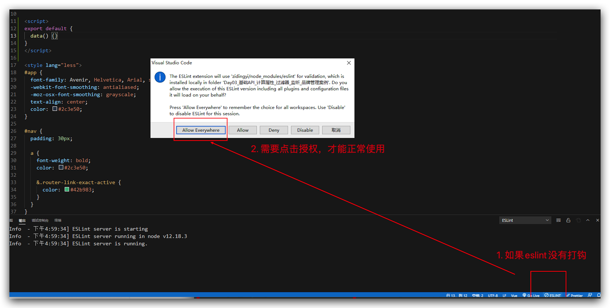
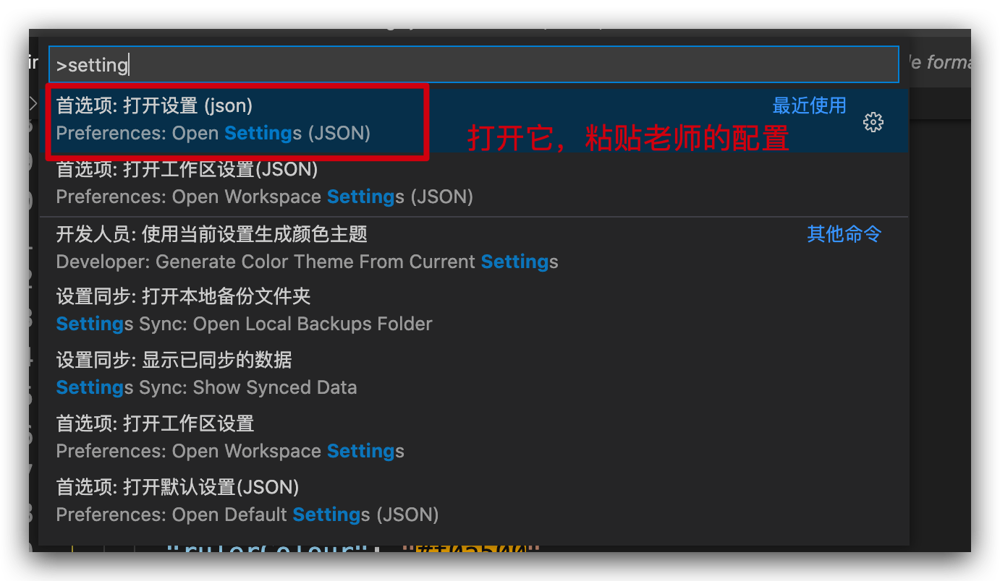

# 课外扩展

> 工作相关实用知识

## vue如何自定义创建一个项目?

> 选择需要的插件，辅助开发

1. 使用vue-cli创建=>`vue create 项目的名字`
2. 选择最后一项=》manually select features=> 自定义选择创建项目需要的插件


3. 选择脚手架需要的依赖


## vscode工作区创建和使用

目的：学习工作区的使用

步骤:

1. 不要把项目放到一个目录，**在vscdoe打开====重要**
2. 项目要单独在vscode打开
3. 通过vscode文件目录，另存工作区文件
4. 这样话，下次打开这个工作区文件会**还原上次工作状态**


## vue配置eslint代码检查

> 自动修复代码规范问题

步骤：

1. 安装插件：vetur + eslint + prettier


注意⚠️：如果出现图示eslint没有打钩情况，需要授权才能正常使用




2. 添加vscode配置文件：

```json
// eslint start 保存时自动格式化代码
  "editor.formatOnSave": true,
  // eslint配置项，保存时自动修复错误
  "editor.codeActionsOnSave": {
    "source.fixAll": true
  },
  // "vetur.format.defaultFormatter.html": "js-beautify-html",
  // 饿了吗admin 开启
  // "vetur.format.defaultFormatterOptions": {
  //   "js-beautify-html": {
  //     "wrap_line_length": 100, //换行长度
  //     "wrap_attributes": "auto", //属性换行
  //     "end_with_newline": true
  //   }
  // },
  "vetur.ignoreProjectWarning": true,
  // 让vetur使用vs自带的js格式化工具，以便在函数前面加个空格
  // uni-app和vue 项目使用
  "vetur.format.defaultFormatter.js": "vscode-typescript",
  "javascript.format.semicolons": "remove",
  // // 指定 *.vue 文件的格式化工具为vetur
  "[vue]": {
    "editor.defaultFormatter": "octref.vetur"
  },
  // // 指定 *.js 文件的格式化工具为vscode自带
  "[javascript]": {
    "editor.defaultFormatter": "vscode.typescript-language-features"
  },
  // // 默认使用prettier格式化支持的文件
  "editor.defaultFormatter": "esbenp.prettier-vscode",
  "prettier.jsxBracketSameLine": true,
  "javascript.format.insertSpaceBeforeFunctionParenthesis": true,
  "prettier.singleQuote": true,
  "prettier.semi": false,
	"editor.tabSize": 2
  // eslint end
```

注意：把上边配置放到



3. 设置代码缩进为2个空格（vue开发规范要求）


注意：

1. 有些vscode插件会影响自动修复，需要禁用


2. vue项目在vscode中打开，**不要嵌套**其它目录=》**直接打开 vue create创建的项目目录名**
3. 如果还是不能跑   npm run lint  --fix 修复eslint
4. 关闭


5. 不是万能的， lintOnSave: true, // 开启eslint检查(如果有编译问题不会影响开发)

## vue如何拉取别人项目开发？

> 拉取别人项目，进行开发

例子：拉取黑马头条app项目=》体验 => 克隆地址：https://gitee.com/heima-class/toutiao-app

1. 克隆开发的项目：`git@gitee.com:heima-class/toutiao-app.git`
2. 克隆下来后：首先安装所有依赖=》==npm i==
3. 运行开发服务器：`npm run serve`

## vue云开发

> 云端协同开发和练习

云开发地址：https://stackblitz.com/

使用：

1. 可以使用github账号注册登录
2. 开发界面类似vscode
   1. 支持HMR
   2. 安装依赖

3. 代码可以保存到云端和分享

