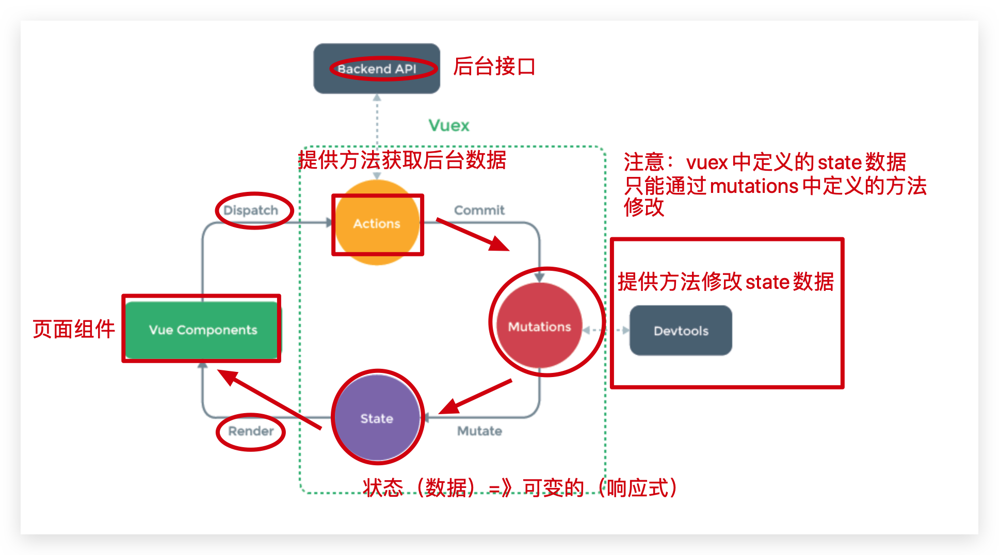
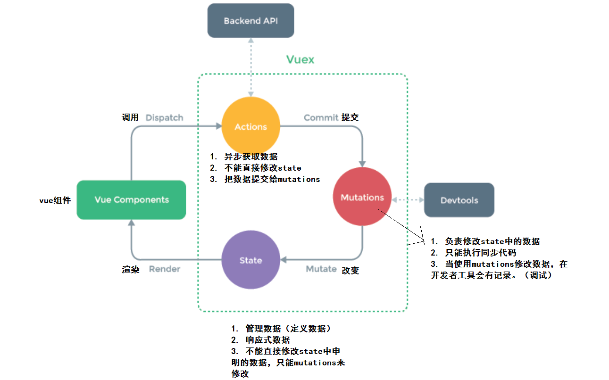
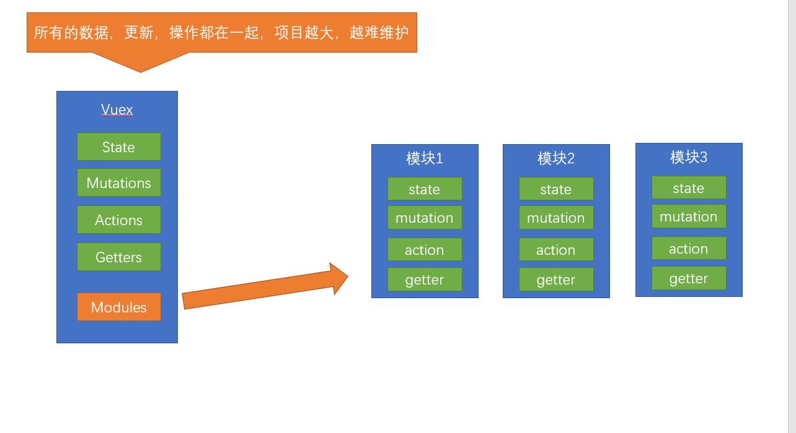
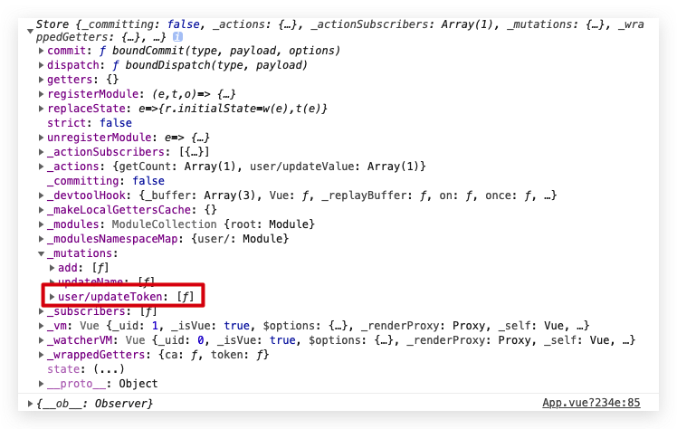

## Vuex


### 01-vuex基础-介绍

> 组件共享数据/通信的方式有哪些？

1. 父传子通信 =》通过props把父组件的数据传递给子组件
2. 子传父 =》1. 父组件定义自定义事件和回调函数（接收子组件数据）2. 通过this.$emit('自定义事件名', data)

结论：组件通信的目的=》**共享数据给其它组件使用**

​	Vuex 是一个专为 Vue.js 应用程序开发的**状态管理模式**。它采用**集中式**存储管理应用的所有组件的状态，并以相应的**规则**保证状态以一种可预测的方式发生变化。

<font color="red">我们理解：</font>

- vuex是采用集中式管理组件依赖的共享数据的一个工具vue插件，可以解决不同组件数据共享问题。




<font color="red">看图结论：</font>

- state 管理数据，管理的数据是响应式的，当数据改变时驱动视图更新。=》类似组件的data
- **mutations 更新数据**，state中的数据只能使用mutations去改变数据。
- actions 请求数据，响应成功后把数据提交给mutations



**使用原则/场景**：如果你不知道是否需要 vuex，那就是不需要它。适合在一些比较复杂和大型的项目中使用。

大型的项目：页面数据=》大于100个=》大型项目

扩展阅读：

* [官网](https://vuex.vuejs.org/zh/guide)
* [使用原则](http://www.ruanyifeng.com/blog/2016/09/redux_tutorial_part_one_basic_usages.html)

### 02-vuex基础-初始化和基本使用

> 使用cli快速创建和配置项目

说明：注意**选择vuex插件**

> 基本使用步骤

初始化：

- 第一步：`npm i vuex --save` =》创建项目没选择vuex，需要单独安装和初始化
- 第二步： 创建store.js  `import vuex from 'vuex'`  `import vue from 'vue'`
- 第三步：`Vue.use(vuex)`=>注册
- 第四步：`const store = new Vuex.Store({...配置项})`
- 第五步：导出 `export default store`
- 第六步：导入main.js 在根实例配置 store ，选项指向 store 实例对象

`store.js`

```js
// 初始化一个vuex的实例（数据仓库） 导出即可
import Vuex from 'vuex'
import Vue from 'vue'

// 使用安装
Vue.use(Vuex)

// 初始化
const store = new Vuex.Store({
  // 配置（state|mutations|actions）
})

export default store
```

`main.js`

```diff
+import store from '@/store'

new Vue({
// 注入store实例=》所有组件=》访问this.$store
+  store,
  render: h => h(App),
}).$mount('#app')
```


### 03-vuex基础-state

#### 基本用法

- 管理数据=>类似组件data

```js
// 初始化vuex对象
const store = new vuex.Store({
  state: {
    // 管理数据
    count: 0
  }
})
```

* 获取数据

1. 在组件获取state的数据：原始用法插值表达式

```html
<div>A组件 state的数据：{{$store.state.count}}</div>
```

2. 使用计算属性

```js
// 把state中数据，定义在组件内的计算属性中
  computed: {
    // 1. 最完整的写法
    // count: function () {
    //   return this.$store.state.count
    // },
    // 2. 缩写
    count () {
      return this.$store.state.count
    }
  }
// 不能使用剪头函数  this指向的不是vue实例
```


#### 辅助用法

说明：当一个组件需要获取多个状态的时候，将这些状态都声明为计算属性会有些重复和冗余。

作用：

- 把vuex中的state数据映射到组件的计算属性中。
- 辅助函数，生成计算属性。
- 方便使用store中的数据

导入：

```js
import { mapState } from 'vuex'
```

1. 使用：mapState(对象) （了解）

```JS
  // 使用mapState来生成计算属性  mapState函数返回值是对象
  // 使用mapState使用对象传参
  computed: mapState({
    // 1. 基础写法 (state) 代表就是vuex申明的state 
    count1: function (state) {
      return state.count
    },
    // 2. 使用箭头函数
    count2: state => state.count,
    // 3. vuex提供写法 (count是state中的字段名称)
    count3: 'count',
    // 4. 当你的计算属性 需要依赖vuex中的数据 同时  依赖组件中data的数据
    myCount (state) {
      return state.count + this.num
    }
  })
```

2. 使用：mapState(数组)=>**推荐**

```js
  // 使用mapState使用数组传参
  computed: mapState(['count']) =>返回对象
```

3. 如果组件自己有计算属性，state的字段映射成计算属性

```js
  // 当你需要使用mapState来映射计算属性 同时又想拥有自己的计算属性
  // 合并即可：const obj = {data: 100}  const config = {url: '', ...obj}
  computed: {
    // 自己的计算属性
    myCount () {
      return this.num * 10
    },
    ...mapState(['count'])
  }
```


### 04-vuex基础-mutations

#### 基本用法

- 修改数据

vuex的store中声明：

```js
  // 修改数据的配置
  mutations: {
    // 定义修改数据的函数
    
    // 自增的函数  
    // state 当前申明的state选项中的数据
    // params 接受数据 , payload 载荷（运送数据）建议对象{}形式
    increment (state, payload) {
      // 此时的this获取不到count数据
      state.count = state.count + payload.num
    }
  }
```

组件调用：

```js
  methods: {
    fn () {
      // 调用vuex申明的mutations函数
      // 第一个参数：函数名称
      // 第二个参数：调用函数的时候的传参  官方叫payload                                    
      this.$store.commit('increment', {num: 100})
    }
  },
```

注意：

1. Mutation 需遵守 Vue 的响应规则
2. Mutation 必须是**同步函数**


#### 辅助用法

说明：

- 把vuex中的mutations的函数映射到组件的methods中
- 通俗：通过mapMutations函数可以**生成methods中函数**

导入：

```js
import { mapMutations } from 'vuex'
```

使用：

```js
  methods: {
    // 使用对象
    // 相当于 methods申明了一个函数fn(params){ this.$store.commit('increment', params)} 
    // ...mapMutations({
    //   // fn 是methods函数名称
    //   // 'increment' vuex中的mutations中的函数名
    //   fn: 'increment'
    // })
    // 使用数组
    // 相当于 methods申明了一个函数increment(params){ this.$store.commit('increment', params)} 
    ...mapMutations(['increment']),
    // 调用  
    handlerAdd () {
      // this.$store.commit('add', { num: 10 })
      this.increment({ num: 10 })
    }  
  },
```

注意⚠️：需要先在根节点注入 `store`


### 05-vuex基础-actions

#### 基本用法

说明：异步获取后台数据=》mutation 来记录 action 产生的副作用

vuex定义：

```js
  // 异步获取数据
  actions: {
    // actions 中的函数有默认传参 context
    // context 术语：执行上下文 执行环境  大白话：函数能够使用到的对象（vuex实例===this.$store）
    getData ({commit}, num) {
      // 模拟异步的获取数据
      window.setTimeout(()=>{
        const data = num
        // 通过commit提交数据给mutations修改数据
        commit('add', data)
      },2000)
      // Promise形式
      // return new Promise((r) => {
      //   setTimeout(() => {
      //     commit('add', num);
      //     r()
      //   }, 2000)
      // })
    }
  }
```

组件使用：

```js
getData () {
    // 发请求获取数据
    // this.$store.dispatch('getData')
    this.$store.dispatch('getData',{ num: 10 })
},
```

注意：

- Action 提交的是 mutation，而不是直接变更状态。

- Action 可以包含任意异步操作。

  

#### 辅助用法

说明：

- mapActions辅助函数，把actions中的函数映射组件methods中
- 通俗：通过mapActions函数可以生成methods中函数

```js
methods: { 
// 相当于 methods申明了一个函数fn(num){ this.$store.dispatch('getData', num)} 
    // ...mapActions({
    //   fn: 'getData'
    // })
    // 相当于 methods申明了一个函数getData(num){ this.$store.dispatch('getData', num)} 
    ...mapActions(['getData']),
    // 调用
    handlerAdd2 () {
      // this.$store.dispatch('getData', { num: 10 })
      this.getData({ num: 10 })
    }
}    
```

注意⚠️：需要先在根节点注入 `store`


### 06-vuex基础-getters

#### 基本用法

> 除了state之外，有时我们还需要从state中派生出一些状态，这些状态是依赖state的，此时会用到getters（类似组件中计算属性，依赖值变化会重新执行计算）

说明：类似vue组件中计算属性computed

例如，state中定义count值

```js
state: {
    count: 0
}
```

组件中，需要显示count值减一

* 定义getters

```js
  getters: {
    // getters函数的第一个参数是 state
    // 必须要有返回值
     countSub:  state =>  state.count - 1
  }
```

* 使用getters

```vue
<div>{{ $store.getters.countSub }}</div>
```

#### 辅助用法

```js
computed: {
    ...mapGetters(['countSub'])
}
```

```vue
 <div>{{ countSub }}</div>
```


### 07-vuex基础-modules

#### 为什么会有模块化？

> 由于使用单一状态树，应用的所有状态会集中到一个比较大的对象。当应用变得非常复杂时，store 对象就有可能变得相当臃肿。

这句话的意思是，如果把所有的状态都放在state中，当项目变得越来越大的时候，Vuex会变得越来越难以维护

由此，又有了Vuex的模块化



#### 模块化的简单应用

**应用**

定义两个模块   **user** 和  **setting**

需求：

1. user中管理用户的状态  token 

2. setting中管理 应用的名称 name

* 定义这两个module数据

```js
const store  = new Vuex.Store({
  modules: {
    user: {
       state: {
         token: '12345'
       }
    },
    setting: {
      state: {
         name: 'Vuex实例'
      }
    }
  })
```

* 组件中分别显示用户的token和应用名称name

```vue
<template>
  <div>
      <div>用户token {{ $store.state.user.token }}</div>
      <div>网站名称 {{ $store.state.setting.name }}</div>
  </div>
</template>
```

请注意： 此时要获取子模块的状态 需要通过 $store.**`state`**.**`模块名称`**.**`属性名`** 来获取

* 简化数据获取

> 看着获取有点麻烦，我们可以通过之前学过的getters来改变一下

```js
 getters: {
   token: state => state.user.token,
   name: state => state.setting.name
 } 
```

请注意：这个getters是根级别的getters哦

**通过mapGetters引用**

```js
 computed: {
    ...mapGetters(['token', 'name'])
 }
```


#### 模块化中的命名空间

**命名空间**  **`namespaced`**

> 这里注意理解

##### 为什么引入命名空间？

默认情况下，模块内部的 action、mutation 和 getter 是注册在**全局命名空间**的——这样使得多个模块能够对同一 mutation 或 action 作出响应。

> 这句话的意思是 刚才的user模块还是setting模块，它的 action、mutation 和 getter 其实并没有区分，都可以直接通过全局的方式调用 如


```js
  user: {
       state: {
         token: '12345'
       },
       mutations: {
        //  这里的state表示的是user的state
         updateToken (state) {
            state.token = 678910
         }
       }
    },
```

**通过mapMutations调用**

```vue
 methods: {
       ...mapMutations(['updateToken'])
  }
 <button @click="updateToken">修改token</button>
```

> 但是，如果我们想保证内部模块的高封闭性，我们可以采用namespaced来进行设置

##### 如何使用命名空间？

高封闭性？可以理解成 **一家人如果分家了，此时，你的爸妈可以随意的进出分给你的小家，你觉得自己没什么隐私了，我们可以给自己的房门加一道锁（命名空间 namespaced）,你的父母再也不能进出你的小家了**

如

```js
  user: {
       namespaced: true,
       state: {
         token: '12345'
       },
       mutations: {
        //  这里的state表示的是user的state
         updateToken (state) {
            state.token = 678910
         }
       }
    },
```

使用带命名空间的模块 **`action/mutations`**



方案1：**直接调用-带上模块的属性名路径**

```js
test () {
   this.$store.commit('user/updateToken') // 直接调用方法
}
```

方案2：**辅助函数-指定模块名调用（推荐）**

```vue
  methods: {
       ...mapMutations('user', ['updateToken']),
       test () {
          this.updateToken()
       }
   }
  <button @click="test">修改token</button>

```

### 08-vuex案例-新闻

#### 1-搭建项目

> 使用cli创建项目，选择自定义=》添加router和vuex插件

- 使用vue-router插件  router.js
- 使用vuex插件  store.js

main.js

```js
import Vue from 'vue'
import App from './App.vue'

// vuex实例
import store from './store'
// router路由实例
import router from './router'

Vue.config.productionTip = false

new Vue({
  render: h => h(App),
  // 挂载vuex实例
  store,  // 项目中所有组件就可以通过this.$store
  // 挂载router实例
  router // 项目中所有组件就可以通过this.$router(跳转路由) / this.$route（获取路由参数）
}).$mount('#app')

```

store.js

```js
// 管理数据
import Vuex from 'vuex'
import Vue from 'vue'

Vue.use(Vuex)

const store = new Vuex.Store({

})

export default store

```

router.js

```js
// 路由相关功能
import Vue from 'vue'
import VueRouter from 'vue-router'

Vue.use(VueRouter)

const router = new VueRouter({
  // TODO 路由规则
  routes: []
})

export default router

```


#### 2-创建组件和配置路由

需求说明：

> 使用vuex开发新闻列表和详情

功能说明：

1. 新闻列表功能
2. 新闻详情功能


- 封装组件

  - 新闻列表组件
  - 新闻详情组件

    

- 路由规则

  - /  重定向  /list
  - /detail

  ```js
  // 路由规则
    routes: [
      { path: '/', redirect: '/list' },
      { path: '/list', component: Hot }, // 新闻列表
      { path: '/detail/:id', component: Detail } // 新闻详情
    ]
  ```


#### 3-列表功能

> 定义vuex数据、修改数据方法、获取后台数据方法，组件中获取数据渲染

准备：

后台请求基础地址：http://geek.itheima.net/v1_0/

1. 安装axios：`npm i axios`

说明❓：`src/utils/request.js`

```js
import axios from 'axios'

// 后台接口基础地址
const BASE_URL = 'http://geek.itheima.net/v1_0/'
// 创建axios实例
const request = axios.create({
  baseURL: BASE_URL
})

export default request

```


第一步：申明数据，根据页面需要的数据进行申明。

```js
  state: {
      // 新闻列表
    list: []
  },
```

第二步：定义修改数据的方法

```js
 mutations: {
    // payload = {list}  约定数据格式
    setListPageData (state, payload) {
      state.list = payload.list
    }
  },
```

第三步：获取数据的方法

```js
actions: {
    // 获取数据
    async getNews ({ commit }) {
      const { data: { data: { results } } } = await request({ url: 'articles', params: { 			   channel_id: 0, timestamp: +new Date(), with_top: 1 } })
      // console.log(res)
      commit('setListPageData', { list: results })
    } 
 			
  }
```

第四步：调用获取数据的方法

```js
methods: {
    ...mapActions(['getNews'])
  }
```

```js
 created () {
    this.getNews()
    // this.$store.dispatch('getNews')
  },
```

第五步：获取vuex的数据

```js
computed: {
    ...mapState(['list'])
  },
```

第六步：渲染页面

```html
<div>
  <ul>
    <li v-for="item in list" :key="item.art_id">
      <router-link :to="`/detail/${item.art_id}`">{{
        item.title
        }}</router-link>
    </li>
  </ul>
</div>
```


#### 4-详情功能(作业)

- 点击新闻列表某项，查看新闻详情
  - 使用动态路由功能  /detail/:id  
  - 详情组件获取id获取详情数据

第一步：路由规则

```js
{ path: '/detail/:id', component: Detail }
```

```js
router-link :to="`/detail/${item.art_id}`"
```

第二步：准备数据

```diff
state: {
    // 列表
    list: [],
    // 详情
+   detail: {}
  },
```

第三步：修改数据函数

```js
mutations: {
    // payload = {detail}  约定数据格式
    setDetailPageData (state, payload) {
      state.detail = payload.detail
    }
  },
```

第四步：获取数据去修改数据的函数

```js
 actions: {
    // 详情
    async getDetailById ({ commit }, articleId) {
      const { data: { data } } = await request({ url: `articles/${articleId}` })
      // console.log(data)
      commit('setDetailPageData', { detail: data })
    }
  }
```

第五步：在组件使用数据

```js
computed: {
    ...mapState(['detail'])
  },
```

第六步：在组件初始化获取数据

```js
created () {
    this.getDetailById(this.$route.params.id)
  },
```

```js
 methods: {
    ...mapActions(['getDetailById'])
  }
```

第七步：渲染页面

```vue
<template>
  <div>
    <h1>{{ detail.title }}</h1>
    <h2>{{detail.art_id}}</h2>
    <!-- <h2>{{detail.art_id}}</h2> -->
    <article v-html="detail.content"></article>
  </div>
</template>
```

### 第一天重点总结

> vuex核心知识

- state  声明数据
  
  - this.$store.state.数据属性名
  - mapState  生成计算属性（获取数据）
  
- mutations 修改数据（同步）
  
  - this.$store.commit('函数名称','传参')
  - mapMutations 生成methods函数
  
- actions 获取后台数据（异步）
  
  - this.$store.dispatch('函数名称','传参')
  - mapActions 生成methods函数
  
- getters 派生数据
  
  - this.$store.getters.函数名
  - mapGetters 生成计算属性（获取数据）
  
- modules 模块化
  
  - 独立的文件（对象）中定义：state、mutations、actions、getters
  - 更好的管理项目状态数据
  
  