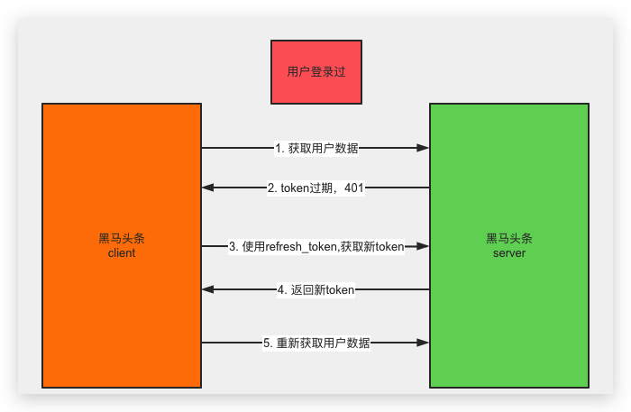
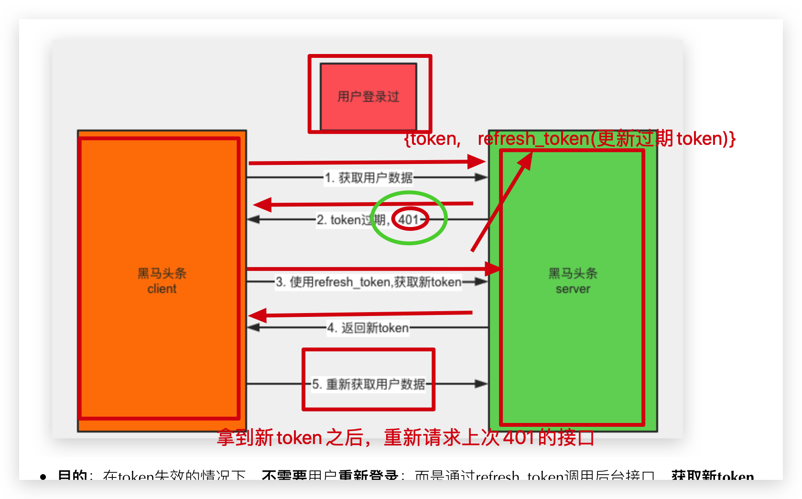

# 登录模块

### 01-登录布局

> 使用Form表单组件

步骤：

1. 查看Form表单组件**基础用法**
2. 通过**插槽功能**，处理基本布局
3. 处理提交事件

```html
<van-form @submit="onSubmit">
  <van-field
    v-model="mobile"
    name="手机号"
    label="手机号"
    placeholder="手机号"
    :rules="[{ required: true, message: '请填写手机号' }]"
  />
  <van-field
    v-model="code"
    name="验证码"
    label="验证码"
    placeholder="验证码"
    :rules="[{ required: true, message: '请填写验证码' }]"
  >
    <template #button>
      <van-button size="small" native-type="button" type="primary"
                  >发送验证码</van-button
        >
    </template>
  </van-field>   
  <div style="margin: 16px;">
    <van-button round block type="info" native-type="submit">提交</van-button>
  </div>
</van-form>
```

```js
export default {
  data() {
    return {
      mobile: '',
      code: '',
    };
  },
  methods: {
    onSubmit(values) {
      console.log('submit', values);
    },
  },
};
```

注意：

> 点击表单中的普通按钮为什么会触发表单提交？

在表单中，除了提交按钮外，可能还有一些其他的功能性按钮，如发送验证码按钮。在使用这些按钮时，要注意将`native-type`设置为`button`，否则会触发表单提交。

```html
<van-button native-type="button">发送验证码</van-button>
```

### 扩展-插槽回顾

> 插槽分类

插槽写法：<self><p>123</p></self>

1. 默认插槽
2. 具名插槽
3. 作用域插槽 => 插槽内容能够访问子组件中才有的数据

父组件：

```vue
<template>
<div>
  <!-- 插槽回顾 -->
    <v-test>
      <p>默认插槽</p>
      <!-- 新用法 -->
      <div slot="mn">具名插槽1</div>
      <!-- 老用法=》只能加在template/自定义组件上使用 => # 等价于v-slot: -->
      <template #mj>
        <div>具名插槽2</div>
      </template>
     <template v-slot:tt>
        <div>具名插槽3</div>
     </template>
     <!-- 作用域插槽=》插槽内容能够访问子组件中才有的数据-->
		<!-- <template v-slot:sp></template> -->
     <template v-slot:sp="{ user}">
        <p>{{user.name}}</p>
     </template>
    </v-test>
  </div>
</template>
```

子组件：

```vue
<template>
    <slot />
    <hr>
    <slot name="mn" />
    <slot name="mj" />
    <slot name="tt" />
    <hr>
    <slot name="sp" :user="user">
  		<h2 style="color:red">{{ user.name }}</h2>
    </slot>
</template>
<script>
export default {
  data () {
    return {
      user: { name: 'meng', age: 28 }
    }
  }
}
</script>
```


### 02-表单校验

> 通过方法和正则，验证表单

步骤：

1. 了解rules字段用法
2. 通过正则或方法做复杂校验

```html
    <!-- form -->
    <van-form @submit="onSubmit">
      <van-field
        v-model="userForm.mobile"
        name="mobile"
        label="手机号"
        placeholder="手机号"
        :rules="[{ pattern: mobilePat, message: '请填写手机号' }]"
      />
      <van-field
        v-model="userForm.code"
        name="code"
        label="验证码"
        placeholder="验证码"
        :rules="[
          { required: true, message: '请填写验证码' },
          { validator: validatorCode, message: '验证码6位！' },
        ]"
      >
        <template #button>
          <van-button size="small" native-type="button" type="primary"
            >发送验证码</van-button
          >
        </template>
      </van-field>
      <div style="margin: 16px">
        <van-button round block type="info" native-type="submit"
          >提交</van-button
        >
      </div>
    </van-form>
```

```js
  data () {
    return {
      // 表单数据
      userForm: {
        mobile: '13611111111',
        code: '246810'
      },
      mobilePat: /^(0|86|17951)?(13[0-9]|15[012356789]|166|17[3678]|18[0-9]|14[57])[0-9]{8}$/
    }
  },
  methods: {
    // 校验函数返回 true 表示校验通过，false 表示不通过
    validatorCode (val) {
      if (val.length !== 6) return false
      return true
    },
    // 登录时候  
    async onSubmit (values) {
      // 通过校验
      console.log('submit', values)
      
    }   
```

- 点击登录，整体表单校验。


### 03-进行登录

> 完成登录逻辑

步骤：

1. 在API目录封装用户登录接口
2. 调用登录接口方法
3. 使用try/catch捕获请求异常
4. 使用Toast组件的全局$toast实例提示
5. 引入store，登录成功后=》**存储**本地token =〉**跳转上次浏览页面或个人中心**

说明⚠️：内置账号=》15801018888(**使用自己的手机号**)  &   246810 

- 封装api  `src/api/user.js`

```js
// 导入封装的axios
import request from '@/utils/request'

/**
 * 用户登录
 * @param {*} formData 登录信息：手机号/验证码
 */
export function login (data) {
  return request.post('authorizations', data)
}
```

- 进行登录 `src/views/login/index.vue`

```js
import { login } from '@/api/user'
import { mapMutations } from 'vuex'
```

```js
    ...mapMutations(['setToken']),
    async onSubmit (values) {
      console.log('submit', values)
      // 校验成功
      // 1. 基于request封装登录的API
      // 2. 导入API
      // 3. 调用即可
      // 4. 获取用户信息
      // 5. 更新vuex中的user数据
      // 6. 根据地址栏进行跳转
      // 7. 提示 成功
      // 8. 失败 错误提示
      try {
        const { data } = await login(values)
        // data  是对象  token  refresh_token
        this.setToken(data)
        console.log(this.$route.query.redirectUrl)
        this.$router.push(this.$route.query.redirectUrl || '/user')
        this.$toast.success('登录成功！')
      } catch (e) {
        this.$toast.fail('手机号或验证码错误！')
      }
 }
```


### 扩展-移动APP保持登录的实现机制

> 长期的Refresh Token 和 短期的Access Token





* **目的**：在token失效的情况下，**不需要**用户**重新登录**；而是通过refresh_token调用后台接口，**获取新token**=》重新发送上次401请求

* **流程**：在access_token里加入refresh_token标识，给access_token设置短时间的期限（例如一天），给refresh_token设置长时间的期限（例如七天）。当活动用户（拥有access_token）发起request时，在权限验证里，对于requeset的header包含的access_token、refresh_token分别进行验证：

  1、access_token没过期，即通过权限验证；=》正常使用

  2、**access_token过期**,**refresh_token没过期**，则返回权限验证失败（**401**），并在返回的response的header中加入标识状态的key，在request方法的catch中通过webException来获取标识的key，**获取新的token**（包含新的access_token和refresh_token），再次发起请求，并返回给客户端请求结果以及新的token，再在客户端更新公共静态token模型；=》刷新token后正常使用

  3、**access_token过期,refresh_token过期**即权限验证失败。=》只能重新登录


### 扩展-保持APP登录状态

> 处理token失效，保持用户的登录状态

说明：通过`获取用户资料`接口**进行测试**，未授权会返回401（查看接口文档）

```js
// 获取用户资料（需要token）
request.get('user/profile').then(res => {
  console.log(res)
})
```

步骤：

1. 在响应拦截器中的**错误处理函数**中，处理**401情况**
   * **没有登录过** =》跳回登录
   * **登录过**，token过期了，但是refresh_token 没过期 =》免登陆获取新token =〉更新vuex和本地token =》继续上次401的错误请求
     * refresh_token 失效 =〉跳回登录

2. 通过Promise.reject(error)返回异常信息

```js
// 导入router实例
import router from '@/router'
import store from '@/store'
```

```js
// Add a response interceptor
MyAxios.interceptors.response.use(function (response) {
  // Any status code that lie within the range of 2xx cause this function to trigger
  // Do something with response data
  // 处理和简化返回的数据
  return {
    status: response.status,
    data: response.data.data
  }
}, async function (error) { 
  // 在这里处理401刷新token流程
  // Any status codes that falls outside the range of 2xx cause this function to trigger
  // Do something with response error
  // token 失效=》刷新token=》保持登录状态
  // console.log(error.response)
  const loginConfig = { path: '/login', query: { redirectUrl: router.currentRoute.path } }
  try {
    if (error.response && error.response.status === 401) {
      // 获取到store里token数据
      const { user } = store.state
      // 1. 从来没有登录过
      if (!user.token || !user.refresh_token) {
        // 跳回登录页面
        router.push(loginConfig)
        return Promise.reject(error)
      }
      // 2. 登录过，token失效了=》刷新token
      // console.log('refresh')
      const { status, data } = await MyAxios.put('authorizations', null, {
        headers: {
          Authorization: `Bearer ${user.refresh_token}`
        }
      })
      // console.log(status, data)
      if (status === 201) {
        // 更新vuex和本地的token
        store.commit('setToken', {
          token: data.token,
          refresh_token: user.refresh_token
        })
        // 继续上次的错误请求(这时token已经刷新了)
        // console.log(error.config)
        return MyAxios(error.config)
      }
    }
  } catch (error) {
    // 3. refresh_token也失效
    // 跳回登录页面
    router.push(loginConfig)
    return Promise.reject(error)
  }

  return Promise.reject(error)
})
```

