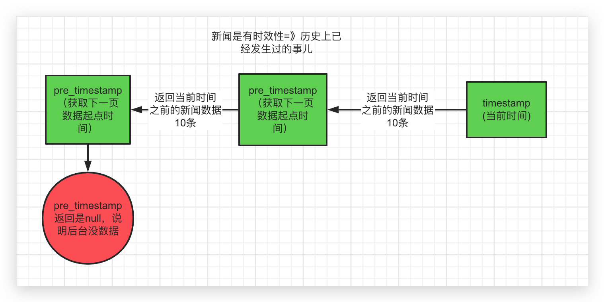
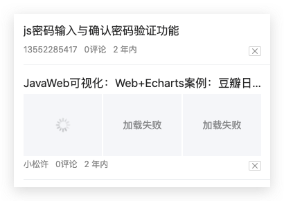

# 首页-文章列表

### 01-使用tabs组件

> 布局首页的文章分类栏和内容区域

步骤：

1. 根据文档使用Tab 标签页和Icon图标
2. Tabs添加移动端可滑动切换属性
3. 使用v-for测试

`src/views/home/index.vue`

基础结构：

```html
<div class="container">
<!-- 文章分类栏 -->
<van-tabs swipeable>
  <van-tab :key="item" v-for="item in 8" :title="'标签'+ item">
    <!-- 可滚动内容区域 -->
    <div class="scroll-wrapper">
      <van-cell :key="i" v-for="i in 20" title="单元格" value="内容">{{i}}</van-cell>
    </div>
  </van-tab>
</van-tabs>
<!-- 右侧图标 -->
<span class="bar_btn">
  <van-icon name="wap-nav"></van-icon>
</span>
</div>  
```

设置样式：

```less
.van-tabs {
  height: 100%;
  display: flex;
  flex-direction: column;
  // 自定义tab样式
  /deep/ .van-tabs__wrap {
    height: 36px;
    padding-right: 36px;
    .van-tab {
      line-height: 36px;
    }
    .van-tabs__line {
      background-color: #fc6627;
      height: 2px;
    }
  }
  /deep/ .van-tabs__content{
    flex: 1;
    overflow: hidden;
  }
  /deep/ .van-tab__pane{
    height: 100%;
    // 控制列表区域可滚动
    .scroll-wrapper{
      height: 100%;
      overflow-y: auto;
    }
  }
}
.bar_btn {
  width: 36px;
  height: 35px;
  position: absolute;
  top: 0;
  right: 0;
	font-size: 20px;
  text-align: center;
  line-height: 40px;
  box-shadow: -6px -6px 8px #ddd;
}
```

- /deep/  作用：让样式在其它没有data-v属性的元素上生效。
- 保证 scroll-wrapper 容器能够生成滚动条，将来需要使用滚动。
  - 下拉刷新
  - 上拉加载
  - 记录浏览位置


### 02-实现上拉加载

> 使用List 列表组件实现（移动端分页效果）

场景：移动分页效果=》每次用户滚动到底部，会触发加载下一页数据的方法（PC端点击页码切换）

步骤：

1. 根据文档**基础用法**例子，了解主要属性用法
2. 本地mock数据测试

结构：

```html
<!-- van-list 列表组件 实现上拉加载 -->
<!-- v-model="upLoading" 如果值 true 代表正在加载中  false 代表加载完毕 -->
<!-- :finished="finished" 如果值 true 代表所有数据加载完毕  false 代表还有数据 -->
<!-- finished-text="没有更多文章了"  加载完毕的提示文章 -->
<!-- @load="onLoad" 上拉加载触发的事件： -->
<!-- 何时触发：拉到底部（滚动到底部）触发 -->
<!-- 何时触发：当组件初始化的时候，默认触发一次 -->
<!-- 何时触发：当加载数据渲染后不足一屏幕的高度，自动触发事件去加载更多数据直到 高于一屏幕的高度 为止 -->
<div class="scroll-wrapper">
 <van-list v-model="upLoading" :finished="finished" finished-text="没有更多了" @load="onLoad">
  <van-cell v-for="item in articles" :key="item">{{item}}</van-cell>
</van-list> 
</div>
```
数据：

```js
// ----列表需要的数据----
// 上拉加载中
upLoading: false,
// 是否全部加载完成
finished: false,
// 文章列表
articles: []
```
逻辑：

```js
  methods: {
    onLoad () {
      // 模拟获取数据
      window.setTimeout(() => {
        // 获取数据成功
        const data = []
        for (let i = this.articles.length; i < this.articles.length + 10; i++) {
          data.push(i + 1)
        }
        // 追加数据
        this.articles.push(...data)
        // 结束加载中效果
        this.upLoading = false
        // 考虑：是否全部数据加载完毕   假设超过40就没有数据了
        if (this.articles.length >= 40) {
          this.finished = true
        }
      }, 1500)
    }
  }
```


### 03-实现下拉刷新

> 使用PullRefresh 下拉刷新

使用场景：列表数据加载完成后，获取最新数据=》通过下拉刷新，重置列表（从头再来）

步骤：

1. 使用van-pull-refres包裹list组件
2. 添加数据状态和方法
3. 刷新方法中**重置列表数据为空**，然后**重新获取数据**

结构：

```html
<!-- van-pull-refresh 下拉刷新组件 -->
<!-- v-model="downLoading"  值为true 正在刷新中  值为false  结束刷新效果 -->
<!-- :success-text="refreshSuccessText" 刷新成功后的文案  -->
<!-- @refresh="onRefresh" 下拉刷新事件：下拉后松手后触发 -->
```

```diff
<div class="scroll-wrapper">
+<van-pull-refresh v-model="downLoading" @refresh="onRefresh" :success-text="refreshSuccessText">
  <van-list v-model="upLoading" :finished="finished"
  finished-text="没有更多了" @load="onLoad">
    <van-cell-group>
      <van-cell v-for="item in articles" :key="item">{{item}}</van-cell>
    </van-cell-group>
  </van-list>
+</van-pull-refresh>
</div>
```

数据：

```js
      // 是否是刷新中状态
      downLoading: false,
      // 刷新完成的提示  文案
      refreshSuccessText: '',
```

逻辑：

```js
    // 刷新执行
    onRefresh () {
      // 清空列表数据
      if (this.downLoading) {
        this.articles = []
      }
      // 重新加载数据
      // 将 loading 设置为 true，表示处于加载状态
      this.finished = false
      this.upLoading = true
      this.onLoad()
    },
    onLoad() {
      // ...
      // 获取数据后结束刷新
      this.downLoading = false
      this.refreshSuccessText = '刷新成功'
    }  
      
```


### 04-列表文章布局

> 说明布局效果：多图和单图情况

结构：放入van-list>van-cell组件下测试

- 三张图

```html
<div class="article_item">
  <h3 class="van-ellipsis">PullRefresh下拉刷新PullRefresh下拉刷新下拉刷新下拉刷新</h3>
  <div class="img_box">
     <van-image class="w33" fit="cover" src="https://img.yzcdn.cn/vant/cat.jpeg"/>
     <van-image class="w33" fit="cover" src="https://img.yzcdn.cn/vant/cat.jpeg"/>
     <van-image class="w33" fit="cover" src="https://img.yzcdn.cn/vant/cat.jpeg"/>
  </div>
  <div class="info_box">
     <span>你像一阵风</span>
     <span>8评论</span>
     <span>10分钟前</span>
     <span class="close"><van-icon name="cross"></van-icon></span>
  </div>
</div>
```

- 一张图

```html
<div class="article_item">
  <h3 class="van-ellipsis">PullRefresh下拉刷新PullRefresh下拉刷新下拉刷新下拉刷新</h3>
  <div class="img_box">
      <van-image class="w100" fit="cover" src="https://img.yzcdn.cn/vant/cat.jpeg"/>
  </div>
  <div class="info_box">
     <span>你像一阵风</span>
     <span>8评论</span>
     <span>10分钟前</span>
     <span class="close"><van-icon name="cross"></van-icon></span>
  </div>
</div>
```

- van-ellipsis  vant内置的样式 当文本内容长度超过容器最大宽度时，自动省略多余的文本。
- w33   宽度33% 剩余1%当作间距。
- w100 宽度100% 


样式：

```less
.article_item{
  h3{
    font-weight: normal;
    line-height: 2;
  }
  .img_box{
    display: flex;
    justify-content: space-between;
    .w33{
      width: 33%;
      height: 90px;
    }
    .w100{
      width: 100%;
      height: 180px;
    }
  }
  .info_box{
    color: #999;
    line-height: 2;
    position: relative;
    font-size: 12px;                  
    span{
      padding-right: 10px;
      &.close{
        border: 1px solid #ddd;
        border-radius: 2px;
        line-height: 15px;
        height: 12px;
        width: 16px;
        text-align: center;
        padding-right: 0;
        font-size: 8px;
        position: absolute;
        right: 0;
        top: 7px;
      }
    }
  }
}
```


### 05-渲染频道

> 获取当前登录用户的频道栏目数据并渲染

步骤：

1. 封装获取频道数据接口
2. 设置数据并渲染

api函数 `src/api/channel.js`

```js
/**
 * 获取我的频道信息（如果没登录，获取的是后台设置的默认频道列表）
 */
export const getMyChannels = () => {
  return request.get('user/channels')
}
```

导入api函数

```js
import { getMyChannels } from '@/api/channel'
```

使用函数 

```js
  created () {
    this.getMyChannels()
  },
  methods: {
    // 获取频道列表
    async getMyChannels () {
      const {data} = await getMyChannels()
      this.myChannels = data.channels
    },
```

申明数据

```js
// 我的频道列表(推荐频道默认拥有第一个频道)
myChannels: []
```

渲染组件

```html
<van-tab :key="channel.id" v-for="channel in myChannels" :title="channel.name">
```


### 第三天重点总结

### 06-组件拆分（预习）

> 把频道对应的文章列表拆分为单独的组件，处理不同频道的列表数据

目的：复用新闻列表组件

步骤：

1. 分析频道和文章列表的关系(一个频道对应一个列表组件)
2. 把文章列表作为公共部分，拆分为单独的组件
3. 接收频道ID作为参数，根据ID查询对应频道的文章列表数据

父组件结构：

```html
    <!-- 文章分类栏 -->
    <van-tabs swipeable>
      <van-tab :key="channel.id" v-for="channel in channels" :title="channel.name">
        <!-- 可滚动内容区域 -->
        <ArticleList :channelId="channel.id" />
      </van-tab>
    </van-tabs>
```

新建ArticleList子组件:

```vue
<template>
  <div class="scroll-wrapper">
    <van-pull-refresh
      v-model="refreshing"
      @refresh="onRefresh"
      success-text="刷新成功"
    >
      <van-list
        v-model="loading"
        :finished="finished"
        finished-text="没有更多了"
        @load="onLoad"
      >
        <van-cell v-for="item in list" :key="item">
          <div class="article_item">
            <h3 class="van-ellipsis">
              PullRefresh下拉刷新PullRefresh下拉刷新下拉刷新下拉刷新
            </h3>
            <div class="img_box">
              <van-image
                class="w100"
                fit="cover"
                src="https://img.yzcdn.cn/vant/cat.jpeg"
              />
              <!-- <van-image
                      class="w33"
                      fit="cover"
                      src="https://img.yzcdn.cn/vant/cat.jpeg"
                    />
                    <van-image
                      class="w33"
                      fit="cover"
                      src="https://img.yzcdn.cn/vant/cat.jpeg"
                    /> -->
            </div>
            <div class="info_box">
              <span>你像一阵风</span>
              <span>8评论</span>
              <span>10分钟前</span>
              <span class="close"><van-icon name="cross"></van-icon></span>
            </div>
          </div>
        </van-cell>
      </van-list>
    </van-pull-refresh>
  </div>
</template>
```

```js
  props: {
    channelId: {
      type: Number,
      default: 0
    }
  },
  data () {
    return {
      // 文章列表
      list: [],
      // 加载状态
      loading: false,
      // 加载完成
      finished: false,
      // 是否正在刷新
      refreshing: false,
      refreshTxt: ''
    }
  },
```

注意：

1. 拆分列表需要的数据和方法、列表item样式

### 07-渲染新闻列表

> 封装文章列表接口方法，替换真实数据渲染列表

步骤：

1. 根据API文档封装文章列表数据
2. 设置默认的timestamp数据为当前时间
3. 在articleList组件onLoad中调用接口
4. 向文章列表**追加数据**
5. 根据pre_timestamp字段判断数据**是否全部加载完毕**=>pre_timestamp(**下一页数据的开始时间戳**)
6. onRefresh刷新时**重置timestamp为当前最新时间戳**

说明：`timestamp`作为请求新闻数据的最新起点=》获取当前起点时间之前的数据



- 封装api  `src/api/article.js`

```js
import request from '../utils/request'
/**
 * 文章相关
 */
// 频道新闻推荐_V1.1
export function getArticlesById (channelId, timestamp) {
  return request.get('articles', {
    params: {
      channel_id: channelId, timestamp
    }
  })
}
```


articleList组件：

- data

```js
data () {
return {
...
// 分页时间戳
timestamp: +new Date(),
```


- method

```js
  methods: {
    // 加载列表执行
    async  onLoad () {
      // 异步更新数据
      const { status, data } = await getArticlesById(this.channelId, this.timestamp)
      if (status === 200) {
        // 追加列表数据
        this.list.push(...data.results)
        // 加载状态结束
        this.loading = false
        // 刷新完成
        this.refreshing = false
        this.refreshTxt = '刷新成功'
        // 数据全部加载完成
        if (data.pre_timestamp) {
          this.timestamp = data.pre_timestamp
        } else {
          this.finished = true
        }
      }
    },
    // 刷新执行
    onRefresh () {
      // 清空列表数据
      if (this.refreshing) {
        this.list = []
      }
      // 重新加载数据
      // 将 loading 设置为 true，表示处于加载状态
      this.finished = false
      this.loading = true
      // 设置最新的时间戳
      this.timestamp = Date.now()
      this.onLoad()
    }
  }
```

- 渲染页面

```html
<template>
  <div class="scroll-wrapper">
    <van-pull-refresh :success-text="refreshTxt" v-model="refreshing" @refresh="onRefresh">
      <van-list v-model="loading" :finished="finished" finished-text="没有更多了" @load="onLoad">
        <van-cell v-for="item in list" :key="item.art_id">
          <div class="article_item">
            <h3 class="van-ellipsis">{{item.title}}</h3>
            <div class="img_box" v-if="item.cover.type">
              <van-image
                :key="i"
                v-for="(img,i) in item.cover.images"
                :class="item.cover.type===1?'w100':'w33'"
                fit="cover"
                :src="img"
              />
            </div>
            <div class="info_box">
              <span>{{item.aut_name}}</span>
              <span>{{item.comm_count}}评论</span>
              <span>{{item.pubdate}}</span>
              <span class="close">
                <van-icon name="cross"></van-icon>
              </span>
            </div>
          </div>
        </van-cell>
      </van-list>
    </van-pull-refresh>
  </div>
</template>
```

### 扩展-插件使用

- 延时函数 `src/utils/plugin.js`

```js
/**
 * 全局插件方法
 */

// 延迟执行
const $sleep = () => {
  return new Promise((resolve, reject) => {
    setTimeout(() => {
      resolve()
    }, 1000)
  })
}

// 提供插件方法列表
export default {
  install (Vue) {
    Vue.prototype.$sleep = $sleep
  }
}

```

```js
import myPlugin from '@/utils/plugin'
Vue.use(myPlugin)
```

- 仅在开发中使用，测试。


### 08-时间格式处理

> 使用dayjs封装相对时间模版过滤器方法

`src/utils/plugin.js`

安装：`npm i dayjs`

扩展阅读：https://day.js.org/docs/en/installation/installation

- 封装一个相对时间函数

```js
// moment 插件  dayjs 插件  都是处理时间格式
import dayjs from 'dayjs'
// 使用dayjs插件（按需）
import relativeTime from 'dayjs/plugin/relativeTime'
// 国际化
import 'dayjs/locale/zh-cn'
dayjs.locale('zh-cn')
// 添加插件
dayjs.extend(relativeTime)
```

```js
// 相对时间换算
/**
 *
 * @param {*} value 获取模版中值：val | filter
 */
const relTime = (value) => {
  // console.log(dayjs())
  return dayjs().from(value)
}
```

- 注册成过滤器

```diff
export default {
  install (Vue) {
    Vue.prototype.$sleep = $sleep
+   Vue.filter('relTime', relTime)
  }
}
```

使用：

```html
<span>{{article.pubdate|relTime}}</span>
```

扩展阅读：https://github.com/iamkun/dayjs

### 09-图片懒加载

> 处理文章列表中图片的懒加载

原理：首先渲染可视区域内的图片，按需渲染不可见区域

说明：

1. 查阅Image**图片组件懒加载**用法

2. vue-lazyload**是vant内置的插件**，需要注册才能使用，实现图片懒加载。

* 导入和注册

```js
import Vant, { Lazyload } from 'vant'
```

```js
// 注册好了
Vue.use(Lazyload)
```

* 使用



```html
<van-image
  width="100"
  height="100"
  lazy-load <!-- 添加指令 -->
  src="https://img.yzcdn.cn/vant/cat.jpeg"
/>
```

注：可添加加载动画和错误提示


**扩展**：不借助组件库使用，需要单独安装

- 安装插件 https://github.com/hilongjw/vue-lazyload

```sh
npm i vue-lazyload
```

- 导入，注册

```js
import VueLazyload from 'vue-lazyload'
Vue.use(VueLazyload)
```
- 使用

```html

```


### 10-优化-缓存组件

> 切换路由时，保留之前浏览页面的状态

使用场景：项目中某些页面（组件），需要缓存（第一次加载后，就会被缓存到内存中，以后都不会被重新创建）不要用include 有未知 的bug而且嵌套的组价你要同时写include

> 使用**relativeTime组件**结合路由参数控制缓存范围


- keep-alive 缓存组件 （使用keep-alive组件包裹动态组件即可）
  * 将会在 `<keep-alive>` 树内的所有嵌套组件中触发。
    * `activated`  激活组件的钩子
    * `deactivated`  离开组件的钩子
- 并非所有组件要做缓存，所以**按需缓存**
  - **根据路由规则信息**，决定keep-alive是否包裹router-view即可=>路由规则中存储额外信息的选项是：meta 元信息

`src/router.js`

1. 配置元数据

* 在路由配置中通过meta的属性**指定需要缓存的组件**

```diff
const router = new Router({
  routes: [
    { path: '/search', name: 'serach', component: Search },
    { path: '/search/result', name: 'serach-result', component: SearchResult },
    { path: '/user/profile', name: 'user-profile', component: UserProfile },
    { path: '/user/chat', name: 'user-chat', component: UserChat },
    { path: '/login', name: 'login', component: UserLogin },
-   { path: '/article/:id', name: 'article', component: Article}
+   { path: '/article/:id', name: 'article', component: Article, meta: { isKeepAlive: true } },
    {
      path: '/',
      component: Layout,
      children: [
-        { path: '/', name: 'home', component: Home }
+        { path: '/', name: 'home', component: Home, meta: { isKeepAlive: true } },
        { path: '/question', name: 'question', component: Question },
        { path: '/media', name: 'media', component: Media },
        { path: '/user', name: 'user', component: User }
      ]
    }
  ]
})
```

2. 缓存组件

`src/App.vue`

* 根据路由配置中的**meta的标识isKeepAlive在根组件条件渲染**

```html
<div id="app">
    <!-- 1. 当动态路由组件外面包裹了keep-alive就被缓存 -->
    <!-- 2. 当动态路由组件外面没了keep-alive就没有被缓存 -->
    <!-- 3. 判断当前访问的组件 如果是 首页和文章详情  放在keep-alive中 -->
    <!-- 4. $route获取路由信息 meta 元信息  isKeepAlive 判断依据 -->
  <keep-alive>
    <router-view v-if="$route.meta.isKeepAlive"></router-view>
  </keep-alive>
  <router-view v-if="!$route.meta.isKeepAlive"></router-view>
</div>
<!-- <keep-alive include="layout,article">
	<router-view />
</keep-alive>-->
```

### 11-优化-阅读记忆

> 记录用户在频道中滚动列表的位置，以便下次回来，滚动到上次浏览位置（切换标签页情况）

步骤：

1. 在articleList组件中，给滚动区域**绑定scroll事件和ref值**

2. 事件中**获取滚动位置并保存**

3. 提供**滚动列表的方法**

4. articleList组件激活时=》activated钩子中执行=》滚动列表的方法

   

`articleList.vue`

1. 记录滚动位置

* html

```html
  <div @scroll="rememberPos" ref="listBox" class="scroll-wrapper">
	...
 </div>   
```

* js

```diff
 methods: {
    // 记录列表滚动位置
+   rememberPos (e) {
      // 存储到实例this上
      this._scrollTop = e.target.scrollTop
      // console.log(e.target.scrollTop)
    },
    // 根据记录滚动到上次浏览位置
+   scrollList () {
       this.$refs.listBox.scrollTop = this._scrollTop
    },
```

2. 执行滚动

```jsx
  // keeplive下组件激活时调用
  activated () {
    // console.log('in', this.channelId)
    this.scrollList()
  }
```

注意：

* 需要开启`van-tabs`组件的animated

### 12-更多操作-组件准备

> 点击列表项下的小差号，打开更多操作，使用Popup 弹出层组件

步骤：

1. 在`home`下新建components目录，添加`more-action.vue`组件
2. 使用Popup组件布局，在父组件`articleList.vue`中定义数据和控制打开
3. 替换浮层模版内容，控制登录后可用

说明：vue基于**单向数据流**，控制更多浮层显示使用**[组件自定义v-model](https://vue.docschina.org/v2/guide/components.html#%E5%9C%A8%E7%BB%84%E4%BB%B6%E4%B8%AD%E4%BD%BF%E7%94%A8-v-model)**

**结论**：v-model 是个语法糖=》背后=》**value 和 input事件**

子组件：`more-action.vue`

```js
<template>
  <van-popup :value="value" @input="$emit('input',$event)">内容</van-popup>
</template>

<script>
export default {
  props: {
    value: {
      type: Boolean,
      default: false
    }
  }
}
</script>

<style lang="less" scoped>
</style>

```

父组件：`articleList.vue`

Html:

```html
<span @click="openMore(item.art_id.toString())" class="close">
  <van-icon name="cross"></van-icon>
</span>
...
<!-- 更多操作弹出层-放置根元素结束之前 -->
<!-- v-model语法糖原理 :value="showMore" @input="showMore=$event" -->
<MoreAction v-model="showMore" />
```

Js-data:

```js
// 控制浮层显示
showMore: false
```

Js-method:

```js
// 打开更多浮层
openMore (articleId) {
  this.showMore = true
  // 存储文章ID=》后续使用
  this.articleId = articleId
},
```

注意：使用`get-container="#app"`属性解决遮罩层没有全屏问题

### 13-更多操作-组件模板

* `more-action.vue` 组件模版：

```html
<template>
  <van-popup get-container="#app" :value="value" @input="$emit('input',$event)" @open="isReport=false">
    <van-cell-group v-if="!isReport">
      <van-cell icon="closed-eye">不感兴趣</van-cell>
      <van-cell is-link @click="isReport=true">反馈垃圾内容</van-cell>
      <van-cell icon="info-o">拉黑作者</van-cell>
    </van-cell-group>
    <van-cell-group v-else>
      <van-cell icon="arrow-left" @click="isReport=false">返回</van-cell>
      <van-cell>侵权</van-cell>
      <van-cell>色情</van-cell>
      <van-cell>暴力</van-cell>
      <van-cell>低俗</van-cell>
      <van-cell>不适</van-cell>
      <van-cell>错误</van-cell>
      <van-cell>其他</van-cell>
    </van-cell-group>
  </van-popup>
</template>

<script>
export default {
  props: {
    value: {
      type: Boolean,
      default: false
    }
  },
  data () {
    return {
      // 是否显示上报垃圾内容
      isReport: false
    }
  }
}
</script>

<style scoped lang='less'>
.van-popup {
  width: 80%;
  border-radius: 4px;
}
</style>

```

- 登录后才可使用

```diff
<span
+  v-if="$store.state.user"
  @click="openMore(item.art_id.toString())"
  class="close"
  >
  <van-icon name="cross"></van-icon>
</span>
```


### 14-更多操作-不感兴趣

> 用户点击不感兴趣，调用接口添加不感兴趣，并从本地列表删除该文章

步骤：

1. 注册点击事件处理不感兴趣
2. 封装不感兴趣接口
3. 点击调用不感兴趣，成功提示后，通知父组件删除该文章


- 封装API `src/api/article.js`

```js
// 根据文章ID添加不感兴趣
/**
 *
 * @param {*} target 文章ID
 */
export function disLikeById (target) {
  return request.post('article/dislikes', {
    target
  })
}
```

- 点击 不感兴趣 发请求

`more-action.vue` 

```js
  props: {
    value: {
      type: Boolean,
      default: false
    },
    // 文章ID
    articleId: {
      type: String,
      default: ''
    }
  },
```

```html
<van-cell icon="closed-eye" @click="disLike()">不感	兴趣</van-cell>
```

```js
  methods: {
    // 不感兴趣
    async  disLike () {
      console.log('dislike:', this.articleId)
      const { status } = await disLikeById(this.articleId)
      if (status === 201) {
        this.$toast.success('操作成功！')
        // 关闭浮层
        this.$emit('input', false)
        // 通知父组件删除当前文章
        this.$emit('on-dislike')
      }
    }
  }
```

- 成功后 通知父组件 删除文章

父组件：`articleList.vue`

```html
    <!-- 更多操作弹出层 -->
    <MoreAction
      v-if="$store.state.user"
      v-model="showMore"
      @on-dislike="removeArticle"
      :articleId="articleId"
    />
```

```js
    // 删除文章
    removeArticle () {
      // 获取要删除文章ID的索引
      const index = this.list.findIndex((item) => item.art_id.toString() === this.articleId)
      // debugger
      // 删除当前不感兴趣文章
      this.list.splice(index, 1)
    },
```


### 15-更多操作-举报文章(作业)

> 举报文章不合规

- 根据接口提供的传参，定义常量数据 `src/api/constants.js`

```js
/**
 * 举报类型
 */
export const reports = [
  { value: 0, label: '其他问题' },
  { value: 1, label: '标题夸张' },
  { value: 2, label: '低俗色情' },
  { value: 3, label: '错别字多' },
  { value: 4, label: '旧闻重复' },
  { value: 5, label: '广告软文' },
  { value: 6, label: '内容不实' },
  { value: 7, label: '涉嫌违法犯罪' },
  { value: 8, label: '侵权' }
]
```

- 使用数据渲染举报类型

`more-action.vue` 

```js
import { reports } from '@/api/constants'
```

```diff
  data () {
    return {
      isReport: false,
+     reports
    }
  },
```

```html
<van-cell icon="info-o" v-for="item in reports" :key="item.value">
  {{item.label}}
</van-cell>
```

- 举报api  `src/api/article.js`

```js
// 根据文章ID举报
/**
 *
 * @param {*} target 文章ID
 * @param {*} type 举报类型
 */
export function reportById (target, type) {
  return request.post('article/reports', {
    target, type
  })
}
```

- 绑定点击事件，发请求

`more-action.vue` 

```js
import { reportById } from '@/api/article'
```

```html
<van-cell icon="info-o" @click="report(item.value)"
```

```js
// 举报
async report (type) {
  try {
      await reportById(this.articleId, type)
      this.$toast.success('举报成功！')
      // 关闭浮层
      this.$emit('input', false)
      // 通知父组件删除当前文章
      this.$emit('on-report')
  } catch (e) {
    // console.log(e)
    if (e.response.status === 409) {
      return this.$toast.fail('已经举报过了！')
    }
    this.$toast.fail('举报失败！')
  }
}
```

- 成功后 通知父组件 删除文章

父组件：`articleList.vue`

```diff
    <!-- 更多操作弹出层 -->
    <MoreAction
      v-if="$store.state.user"
      v-model="showMore"
      @on-dislike="removeArticle"
+     @on-report="removeArticle"
      :articleId="articleId"
    />
```

### 第四天重点总结

