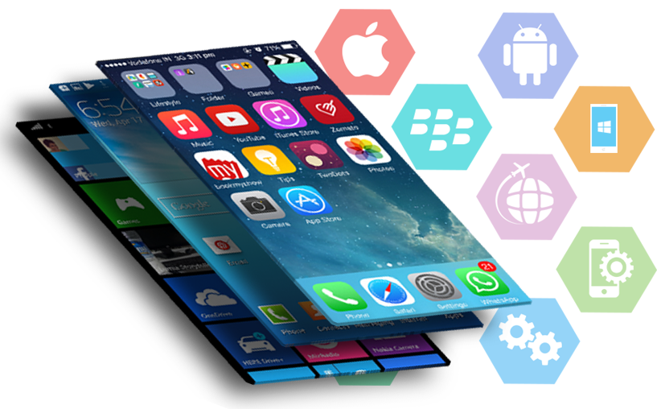
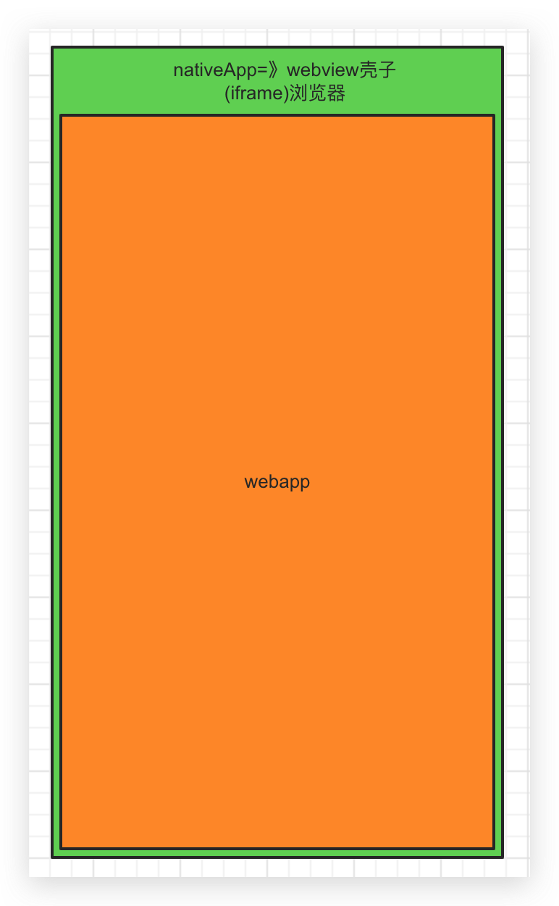
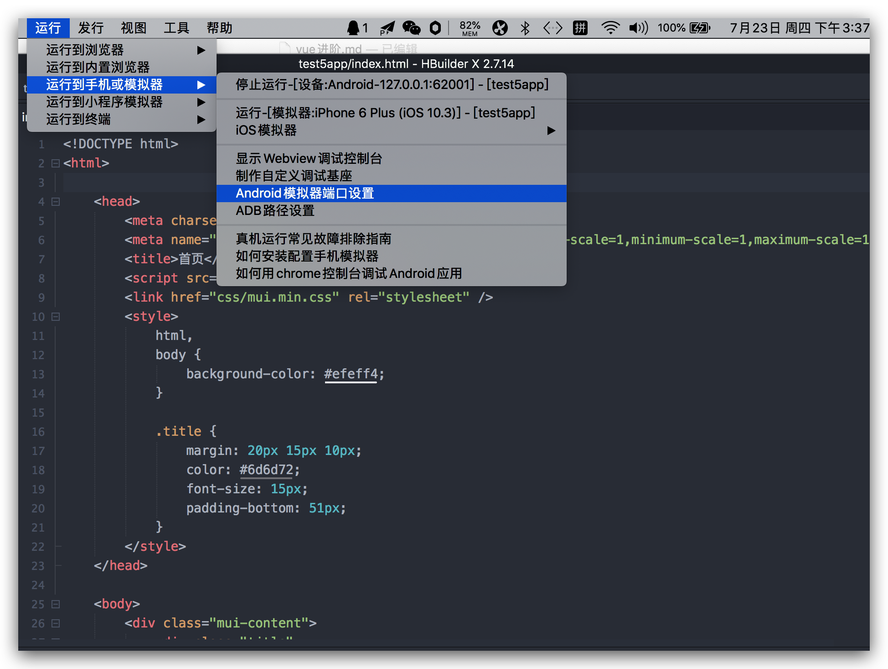
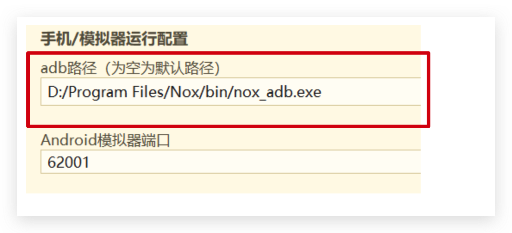
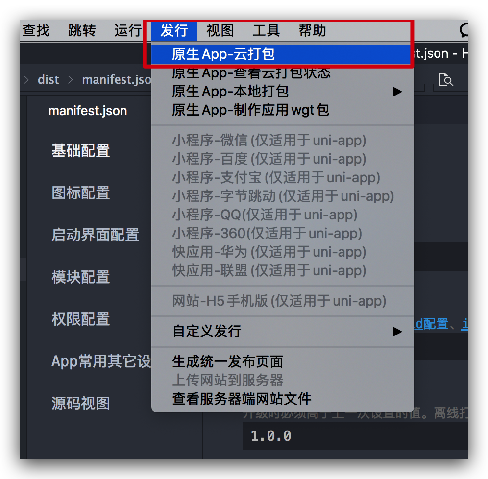
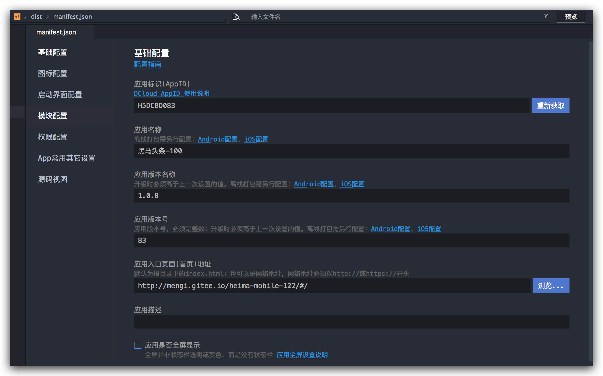
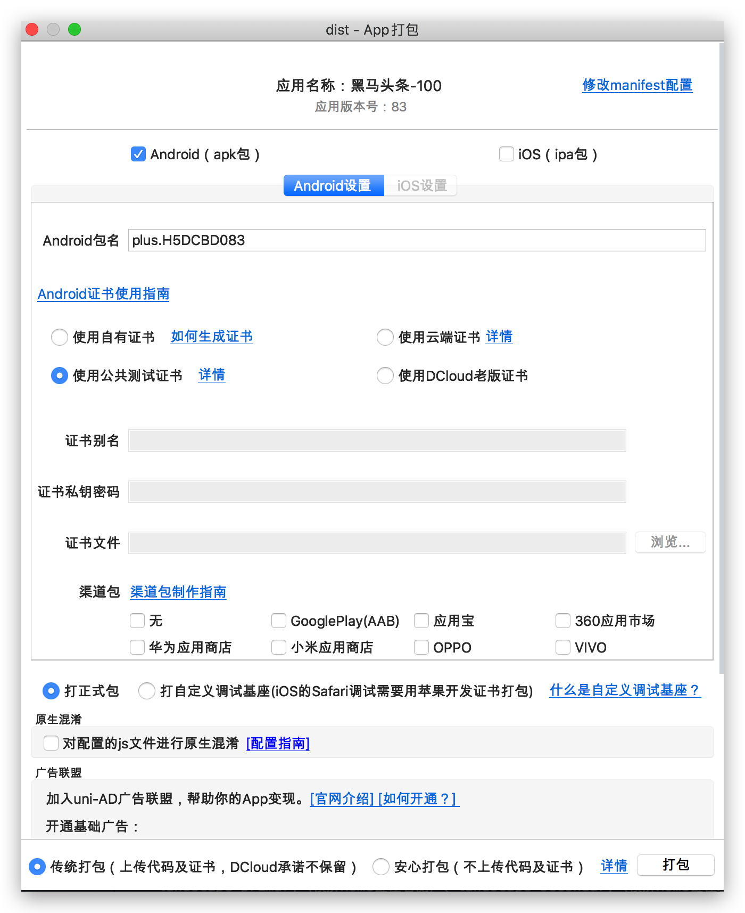

# 移动开发经验值

## 01-移动App开发的几种方式

1. 原生App=》**NativeApp** =〉iOS闭源(oc、swift) + android（开源）(java)
2. **WebApp(H5)**=》基于H5（前端重度参与）
3. **HybridApp**=>混合开发=>webview控件=》浏览器
4. 分支：跨**平台**开发（一套代码）=》**比较火**=〉react native框架=》前端重度参与
5. 分支：其他类型(小**程序**/快应用等等)

说明什么：

1. ios => 安装包格式.ipa

2. android =>安装包格式.apk

## 02-NativeApp介绍和特点

**定义**:传统的原生App开发模式，有iOS和Android两大系统，需要各自语言开发各自App。 

**优点**：性能和体验都是最好的

**缺点**：开发和发布成本高

**应用技术**：Swift，OC，Java

> 常识: 安卓/iOS/Web 基本都使用Mac进行开发

## 03-WebApp介绍和特点

[M站演示](https://tophub.today/)  

**定义**: 移动端的网站，常被称为**H5(WebApp)应用**，说白了就是特定运行在移动端浏览器上的网站应用。一般泛指 **SPA(**Single Page Application)模式开发出的网站，与**MPA（**Multi-page Application）对应。 

H5之前wap

**优点**：**开发和发布成本最低** 

1. 开发成本低,可以跨平台,调试方便，开发速度最快

   web app一般只需要一个前端人员开发出一套代码,然后即可应用于各大主流浏览器(特殊情况可以代码进行下兼容),没有新的学习成本,而且可以直接在浏览器中调试

2. 维护成本低

   同上,如果代码合理,只需要一名前端就可以维护多个web app

3. 更新最为快速=>运维

   由于web app资源是直接部署在服务器端的,所以只需要替换服务器端的文件,用户访问是就已经更新了(当然需要解决一些缓存问题)

4. 无需安装App,不会占用手机内存

   通过浏览器即可访问,无需安装,用户就会比较愿意去用

**缺点**：**性能和体验不能讲是最差的**，但也**受到浏览器处理能力的限制**

1. 性能和用户体验相对差点（相对来说，随着硬件提升）

   由于是直接通过的浏览器访问,所以无法使用原生的API,操作体验不好

2. 依赖于网络,页面访问速度慢,耗费流量

   Web App每次访问都需要去服务端加载资源访问,所以必须依赖于网络,而且网速慢时访问速度很不理想,特别是在移动端,如果网站优化不好会无故消耗大量流量

3. 功能受限,大量功能无法实现

   只能使用Html5的一些特殊api,无法调用原生API,所以很多功能存在无法实现情况

4. 临时性入口,**用户留存率低**

   这既是它的优点,也是缺点,优点是无需安装,缺点是用完后有时候很难再找到,或者说很难专门为某个web app留存一个入口,导致用户很难再次使用

**应用技术**：**ReactJS**，AugularJS，**VueJS**，jQuery等等 

## 04-HybridApp介绍和特点

**定义**:混合模式移动应用，介于**Web App、Native App**这两者之间的App开发技术，兼具“Native App良好交互体验的优势”和“Web App跨平台开发的优势” ,**原生客户端的壳WebView类似iframe，其实里面是HTML5的网页**

- 把网页打包成移动 App
- 使你的 Web 程序可以访问手机原生能力

> 是有安装包（ios和android）=> 代码包含原生代码和JS代码

**开发方式**：

1. 一些页面前端同学开发使用**HTML**=》vue打包=〉提供给iOS和android工程师打包的页面

2. 另外一些页面由iOS/android开发（**原生页面**）=》提供一个**webview标签**（像iframe）=>运行前端同学开发的页面

     

**优点**：开发和发布都比较方便，效率介于Native App、Web App之间 

1. 开发成本较低,可以跨平台,调试方便

   Hybrid模式下,由原生提供统一的API给JS调用,实际的主要逻辑有Html和JS来完成,而由于最终是放在webview中显示的,所以只需要写一套代码即可,达到跨平台效果,另外也可以直接在浏览器中调试,很为方便

   最重要的是只需要一个前端人员稍微学习下JS api的调用即可,无需两个独立的原生人员

   一般Hybrid中的跨平台最少可以跨三个平台:Android App,iOS App,普通webkit浏览器

2. 维护成本低,功能可复用

   同上,如果代码合理,只需要一名前端就可以维护多个app,而且很多功能还可以互相复用

3. 更新较为自由

   虽然没有web app更新那么快速,但是Hybrid中也可以通过原生提供api,进行资源主动下载,达到只更新资源文件,不更新apk(ipa)的效果

4. 针对新手友好,学习成本较低

   这种开发模式下,只需要前端人员关注一些原生提供的API,具体的实现无需关心,没有新的学习内容,只需要前端人员即可开发

5. 功能更加完善,性能和体验要比起web app好太多

   因为可以调用原生api,所以很多功能只要原生提供出就可以实现,另外性能也比较接近原生了

6. 部分性能要求的页面可用原生实现

   这应该是Hybrid模式的最多一个好处了,因为这种模式是原生混合web,所以我们完全可以将交互强,性能要求高的页面用原生写,然后一些其它页面用JS写,嵌入webview中,达到最佳体验

**缺点**：学习范围较广，需要原生配合 =>JS Bridge=》js和oc/java可以互相通信

1. 相比原生,性能仍然有较大损耗

   这种模式**受限于webview**的性能桎梏,相比原生而言有不少损耗,体验无法和原生相比

2. 不适用于交互性较强的app

   这种模式的主要应用是:一些a新闻阅读类,信息展示类的app;但是不适用于一些交互较强或者性能要求较高的app(比如动画较多就不适合)

**应用技术**：[Cordova](https://cordova.apache.org/)(科多瓦)、[APPCan](http://www.appcan.cn/)、 [DCloud](https://dcloud.io/) 、[API Cloud ](https://www.apicloud.com/)

**四种方式对比**

## 05-跨平台开发介绍和特点

> 特点：使用类似于 Web 技术的方式来开发 Native App。

**定义**: Facebook发现Hybrid App存在很多缺陷和不足，于是发起开源的一套新的App开发方案RN（react native）。使用JSX语言写原生界面，js通过JSBridge调用原生API渲染UI交互通信。

**优点**：效率体验接近Native App，发布和开发成本低于Native App

1. 虽然说开发成本大于Hybrid模式,但是小于原生模式,大部分代码可复用

   相比于原生模式,这种模式是统一用JS写代码,所以往往只需要一名成员投入学习,即可完成跨平台app的开发,而且后续代码封装的好,很多功能可复用

2. 性能体验高于Hybrid,不逊色与原生

   这种模式和Hybrid不一样,Hybrid中的view层实际上还是dom,但是这种模式的view层是**虚拟dom**,所以性能要高于Hybrid,距离原生差距不大

   这种模式可以认为是用JS写原生,即页面用JS写,然后原生通过Bridge技术分析JS,将JS内容单独渲染成原生Android和iOS,所以也就是为什么性能不逊色原生

3. 开发人员单一技术栈,一次学习,跨平台开发

   这种模式是统一由JS编写,有着独特的语法,所以只需要学习一次,即可同时开发Android和iOS

4. 社区繁荣,遇到问题容易解决

   这应该是React Native的很大一个优势,不像Hybrid模式和原生模式一样各自为营,这种模式是Facebook统一发起的,所以有一个统一的社区,里面有大量资源和活跃的人员,对开发者很友好

**缺点:** 学习有一定成本，且文档较少，免不了踩坑  

1. 虽然可以部分跨平台,但并不是Hybrid中的一次编写,两次运行那种,而是不同平台代码有所区别

   这种模式实际上还是JS来写原生,所以Android和iOS中的原生代码会有所区别,如果需要跨平台,对开发人员有一定要求

   当然了,如果发展了有一定时间,组件库够丰富了,那么其实影响也就不大了,甚至会比Hybrid更快

2. 开发人员学习有一定成本

   虽然社区已经比较成熟了,但是一个新的普通前端学习起来还是有一定学习成本的,无法像Hybrid模式一样平滑

3. 学习成本大，对开发人员技术要求比较高

4. 不懂原生开发很难驾驭好

5. 说是使用 Web 技术进行开发，还是多少得学点儿原生 App 开发，才能处理好跨平台。

6. 前期投入比较大，后劲很足。

**应用技术** :

#### React Native（主流）

- 公司：Facebook  meta
- 技术栈：React
- 基于React开发App的框架RN

**其他技术**: 

#### Weex（使用不多）

- 公司：Apache 开源基金会
- Vue.js 技术栈
- 基于Vue开发App的框架WEEX

#### Flutter（未来趋势）

- 公司：Google
- 它提供了官方的原生 UI 组件
- 比 RN、Weex 之类的体验更好
- 开发语言：Dart（和 JavaScript 很像）
- 商业应用：闲鱼

> 行业常识: 

1. 前端工程师 Web
2. FE客户端开发工程师
   1. 苹果开发工程师
   2. 安卓开发工程师
   3. Web开发工程师

## 06-其他类型App

#### 小程序

**特点**：寄生于特定平台app下

- **微信小程序**=》微信聊天软件
- 百度小程序
- 头条小程序
- 支付宝小程序
- 。。。

#### 统一开发平台=》统一开发规范

- taro(京东)->趋势很好=》react
- uni-app=> vue

#### 微网页

- **微信公众号**=> 网页开发=>运行在微信客户端中（内置了QQ浏览器）
- 百度直达号
- 。。。

#### 快应用（不温不火，iPhone 不参与很难搞起来）

- 各大手机厂商联合制定推出的一种方式，类似于小程序
- 使用 Web 技术进行开发， 而且提供了在 Web 中访问手机硬件等底层交互的 API
- 属于混合 App 的一种方式

#### PWA（网站离线访问技术，没有 iPhone 不参与）

- 它可以让网站拥有一个类似于 App 的入口
- 提供了网站的离线应用访问
- Google 在推动
- 手机端目前只能在 安卓手机的 Chrome 浏览器运行

## 07-移动App开发模式对比和选择

#### 各大开发模式对比

|                      | Native App                       | Web App                       | Hybrid App 常用              | React Native App           |
| :------------------- | :------------------------------- | :---------------------------- | :--------------------------- | :------------------------- |
| 原生功能体验         | 优秀                             | **还不错**                    | 比较好                       | **接近优秀**               |
| 渲染性能             | 非常快                           | 慢                            | 接近快                       | 快                         |
| 是否支持设备底层访问 | 支持                             | 不支持                        | 支持                         | 支持                       |
| 网络要求             | 支持离线                         | 依赖网络                      | 支持离线(资源存本地情况)     | 支持离线                   |
| 更新复杂度           | 高(几乎总是通过应用商店更新)     | 低(服务器端直接更新)          | 较低(可以进行资源包更新)     | 较低(可以进行资源包更新)   |
| 编程语言             | Android(Java),iOS(OC/Swift)      | js+html5+css3                 | js+html5 +css3               | 主要使用JS编写,语法规则JSX |
| 社区资源             | 丰富(Android,iOS单独学习)        | 丰富(大量前端资源)            | 有局限(不同的Hybrid相互独立) | 丰富(统一的活跃社区)       |
| 上手难度             | **难(不同平台需要单独学习)**     | 简单(写一次,支持不同平台访问) | 简单(写一次,运行任何平台)    | **学习一次,写任何平台**    |
| 开发周期             | 长                               | 短                            | 较短                         | 中等                       |
| 开发成本             | 昂贵                             | 便宜                          | 较为便宜                     | 中等                       |
| 跨平台****           | **不跨平台******                 | **所有H5浏览器**              | Android,iOS,h5浏览器****     | **Android,iOS**            |
| APP发布              | App Store/Google Store(应用商店) | Web服务器                     | App Store                    | App Store                  |

#### 如何选择开发模式

目前有多种开发模式,那么我们平时开发时如何选择用哪种模式呢？如下

#### 选择纯Native App模式的情况

- 性能要求极高,体验要求极好,不追求开发效率

  一般属于吹毛求疵的那种级别了,因为正常来说如果要求不是特别高,会有Hybrid

#### 选择Web App模式的情况

- 不追求用户体验和性能,对离线访问没要求

  正常来说,如果追求性能和体验,都不会选用web app

- 没有额外功能,只有一些信息展示

  因为web有限制,很多功能都无法实现,所以有额外功能就只能弃用这种方案了

#### 选择Hybrid App模式的情况

- **大部分情况下的App**都推荐采用这种模式

  这种模式可以用原生来实现要求高的界面,对于一些比较通用型,展示型的页面完全可以用web来实现,达到跨平台效果,提升效率

  当然了,一般好一点的Hybrid方案,都会把资源放在本地的,可以减少网络流量消耗

#### 选择React Native App模式的情况

- 追求性能,体验,同时追求开发效率,而且有一定的技术资本,舍得前期投入

  React Native这种模式学习成本较高,所以需要前期投入不少时间才能达到较好水平,但是有了一定水准后,开发起来它的优势就体现出来了,性能不逊色原生,而且开发速度也很快

#### 选择其它方案

- **小程序**（目前移动 App 中开发难度最低的，体验也是仅次于原生+跨平台NativeApp）

  

# 移动App打包

## 01-HBuliderX安装和项目创建

> 使用HBuliderX创建项目并且编码运行测试  h5---》原生
>
> 架构:BS基于浏览器----CS客户端             S表示server

### **安装HBuilderX** 

**IDE**:敲代码的软件.比如VSCode/WebStrom/HBuliderX

下载地址：https://www.dcloud.io/hbuilderx.html

说明：

1. 安装和配置模拟器说明：https://ask.dcloud.net.cn/article/151
2. android模拟器：https://www.yeshen.com/

### **使用步骤**

**1.  注册开发者**：在HBuliderX编辑器中注册登录

2. 创建项目
   * 新建项目

   * 5+app类型=>选择mui登录模版=》网页测试/模拟器测试/真机测试

### **模拟器安装和配置**

* 下载安装完夜神模拟器后，找到其安装路径进入bin目录

* 找到debugReport.bat，双击启动，**复制端口号：==62001==**

* HBuilderX中，点击运行->运行到手机或模拟器->Android模拟器端口设置，填入端口：**62001**

注意⚠️：

1. Mac下需要安装[virtualbox](https://www.virtualbox.org/wiki/Downloads)，才能正常启动夜神模拟器 苹果下载xcode ios和安卓 window只能开发androrid
2. 端口号设置后，发现夜神模拟器=》可能会有延迟=〉重复尝试等待=>或者添加Nox夜神的[adb.exe](https://www.cnblogs.com/murenziwei/p/12778604.html)文件的路径

## 02-HBuliderX打包原生APP

> 打包创建的5+app项目为原生app

### 打包方式

- 离线打包=> 配置Android环境
- **云打包**=》推荐

### 打包步骤

#### 配置 [manifest.json](http://ask.dcloud.net.cn/article/94) 文件

- 使用云打包，自动生成appID（**注册Dcloud账号成为开发者**） 和修改应用名称
- 配置应用图标
- 支持X86=》对老版本机型做兼容处理

#### 配置打包和执行云打包

> 在 HBuilder 中找到：**发行** -> 原生 App（云打包）

- 选择打android（apk包）
- 使用公共测试证书

- 等待一段时间，得到**打包结果安装包地址**，然后安装到手机上测试
- 最后根据需要发布到对应的手机应用商店

## 扩展-HBuliderX打包黑马头条APP

> 通过HBuliderX将黑马头条移动项目打包成app,生成apk文件下载安装测试
>
> 注意 APPID和应用界面选项 支持cpu加上x86

### 打包vue移动项目

1. npm run build=》dist目录
2. 运行dist下页面查看

### 打包dist代码为APP

步骤：

1. 新建5+app项目保留**manifest.json**文件，拷贝vue的dist下文件到5+app项目下
2. 修改manifest.json配置=>appid、应用名称和图标等=》注意⚠️**勾选**：自动关闭启动界面
3. 发布(发行)=》运行**云打包**
4. 测试

vue-----》js----》hbuilder打包bs为cs安装包---》如果还需要上线要发布

注意⚠️：

* 配置`vue.config.js`中`publicPath: './'`=>部署应用包时的基本 URL 不加会白页
* manifest.json配置文件勾选x86支持

### 分发上线

打包后发布流程：

1. 测试安装包=》通过第三方平台，[分发测试](https://www.pgyer.com/my)
2. 把安装包发布到应用商店=》
   * iOS => AppStore(苹果官方，只有一个)

   * Android=>GoogleStore(官方)或者其它应用商店（小米、华为、OPPO等应用商店）

# 第八天重点总结

